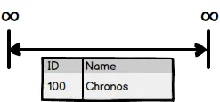
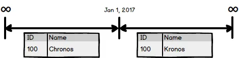
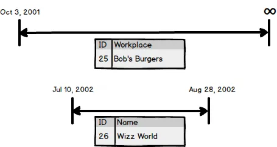
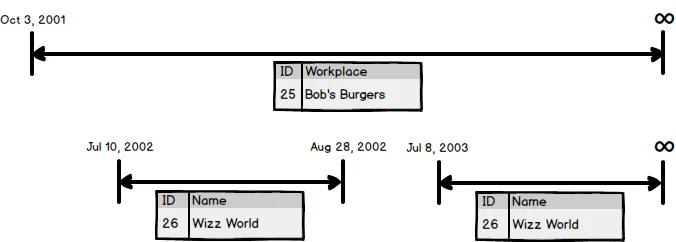
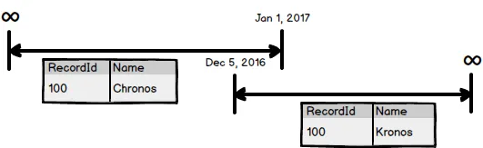

_This is work in progress and constructive feedback via e-mail (chris.cumming@saturdaymp.com) is most appreciated._

# Sections

- [What is a Temporal Database?](#whatisatemporaldatabase)
- [Degrees of Temporalness](#degreeeofdatabasetemporalness)
    - [Type of Table Temporalness](#typeoftabletemporalness)
        - [Effective Historical Temporalness](#effectivehistoricaltemporalness)
        - [Entered Historical Temporalness](#enteredhistoricaltemporalness)
        - [Combing Table Temporalness](#combingtabletemporalness)
    - [Table Temporalness with Auditing](#tabletemporalnesswithauditing)
- [Timelines](#timelines)
- Creating Temporal Tables
- Querying Temporal Tables
- Temporal Foreign Keys
- User's Thinking Temporally

# What is a Temporal Database?

You can read the official [Wikipedia definition](https://en.wikipedia.org/wiki/Temporal_database) but for our purposes it’s a database where you can query for historical data using SQL.

For example, say you have someone named Chronos who lives in New York but on April 15, 2012 moves to Hong Kong.  If you don’t have an historical tracking then you will only be able to see that Chronos lives in Hong Kong.  You don’t know where he lived before Hong Kong or when he moved to Hong Kong.

There are two main ways to track the changes.  The first is to add some auditing.  For our discussion auditing is tracking of database changes but not in a SQL friendly way.  Some examples include audit logs, audit tables, etc.  Using our Chronos example you couldn’t write a query to determine that Chronos moved but you could manually look at the audit data.  You could also use non-manually tools to read the audit information but the important point is the audit data is not SQL friendly.

The second way is to track the change is in a SQL friendly way and make out database a temporal database.  There are various ways to implement this but the main idea is that you can determine where Chronos lived using SQL.

Most of us have worked with database tables that track some historical information.  You add a EffectiveDate column or something similar.  Usually it’s just limited to a table to two.  The important part is that you can access the historical database using a SQL query.  This is what makes a database a temporal database, at least according to me.

# Degree of Temporalness

A database can either be non-temporal, partial temporal, or fully temporal.  You can measure the temporalness by the percentage of tables that store temporal data.

**Non-Temporal (0% Temporalness):** Database has no temporal capabilities.

**Partially Temporal (1% - 99% Temporalness):** The database has some tables store temporal data but not all.

**Fully Temporal (100% Temporalness):** All the tables in the database store temporal data.

## Type of Table Temporalness

We don't measure how temporal a table is by percentage.  Instead a table is defined by what type of historical data you can retrieve.  There are two types of historical data:

### Effective Historical Temporalness

With Effective Historical Temporalness you can determine when a piece of data is effective but not when it was entered into the database.  This is most common type of historical tracking and is what most people think of when they think Temporal Database.

For example, Chronos moved on April 15th but might not have told anyone till April 20th.  If you queried the database before April 15th you would see that Chronos lived in Edmonton and see no reference to Hong Kong.  If you queried the database between April 15th to the 19th you would see the same thing, Chronos only lives in Edmonton and no reference to Hong Kong.  If you queried the database on April 20th onward you would see that Chronos lived in Edmonton till April 15th then moved to Hong Kong.

### Entered Historical Temporalness

With Entered Historical Temporalness you can determine when the data was entered into the table but period the data is effective might not be accurate.  This type of historical tracking is not used as often as Effective Historical Temporalness.

Using the example above for Effective Historical Data the fact that Chronos moved on April 15th is never updated.  Querying the database after April 20th says that Chronos lived in Edmonton till April 20th.

Sometimes this type of temporalness tracking is used in place of auditing.

### Combing Table Temporalness

You can implement both types to Table Temporalness in one table.  In this case you can query both when a piece of data is effective and also when it was entered into the database.

Using the example of Chronos moving again if you query before April 19th you only see he lived in Edmonton and nothing about Hong Kong.  It would be nice if databases could know things before they are entered but that hasn't happened yet.  However, if you query the database on April 20th or later you can see both that Chronos moved on April 15th but the change was not recorded till April 20th.

## Table Temporalness with Auditing

A common requirement is to be able to query for Effective Historical data but not for Entered Historical data.  In this cause auditing is used in the place of Entered Historical temporalness.

For example, users need to frequently know when someone moved but it's rare they need to know when the data used entered into the database.  It's not worth the added database overhead and/or complexity to track Entered Table Temporalness.  The few times users need to check when a piece of data is entered they will have to do it by reviewing the audit log.

Even if you do use for Effective and Entered Table Temporalness you should still have auditing.  The audit log can be used to validate the Effective and/or Entered Historical data in the tables.  Auditing can also be used if data is manipulated at a low level outside the temporal algorithms.

# Timelines

In a non-temporal database a record dose not change over time.  For example say you have a Contacts table with a name field.

A record in that table does not change over time.  Record 100 either has the name Chronos of some other name.  If you think of this record from a temporal point of view it’s a record starts at the beginning of time and goes to infinity.  If we where to represent this record using a timeline it would look like:

Now lets make the table effective-temporal.  The technical details of how we do this in the database is not important right now.  For now lets just focus on the timeline.  Say Chronos changes his name to Kronos on January 1, 2017 then our timeline would look like:

We are going to assume gods aren’t born and don’t die so the timeline still goes from start of time to infinity.  However, the timeline now consists of two segment.  The first segment goes from the start of time to Dec 31, 2016.  The second segment goes from Jan 1, 2017 to infinity.

Notice that the ID does not change.  It’s still 100 in both segments.  Chronos changed his name to Kronos but he is still the same person, er god.

One more example.  In this case lets track where John Doe works as he goes through high school.  Lets start in grade 10 with his first job as a burger flipper.  He works in the weekend as he attends school.  The workplace timeline looks like:

In the summer John continues to work at Bob’s Burgers but also gets a second job as a life guard at the water park Water Wizz.

Now John Doe has two timelines one for Bob’s Burgers and one for Water Wizz.  When summer ends John leaves Wizz World but keeps his burger flipping job in Grade 11 so now his employment timelines look like:

Notice that the timeline for Wizz World has ended but Bob’s Burgers continues.  In the summer between grade 11 and 12 John is again hired by Wizz World because he such a good worker.  Now his employment timelines look like:

One of the challenges when creating a temporal database is deciding when to create new timelines and when to create new segments.  In this case we decided to use the existing Wizz World timeline and add a segment to it.  If the employer stays the same keep the timeline, if the employer is different create a new timeline.

Also notice that the Wizz World timeline has a gap in the segments, which is just fine. What you can’t have is a timeline with overlapping segments.  It's the one rule you can't break so don't forget it!

> ## **Timeline segments cannot overlap!**

That’s it.  That is the one rule you can't break.  Breaking this rule leads to all sorts of problems when you try to actually implement timelines in a database.  Aside from creating problems at the database level it also creates theoretical headaches.  For example, if you have the following in your customer table:

What is Chronos’s name on December 20th?  Is it Chronos or Kronos?  That said it is possible for people to have two names at the same time.  We have nicknames, aliases, and the like.  If you need to create a database that supports multiple names, say a police database, you can have an Aliases table that hangs off the Offenders table.  For example:

Chronos has an offender record with the name but also has two timelines in the Alias table with his over names.  Notice that alias table has two timelines, not one segment with overlapping segments.

How you design your temporal database will depend on your business logic but you must remember that there is one rule you can’t break:

> ## [**When this baby hits 88mph you are going to see some serious $#%!**](https://www.youtube.com/watch?v=JFT7hNhop7w)

Sorry, wrong timeline.  I meant:

> ## **Timeline segments cannot overlap!**

 

# References

[Developing Time-Oriented Database Applications in SQL](https://www2.cs.arizona.edu/people/rts/tdbbook.pdf) Richard T. Snodgrass
