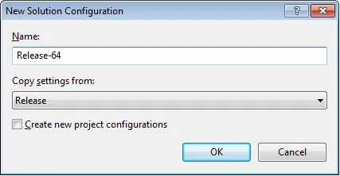
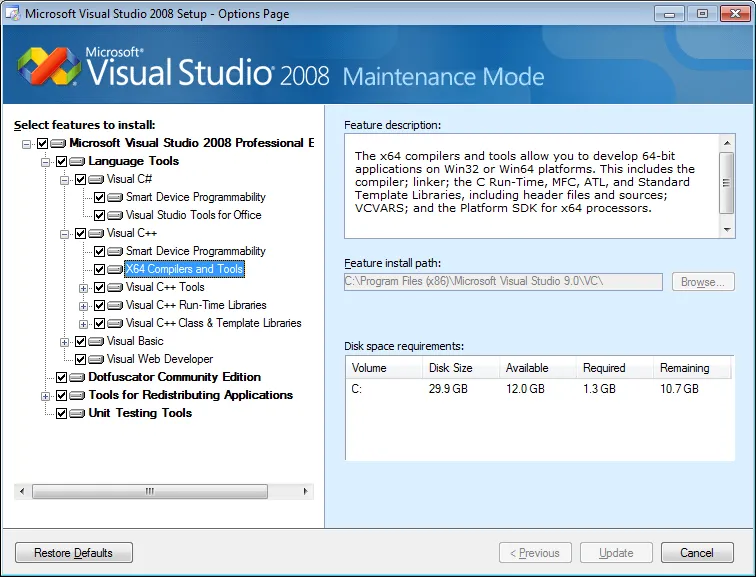
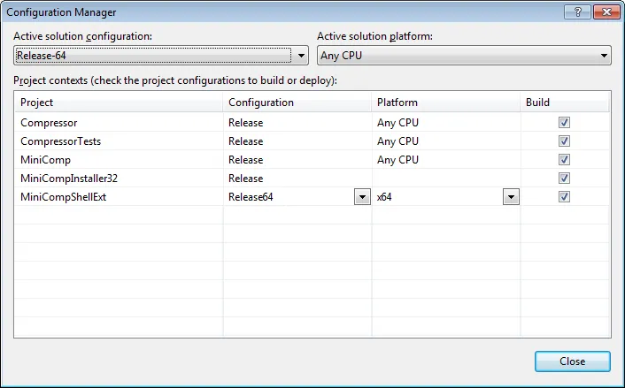
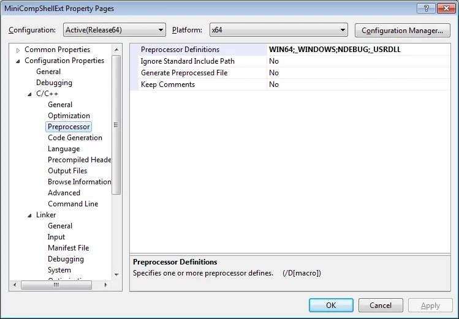
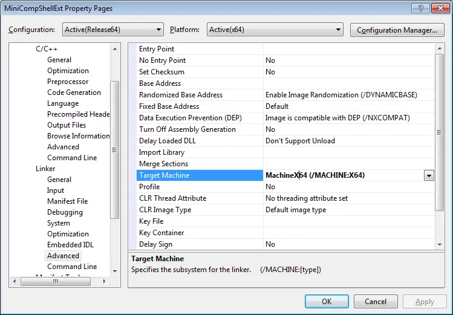

My latest task has been getting Mini-Compressor to work on Windows 7.  In the end no code changes are actually required to get Mini-Compressor working on Windows 7 but the installer required a bit of work.  The amount of work was actually minimal but it turned into a big pain because I didn't document the installer and had to relearn a couple key points.  To prevent this from happening again I thought I'd better take some notes on the problems I encountered and share them with you dear reader.  That way you won't make the same mistakes I made twice.

For .NET projects you don't have to worry about the bit-i-ness, just pick the Platform of "Any CPU" and it will work fine on both 32 and 64 bit architectures.   For C++ projects you need specify the platform which is Win32 or x64.  This means your build will require two compiles, one for each platform.

Create a new solution (Release-64) and project configuration (Release64).  I have a dash in the solution one so I know it's a solution configuration not a project one.  In both cases when prompted copy from the existing Release configuration and don't create the corisponding project/solution configuration.

[](http://saturdaymp.wpengine.com/wp-content/uploads/2010/02/creating-release-64-config1.png)

Also create the x64 platform if it doesn't exist.  Tip: If you can't create the x64 platform from the Configuration Manager you probably didn't install the x64 compilers.  To fix this problem go to Add/Remove Programs and choose to Uninstall/Change Visual Studio 2008.  When prompted choose "Add or Remove Features" then make sure the x64 compilers is selected.

[](http://saturdaymp.wpengine.com/wp-content/uploads/2010/02/installing-x64-compiler.png)

Now the you have the configurations created set them up in the configuration manager.  In the screen shots below MiniCompShellExt is the C++ applicaiton.  You can also ignore the "32" at the end of MiniCompInstaller32 as it can handle create 32 and 64 bit installers.  I'm just lazy and haven't bothered to change the name yet.

[](http://saturdaymp.wpengine.com/wp-content/uploads/2010/02/release-solution-configuration.png)

[](http://saturdaymp.wpengine.com/wp-content/uploads/2010/02/creating-release-64-config1.png)[](http://saturdaymp.wpengine.com/wp-content/uploads/2010/02/release-64-solution-configuration.png)

Finally adjust your C++ projects settings as shown below.  When the Release Configuration is selected make sure the Platform is Win32 and when the Release64 Configuration is selected that the Platform is x64.  Selecting the x64 Platform will update some the settings for you but it never hurts to check.   The settings you are interested in are the "C/C++-->Preprocessor-->Preprocessor Definitions" and "Linker-->Advanced-->Target Machine".  The examples below show the x64 settings:

[](http://saturdaymp.wpengine.com/wp-content/uploads/2010/02/release64-preprocessor-settings.png)

[](http://saturdaymp.wpengine.com/wp-content/uploads/2010/02/release64-linker-advanced-settings.png)

Now you can compile both a 32 and 64 bit application.  Mini-Compressor uses an NAnt build script and the compile target looks like:

```xml
<target name="compile" description="Compiles the code.">
  <exec program="Devenv.com" basedir="C:Program Files (x86)Microsoft Visual Studio 9.0Common7IDE">
    <arg line='/rebuild "${slnconfig}" "MiniComp.sln"' />
   </exec>
 </target>
```

During the automated build the NAnt script is called twice. Once with ${slnconfig} set to Release and then to Release-64.
