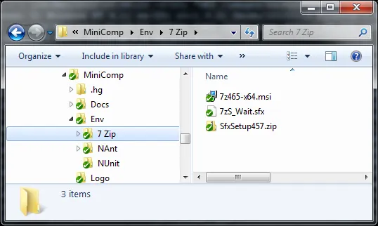
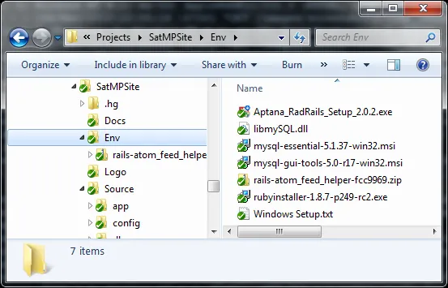

Do you remember VB Commenter?  Probably not because all the cool kids, like you, where using C# so you had no need for it.  See, way back in the Visual Studio 2003 era only .NET's favorite child, C#, had support for [XML comments](http://msdn.microsoft.com/en-us/magazine/cc302121.aspx).  Some jealous VB.NET developer (sorry, can't remember who) wanted VB.NET to be just as cool so VB Commenter addin was created.

Still back in the Visual Studio 2003 era I created rules engine where the end user could script their own rules and hook them into their business application.  The rules referenced pre-compiled business objects.  To create documentation for the end user about these objects I used VB Commenter along with NDoc to generate a MSDN help file.

Fast forward a couple years later and I end up working on the same rules engine code base but with a different company (it's a long story).  One of the first things I was asked was how to create the rules documentation.  Once I explained how the second question I was asked was if I had copy of VB Commenter.  I didn't have a copy and told my co-worker to just download it.  Unfortunately he couldn't find it on the web and neither could I.  That meant we couldn't generate the rules documentation which sucked.  Actually we were able to generate them again but it was a lot of work.

FYI: It appears that VB Commenter has re-appeared [here](http://code.msdn.microsoft.com/VBCommenter).

The moral of my story is you should store 3rd party libraries and tools.  Don't rely on them forever being on the internet.  I recommend storing it with your source code in your source code management (SCM) tool an idea I got from the excellent [Under Pressure and On Time](http://www.amazon.com/Under-Pressure-Time-Pro-Best-Practices/dp/073561184X) book.  The book, and myself, recommend storing all the items, within reason, you need to setup your build machine and developer workstations.

When I setup a project in source control now I create a "Env" folder, short for environment. Inside this folder I put all the items needed to create the projects build machine and developer workstation.  For example, [Mini-Compressor](http://www.saturdaymp.com/mini_comp) Env folder has the following:

The [Saturday MP](http://www.saturdaymp.com) website Env folder has the following:

The goal when setting up my build machine or developer workstation is to do the following:

1. Install the operating system.
2. Install items not in the Env folder, such as Visual Studio.
3. Install the source code control tool.
4. Do a get latest to get the source good.
5. Install the items from the Env folder.

Ideally, all items such as your compiler, IDE, etc would all be in the Env folder but tools, like Visual Studio, are large and don't play nice with SCM tools.  You don't want people to have to download over 2 Gigs when doing a get latest version from you version control.  For these large tools I recommend backing them up somewhere else but close to you version control tool.

Just recently I migrated my build machine and developer workstation from Windows Vista to Windows 7.  Having everything in the Env folder was a real time and life saver.  For example, to setup Ruby and Rails to use MySQL on Windows you need a specific version of MySQL and the magical libmySQL.dll file.  If you don't have the libmySQL.dll or the wrong version of MySQL you won't be able to access your database.  Having the libmySQL.dll file along with specific verions of MySQL in Env saved me the hassle of finding these items on the internet again.  Having a document that outlines your workstation setup, "Windows Setup.txt" also helped.

So once again the moral of the story is: Make sure you have all the items required to build your project, preferably in your SCM.
