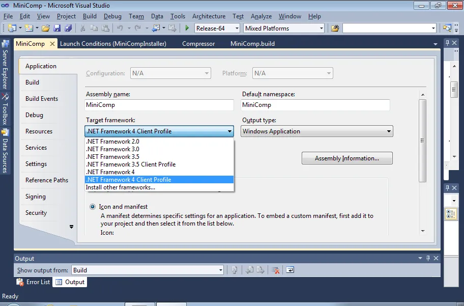
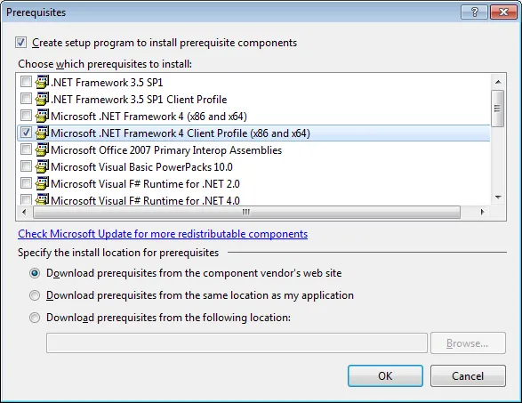
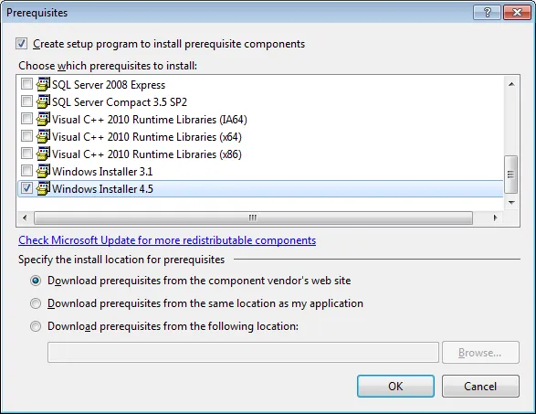
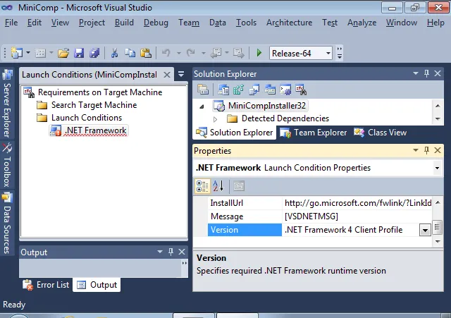
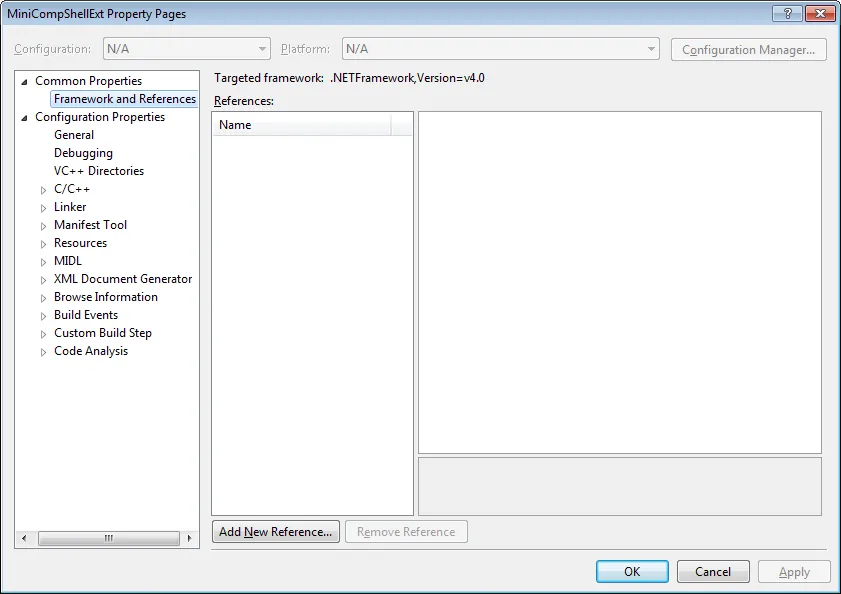
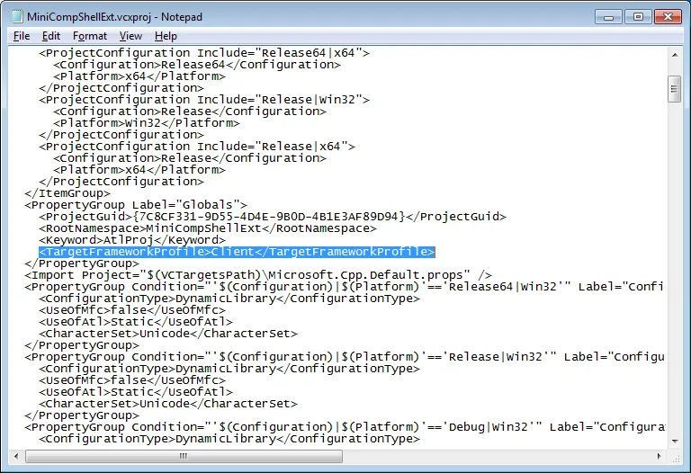

My notes on upgrading Mini-Compressor from .NET 3.5 to .NET 4.0 (Visual Studio 2008 to 2010) and also upgrading NUnit and NAnt.

1) Run the automated VS 2010 upgrade process.  Appears that there are no error but appearances can be deceiving.

2) Try a compile and get errors about not being about to find NUnit.  This makes sense as I upgraded NUnit on the build machine and the path had changed.  One day I should just reference the dll via a lib folder.  Update the NUnit reference and all the errors go away but...

3) Get some errors about  "The parameter to the compiler is invalid, '/define:=' will be ignored.".  After some digging find out the Compressor project contains the following in the "Conditional Compilation Symbols:

```csharp
StreamReader reader = new StreamReader(project.Properties["install-proj-file"]);
```

That is weird but I delete it and try compiling again.

4) Only 2 warnings now and both related to the installer project.  First one is:

```text
Build input parameter 'SupportUrl=www.saturdaymp.com' is not a web url or UNC share.

C:UsersthedudeDesktopMiniCompSourceMiniCompMiniCompInstaller32MiniCompInstaller.vdproj<em>
```

I wonder if I got that error in VS 2008?  I'm too lazy to check.  Add "http://" to the front of the url and error goes away.

5) One warning left, will this be the last warning?  One can hope.  The warning is:

```text
The target version of the .NET Framework in the project does not match the .NET Framework launch condition version '3.5 SP1 Client'.  Update the version of the .NET Framework launch condition to match the target version of the.NET Framework in the Advanced Compile Options Dialog Box (VB) or the Application Page (C#, F#).

C:UsersthedudeDesktopMiniCompSourceMiniCompMiniCompInstaller32MiniCompInstaller.vdproj
```

So I go into all the projects and update the targeted version to .NET 4.0 Client Profile:

[](http://saturdaymp.wpengine.com/wp-content/uploads/2010/09/settargetframework.png)

I also update the installer to use .NET 4.0 in the Prerequisites and Launch Conditions.  I added the Windows Installer 4.5 as well, might as well if we are upgrading everything else:

[](http://saturdaymp.wpengine.com/wp-content/uploads/2010/09/prerequistes40clientprofile.png)

[](http://saturdaymp.wpengine.com/wp-content/uploads/2010/09/prerequistes45installer.png)

[](http://saturdaymp.wpengine.com/wp-content/uploads/2010/09/launchconditions40clientprofile.png)

6) Try a recompile and get the same error.  Wait, it is slightly different.  It is complaining that one of the projects doesn't target .NET 4.0 Client Profile:

```text
The target version of the .NET Framework in the project does not match the .NET Framework launch condition version '.NET Framework 4 Client Profile'.  Update the version of the .NET Framework launch condition to match the target version of the.NET Framework in the Advanced Compile Options Dialog Box (VB) or the Application Page (C#, F#).

C:UsersthedudeDesktopMiniCompSourceMiniCompMiniCompInstaller32MiniCompInstaller.vdproj
```

Double check all the projects target framework values are set correctly.  Find out that my one C++ project also has a .NET target and it is set to .NET 4.0 but without the client project part:

[](http://saturdaymp.wpengine.com/wp-content/uploads/2010/09/minicompcplusplustargetframework2.png)

There appears to be no way in the GUI to change the target.  Wonder if VS 2008 C++ projects had a targeted framework and again I'm too lazy to check.  I also briefly wonder if this is a serious error or if Mini-Compressor would work fine even with the error.  I'm pretty sure my C++ project doesn't use the .NET framework at all, it is a shell extension for the explorer context menu and .NET if not recommended for [this](http://social.msdn.microsoft.com/forums/en-US/netfxbcl/thread/1428326d-7950-42b4-ad94-8e962124043e/).  Except now .NET 4.0 apparently [plays nice with Shell Extensions](http://msdn.microsoft.com/en-us/magazine/ee819091.aspx).  I'll have to investigate this further.  One change at a time.

Anyway, back on topic.  I decide to check with [Mr. Know It All](http://www.google.ca) and after a couple tries find I can manually edit the project file to remove the warning.  More information can be found [here](http://blogs.msdn.com/b/visualstudio/archive/2009/11/22/framework-multi-targeting-for-vc-projects.aspx) and [here](http://social.msdn.microsoft.com/Forums/en-US/vcprerelease/thread/85366e16-7719-4e36-942f-a46d8d0996e5).

First off notice that VS 2010 changed the C++ project file suffix from "vcproj" to "vcxproj".  Not sure what the x is for, maybe extreme or 10?  Anyway, it's a good thing I noticed this so I could add the new project file to source control and delete the old one.  Opening up the new and improved "vcxproj" file with Notepad I add the following to the Globals PropertyGroup section:

[](http://nant.sourceforge.net/release/0.86-beta1/help/tasks/script.html)

Recompile and there are no errors.

7) Commit my changes and make sure I add the new C++ x-treme files.  Only the "vcxproj" file needs to be added.  The "vcxproj.filters" doesn't need to be added.

8) Delete the unneeded C++ project files that where replaced by the xtreme versions.  The files I delete are:

\- MiniCompShellExt.vcproj

\- MiniCompShellExtPS.vcproj

\- MiniCompShellExtps.def

Commit my changes.

9) Go eat some lunch.

10) Now it's time to test the NAnt build script since we updated from 0.86 to 0.90.  Try running it and get errors about the C# script sections.  These sections do a find and replace on the version number and other files.  Getting errors about Regex not existing in the current context.

Read-up on the differences between the NAnt versions and find out that NAnt 0.90 no longer loads the System.Text.RegularExpressions namespace by default as shown in the script task documentation for [0.86](http://nant.sourceforge.net/release/0.86-beta1/help/tasks/script.html) and [0.90](http://nant.sourceforge.net/release/0.90/help/tasks/script.html).  To get around this problem I add both the reference and imports sections.  Both are needed, if you try just the imports, like I did at first, it dosen't work.  The updated NAnt script looks like:

```xml
<script language="C#" failonerror="false">
  <references>
    <include name="System.dll" />
  </references>
  <imports>
    <import namespace="System.Text.RegularExpressions" />
  </imports>
  <code>
    ...
  </code>
</script>
```

11) Try a another build and get an error about the VS 2010 path.  Update the path and notice the NUnit path is also incorrect so I fix that as well.

```xml
<!-- Compiles Mini-Comp. -->
<target name="compile" description="Compiles the code.">
  <exec program="Devenv.com" basedir="C:Program Files (x86)Microsoft Visual Studio 10.0Common7IDE">
    <arg line='/rebuild "${slnconfig}" "MiniComp.sln"' />
  </exec>
</target>

<!-- Run the NUnit tests. -->;
<target name="tests" description="Run the unit tests.">
  <exec program="NUnit-Console.exe" basedir="C:Program Files (x86)NUnit 2.5.7binnet-2.0" />
    <arg line='MiniComp.nunit /config:Release' />
  </exec>
</target>
```

12) Build again and it appears everything works.  Virtual high-five to me but just a small one as I have to test the build on the various versions of Windows.

**Update (Sep 15, 2010):**

13) The WPF OuterGlowBitmapEffect effect has been made obsolete.  This won't show up as an error as the code is in the XMAL file bu the pretty glow effect around the thumbnail previews disappear.  To fix this problem you need to us the DropShadowEffect instead as outlined [here](http://karlshifflett.wordpress.com/2008/11/04/wpf-sample-series-solution-for-the-obsolete-bitmapeffect-property-and-rendering-an-outerglowbitmapeffect/).

The XAML code should look like:

```xml
<Image Name="displayImage" Grid.Column="2" Opacity="0" Width="97" Height="97">
  <Image.Effect>
    <DropShadowEffect ShadowDepth="0" Color="White" BlurRadius="30" />
  </Image.Effect>
</Image>
```

**Update Nov 11, 2010:** You can find an addendum [here](http://nftb.saturdaymp.com/2010/11/03/upgrading-mini-compressor-to-net-40-notes-addendum/).
