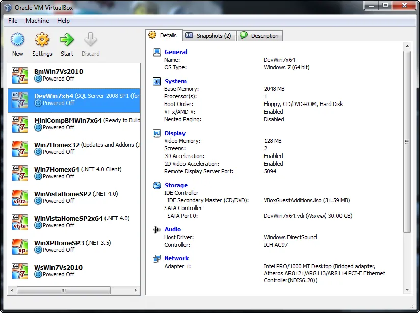
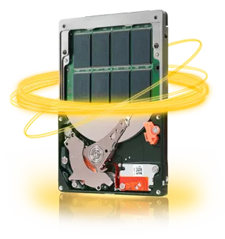

All my development work is done on virtual machines (VM), [Virtual Box](http://www.virtualbox.org/) to be exact.  In the past I've only needed one VM open at a time and only one version [Visual Studio](http://msdn.microsoft.com/en-us/vstudio/default.aspx), or [other IDE](http://www.aptana.com/products/radrails), running in the VM.  On my Core 2 Duo with 4 GB of RAM this was fine with the VM being allocated 1.5 GB of RAM.  Sometimes it would run slow but only for short durations and I could live with it.

My latest contract requires me to have two copies of Visual Studio open at the same time which brings my current setup to its knees, begging for death.  Actually, it's begging for more memory so I bought some.

With 8 GB of memory I can comfortably run a 2 GB Windows 7 VM for development along with running iTunes, Firefox, Word, and Visio on host without any issues.

Aside from upgrading my CPU the only other change I could make that would speed up running my virtual machines is getting an SSD hard drive.  Unfortunately they are [very](http://www.newegg.ca/Product/ProductList.aspx?Submit=ENE&DEPA=0&Order=BESTMATCH&Description=ssd+500gb&x=0&y=0) [pricey](http://www.newegg.ca/Product/ProductList.aspx?Submit=ENE&DEPA=0&Order=BESTMATCH&Description=ssd+250gb&x=0&y=0) if you want lots of storage but now they might be a reasonable alternative: [hybrid hard drives](http://en.wikipedia.org/wiki/Hybrid_drive).  I have my eye on the [Seagate Momentus XT](http://www.newegg.ca/Product/Product.aspx?Item=N82E16822148591&cm_re=Seagate_Momentus_XT-_-22-148-591-_-Product) which has been [getting](http://www.tomshardware.com/reviews/seagate-momentus-xt-hybrid-hard-drive-ssd,2638.html) [good](http://www.overclockersclub.com/reviews/seagate_momentus_xt_500gb/) [reviews](http://www.codinghorror.com/blog/2010/09/revisiting-solid-state-hard-drives.html).

My big problem will be finding a day to reinstall everything.
