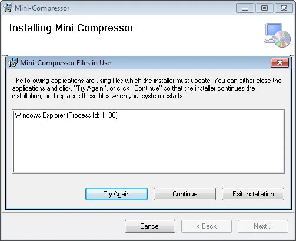
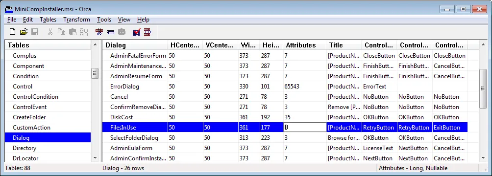

You can read part one at [Upgrading Mini-Compressor to .NET 4.0 Notes](http://nftb.saturdaymp.com/2010/09/09/upgrading-mini-compressor-to-net-4-0-notes/) post.

One item that I feel has been neglected by [Visual Studio](http://msdn.microsoft.com/en-us/vstudio/default.aspx) is the [Setup & Deployment projects](http://msdn.microsoft.com/en-us/library/wx3b589t.aspx).  There has been little improvements to them since Visual Studio 2003 but finally VS2010 has new "feature":

1. A customer installs your [software](http://www.saturdaymp.com/mini_comp) using the installer created using VS2008.
2. You upgrade your product to .NET 4.0 using VS2010 and create a new MSI.
3. The customer runs your new MSI to upgrade their software.  After the upgrade is complete nothing is installed at all.

I really do mean nothing, no files in the Program Files folder, no registry entries, shortcuts, etc.  The old version is gone along with the new version.  It's a great new feature, I mean bug.  The bug is known to Microsoft and you can read more about it [here](https://connect.microsoft.com/VisualStudio/feedback/details/559575/problem-with-installing-and-removing-previous-versions-after-upgrading-my-setup-project-to-vs2010#details).  A summarized description of the error and some workarounds:

> Posted by smondal on 7/22/2010 at 1:17 PM
> 
> Basically the Component GUID's are changed when setup projects are migrated from VS2008 to VS2010. [InstallValidate](http://msdn.microsoft.com/en-us/library/aa369546%28VS.85%29.aspx) marks components to be installed locally, [RemoveExistingProducts](http://msdn.microsoft.com/en-us/library/aa371197%28VS.85%29.aspx) that run at sequence 6550 ends up removing these components.
> 
> There would be two solutions:
> 
> 1.Manually change the component GUID's to be the same as that of VS2008 (this might not be a feasible solution)
> 
> 2\. Resequence RemoveExistingProducts right after InstallInitialize (sequence number 1501). This ensures that older files are removed and reinstalled by the newer version.

More information about the standard sequence for MSI installers can be found [here](http://msdn.microsoft.com/en-us/library/aa372038%28v=VS.85%29.aspx).

Some extra weirdness not in the reported bug is that the application is still listed as installed under the Add/Remove Programs (Programs and Features for Windows 7).  If you click Repair it will install correctly.

So I tried the script listed in the bug report but when it ran I got the following message:

[](http://saturdaymp.wpengine.com/wp-content/uploads/2010/10/filesinuse.png)

If I clicked continue Mini-Compressor installed just fine.  I understand why the dialog box appears but in my case it won't make any sense to the end user and closing Windows Explorer is generally not a good idea.  I don't think the dialog is related to upgrading to Visual Studio 2010 but I still need to get rid of it.

At first I thought changing the [MSIRESTARTMANAGERCONTROL](http://msdn.microsoft.com/en-us/library/aa370377%28VS.85%29.aspx) property in the MSI would do work but that didn't do anything.

After a bit more web-researching I found the File in Use Dialog exists in the Dialog table in the MSI.  What happened if I removed it?  You get error 2803: [Dialog View did not find a record for the dialog](http://msdn.microsoft.com/en-us/library/aa372835%28VS.85%29.aspx).

Finally I noticed the [Dialog table](http://msdn.microsoft.com/en-us/library/aa368286%28VS.85%29.aspx) in the MSI has an [attribute column](http://msdn.microsoft.com/en-us/library/aa368285%28v=VS.85%29.aspx).  The attributes control how the dialog is displayed and setting the attribute to zero solved my problem.  Now when doing an upgrade of Mini-Compressor the dialog is not displayed and the install completes successfully.  GO TEAM ME!

[](http://saturdaymp.wpengine.com/wp-content/uploads/2010/10/orcadialogtable.png)

To automate the process I created a batch file that called both the MoveREP.js script I copied from the Connect bug report and the HideFilesInUse.js script I created.  Both files are listed below.  The batch file looks like:

```text
cscript "%1HideFileInUseDialog.js" "%2"
cscript "%1MoveREP.js" "%2"
```

Then inside my VS Deployment project I set the PostBuildEvent to:

```text
"$(ProjectDir)PostBuildEvent.bat" "$(ProjectDir)" "$(BuiltOuputPath)"
```

My smoke test installs are passing and hopefully my entire test plan passes with the new installer.  Wish me luck.

Appendix A: Orca

[Orca](http://msdn.microsoft.com/en-us/library/aa370557%28VS.85%29.aspx) is a tool from Microsoft to view and edit the tables of an MSI.  Technically you can only get it by downloading the large [Windows SDK](http://) but I found just the Orac application [here](http://blogs.msdn.com/b/astebner/archive/2004/07/12/180792.aspx).

Appendix B: MoveREP.js

```csharp
// MoveREP.js <msi-file>
// Performs a post-build fixup of an msi to run RemoveExistingProducts after InstallInitialize

// Workaround for a bug in VS2010 Setup projects that will remove the old version of Mini-Comp
// installed via the VS2008 MSI but not replace it with the new version.  You can read more at:
//
// https://connect.microsoft.com/VisualStudio/feedback/details/559575/problem-with-installing-and-removing-previous-versions-after-upgrading-my-setup-project-to-vs2010#details

// Where to move the RemoveExistingProducts to.  1525 is just after the
// InstallInialize action.
var newSequence = 1525;

// Constant values from Windows Installer
var msiOpenDatabaseModeTransact = 1;
var msiViewModifyReplace        = 4

if (WScript.Arguments.Length != 1)
{
    WScript.StdErr.WriteLine(WScript.ScriptName + " file");
    WScript.Quit(1);
}

var filespec = WScript.Arguments(0);
var installer = WScript.CreateObject("WindowsInstaller.Installer");
var database = installer.OpenDatabase(filespec, msiOpenDatabaseModeTransact);

var sql
var view
var record

try
{
    WScript.Echo("Updating the InstallExecuteSequence table...");

    sql = "SELECT `Action`, `Sequence` FROM `InstallExecuteSequence` WHERE `Action`='RemoveExistingProducts'";
    view = database.OpenView(sql);
    view.Execute();
    record = view.Fetch();

    if (record.IntegerData(2) == newSequence)
    throw "REP sequence doesn't match expected value - this database appears to have been already modified by this script!";

    if (record.IntegerData(2) != 6550)
    throw "REP sequence doesn't match expected value - this database was either already modified by something else after build, or was not produced by Visual Studio 2010!";

    record.IntegerData(2) = newSequence;

    view.Modify(msiViewModifyReplace, record);
    view.Close();

    database.Commit();
}
catch(e)
{
    WScript.StdErr.WriteLine(e);
    WScript.Quit(1);
}
```

Appendix C: HideFileInUseDialog.js

```csharp
// HideFileInUseDialog <msi-file>
// Performs a post-build fixup of an msi to disable the File In Use Dialog.

// Constant values from Windows Installer
var msiOpenDatabaseModeTransact = 1;
var msiViewModifyReplace        = 4

if (WScript.Arguments.Length != 1)
{
    WScript.StdErr.WriteLine(WScript.ScriptName + " file");
    WScript.Quit(1);
}

var filespec = WScript.Arguments(0);
var installer = WScript.CreateObject("WindowsInstaller.Installer");
var database = installer.OpenDatabase(filespec, msiOpenDatabaseModeTransact);

var sql
var view
var record

try
{
    WScript.Echo("Updating the Dialog table...");

    sql = "SELECT `Attributes` FROM `Dialog` WHERE `Dialog`='FilesInUse'";
    view = database.OpenView(sql);
    view.Execute();
    record = view.Fetch();

    // Setting the dialog attributes to zero hides the dialog when the MSI
    // is running.
    record.IntegerData(1) = 0;

    view.Modify(msiViewModifyReplace, record);
    view.Close();

    database.Commit();
}
catch(e)
{
    WScript.StdErr.WriteLine(e);
    WScript.Quit(1);
}
```
