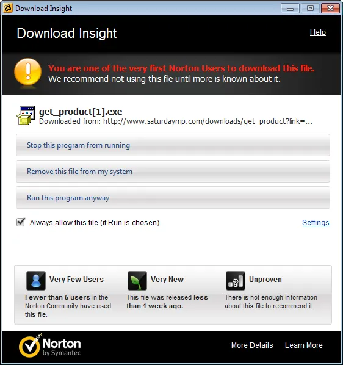
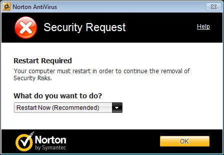

A while ago I got an e-mail from a customer that had just bought [Mini-Compressor](http://www.saturdaymp.com/mini_comp "Mini-Compressor") (which I think is the best image compression software in the world but I'm a bit biased) but was getting warning from [Norton](http://us.norton.com/index.jsp "Nortan") when he tried to install it.  The warning he was getting was [Suspicious.Cloud.5.D](http://www.symantec.com/security_response/writeup.jsp?docid=2010-081701-5142-99 "Suspicious.Cloud.5.D").  This is a low level warning from Norton that a file is suspicious but could also be a false positive.  I quickly double checked that the website had not been compromised.  To be on the safe side I downloaded and scanned Mini-Compressor with both [Windows Defender](http://www.microsoft.com/windows/products/winfamily/defender/default.mspx "Windows Defender") and [Malwarebytes](http://www.malwarebytes.org/ "Malwarebytes").  Neither reported any errors.

I e-mailed the fellow back with my findings and asked him to disable Norton when he installed Mini-Compressor.  He kindly did and Mini-Compressor installed just fine and I thought nothing more of it.

A couple months later I received another complaint.  This one was a bit more severe with Norton not letting Mini-Compressor be installed and saying it’s a very suspicious program.  I was unable to convince her to disable Norton, and I don’t blame her once I saw the errors Norton was generating.

I don’t own Norton so I bit the bullet and bought a copy, installed it on a virtual machine, and downloaded Mini-Compressor and got the following error:

Then the Norton Sonar kicked in and a scary red box appears in the bottom right that said Mini-Compressor was a bad program and should not be trusted.  It then deleted the Mini-Compressor installer and popped-up the following dialog:

Obviously this is not good.  So I did some digging and found the Symantec has a site where you can submit false positives and found this site.   It asks for some basic information and a link to download the software.  This was a bit of pain since we don’t have a trail version I setup a temporary link for them that was valid for 24 hours.

Unfortunately it was Saturday when I did this and Norton didn’t look at my submission till Monday and the link had expired.  They sent me an e-mail saying so and asked me to send them a new link, or better yet, upload the actual files.  Why they didn’t include the upload link in the first e-mail I’m not sure but I uploaded both the 32 and 64 bit installers of Mini-Compressor. Two days later they e-mailed to say:

> “In light of further investigation and analysis Symantec is happy to remove this detection from within its products.”

I updated my copy of Norton and tried to install Mini-Compressor.  This time I don’t get any warnings and Norton Sonar popped up a friendly green box in the bottom right corner.  Thanks to Norton for quickly fixing the problem.

Some final notes:

- If you simply download Mini-Compressor and ran standard Norton scan, e.g. by right-clicking on the installer, no errors are reported.
- Part of the Norton false positive submission process is to generate a hash of the installer.  They suggested using Virus Total website.  This website will not only create a hash but will also run a bunch of virus scanners, including Norton.  It then catalogs the results including the results for the [32-bit](http://www.virustotal.com/file-scan/report.html?id=f085b38eee5ffec4cefb035db4670c477c9c3e9e347758973278e27956e4c3b0-1300564867 "Virus Total Mini-Compressor 32-Bit") and [64-bit](http://www.virustotal.com/file-scan/report.html?id=d947ad347c6cbad723ab3cb3a29cec8f9a6707860f1e36895a56ea71e8c4f3e9-1300878612 "Virus Total Mini-Compressor 64-Bit") versions of Mini-Compressor.
- I need to get a [code signing certificate](http://en.wikipedia.org/wiki/Code_signing "Code Signing").  It’s been on my list of things to do for a while but now it got bumped up a bit.  I think I’ll also try to get Mini-Compressor [Windows 7 Certified](http://connect.microsoft.com/site831 "Windows 7 Logo Program") which I’m sure will require it to signed.
