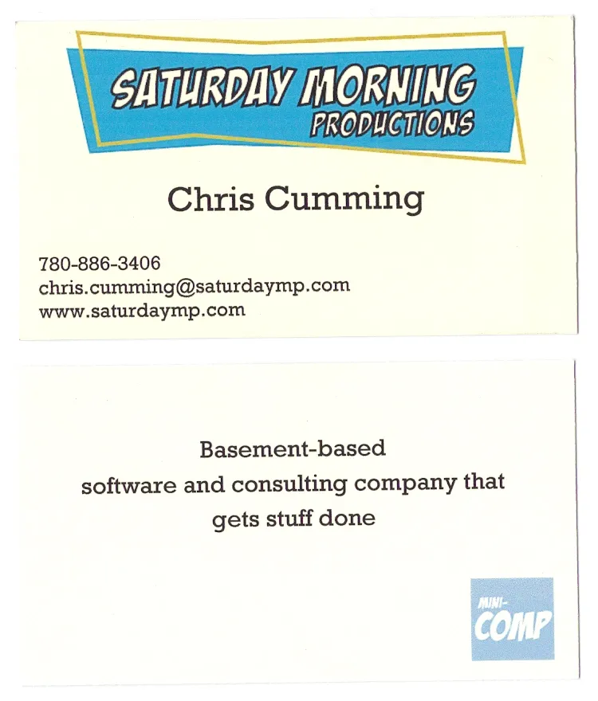

SaturdayMP has been around for a long time.  The concept of a [weekend software company](http://saturdaymp.com/about "Saturday Morning Productions") is how our friends and acquaintances know us (dreamers).  Sure, we incorporated just over 2 years ago, but the name has been around for longer in our circles.  This past winter, Chris had a few opportunities to see some familiar faces and catch them up on our ‘latest venture’.  Imagine our embarrassment when he had to 1) borrow a pen to 2) write down his contact info on the back of a gas receipt.  Seriously!  Doesn’t this dude have a business card?  That was my next project.

I used a handy template from a print-your-own business card kit, and typed in what I thought a business card should look like – front and back – and slapped on our logo.  There.  30 seconds and done.  Well, having been through the logo design process with [Stylecase](http://stylecase.com "Stylecase") , I thought I’d use the other 7 squares in the template to test out a few ideas – you know, bigger font for this, smaller font for that, centre, right justify, serif, sans-serif, blue for this, bold for that.  _Italicize_.  Really, who cares about Serif vs. Sans-serif?  Whatever.  There.  8 designs and I got to flex my creative muscle.

They were all rejected.

Back to the proverbial drawing board.  Move this, remove that, smaller this, change the font.  Print.  Cut into 8 individual business card sized slips of paper_\*_, ready for the CEO to debate.  Well, I was a bit closer... where should the URL go – Front?  Back?  Both?  Let’s try out 8 permutations and combinations of it.

Did I mention we are not design people?  I dare say we wear colours from last season, and sometimes we don’t match our socks to our outfits.  We are not design people.  We don’t usually even care about serifs.

A few more go rounds and we were debating whether to centre the text and what to bold, and which nifty slogan to use on the back.  Boy, my [boss](http://saturdaymp.com/consulting "Chris the boss") was picky!

Fast forward another half hour and the stack of rejected business card sized slips of paper grew by another quarter inch.

The final product looks like this.

We’re really proud.

(And I have so much more respect for our friends in the design world): [Jared](http://stylecase.com/ "Jared @ Stylecase"),  [Sandy](http://www.sandyseifertdesign.com/ "Sandy @ SSD") , [Brad](http://www.ersatzowl.com/who-am-i.html "Brad @ Ersatz Owl")...

_\* I cut them up so they could each be evaluated on their own merit.  I know, anal._
