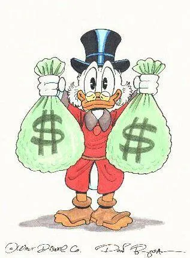

Let’s be honest.  Sales of [Mini-Compressor](http://saturdaymp.com/mini_comp "Mini-Compressor") have been steady, but what we really want is 4 bazillion people to buy a copy and tell 2 friends.  Then we can have bags with dollar signs on them!  And build our dream garage_\*_.

We’ve been working our little brains to think of ways to market our flagship product, on a basement level budget, and this is what we’ve come up_\*\*_

- $0.05 off coupon for [Mini-Wheats](http://www2.kelloggs.ca/Brand/brand.aspx?brand=188 "Mini-Wheats") when you purchase a copy of Mini-Compressor
- Chris will eat a bag of [Cadbury Mini Eggs](http://cadburyeaster.com/products.htm?categoryId=10 "Mini Eggs") when you click that Buy Now button (OK, this one will end up costing us money)
- Saturday MP will buy the cutest car ever made, a little [Mini Cooper](http://www.mini.ca/en/index.html "Mini Cooper"), when the 2 gabillionth copy of Mini-Compressor is sold
- Chris and Ada will take turns saying the words “[Mac Mini](http://www.apple.com/macmini/ "Mac Mini")” for every copy sold
- Send customers previously loved copies of [Mini Pops albums](http://www.ktel.com/store/store_mpk6.php?category=1 "Minipops").  Used record stores are probably littered with them!

_\* Among other things on our “things-to-spend-money-on list”.  You know, while we’re being honest._

_\*\* OK, we didn’t say they were good.  Just ideas.  Our ideas._
