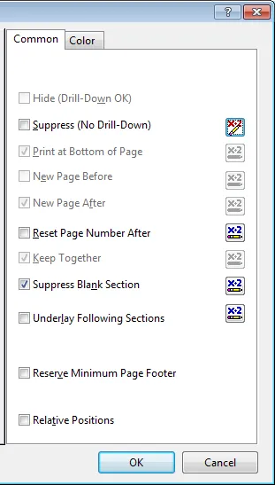
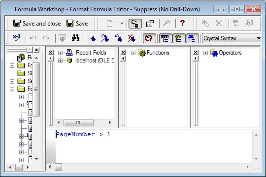

To display a section only on the first page but not on other pages right-click the section in question and choose Section Expert.

Click the x-2 button to the right Suppress (No Drill down) and add the following formula:

 Now this section will only appear on the first page.  Your welcome.
