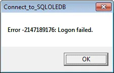

[](http://saturdaymp.wpengine.com/wp-content/uploads/2011/05/scissors.png)Just a heads up that [Visual Cut](http://www.milletsoftware.com/Visual_CUT.htm "Visual Cut") is really picky about command line arguments.  Visual Cut does a bunch of stuff with Crystal Reports but in my current project it is just used to print reports on demand.  The printing is done via a command line call to Visual Cut.

Reading the documentation and looking at the existing code the arguments seemed pretty straight forward, just standard key/value pairs in format "Key:Value".  For example:

```
> "Visual Cut.exe" "key:value" "key:value"
```

In most cases the command line arguments can have as many spaces as you want between them.  For example:

```
> "Visual Cut.exe" "key:value"         "key:value"
```

In Visual Cut you are only allowed one, and only one, space between the arguments.  If you put extra spaces then, for some reason, it doesn't work.  At least for the database command.  For example, I had:

```
> "Visual Cut.exe" -E "MyReport.rpt" "Connect_to_SQLOLEDB:Host>>Catalog>>TRUE"  "Export_Format:Adobe Acrobat (pdf)"
```

The weird "TRUE" is the integrated security argument.  You can read about the Visual Cut command line arguments in the [user manual](http://www.milletsoftware.com/Download/Visual_CUT_User_Manual.pdf#pagemode=bookmarks&zoom=100 "Visual Cut User Manual").

Did you notice the extra space between the Connect\_to\_SQLOLEDB and the Export\_Format?  I didn't.  If you run the above command, with the the extra space, you will get the old ADO -2147189176 error.  That brings back memories to my VB6 days.

[](http://saturdaymp.wpengine.com/wp-content/uploads/2011/05/connecttosqleldberror.png)

The easy fix is to remove the extra space between the arguments, then everything works fine.  If you don't notice the extra space, or think it's relative, then you spend a couple hours double checking there are no typos in the command line, database permissions are correct, and the process running Visual Cut has permission to login to the database via integrated security.

It was when I was randomly changing the command line arguments, delete arguments, etc. that magically the command worked.  I sat back stunned.  Why was it working now and not before?  Nothing seemed to be different?

When the "extra space solution" first came into my head I rejected it.  Actually, I came up with it in my subconscious and was rejected so quickly it never got into my consciousness.  A more accurate description is filed away as a solution, just a low probability one.  It wasn't until I returned from a short break that I thought I would try it.  What the hell, it would only take a second to try.  Of course it worked which prompted some sailor like language of both anger at Visual Cut and joy that I had figured it out.

Sadly that wasn't the bug I was originally trying to fix, just a bug getting in the way of the real bug.  I hate telling a client that several billable hours were wasted on a single space.
