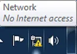

I was working on some new servers that were soon going to be production servers.  While working on them I noticed that they didn't have static IP addresses.  Being the good looking proactive guy that I am I sent a quick e-mail to the IT department offering to change the servers to static IPs myself since I was already working on them.  Once I got the OK I changed all the servers to static IPs.   The problem was I changed the servers to the static version of the IP address DHCP had given them.  For example, if the server had been given a DHCP address of 192.168.25.75 I set the static IP to the same thing.

I may be good looking and proactive but I'm not very smart when it comes to networks.  Every once in a while the static IP I had assigned the server would also get assigned to a new computer connecting the to the network.  Having 2 computers with the same IP address is a bad thing and can cause all sorts of issues.  In this case it was most noticeable when someone, like me, tried to VPN.  The VPN would work but I couldn't see anything else on the network.

It took almost two weeks for me and the IT department to figure out the VPN problem which turned out to be two computers with the same IP problem.  A problem which I created.  If you ever ask me what my network skills are like my answer will be "good enough to be dangerous to myself and others."
