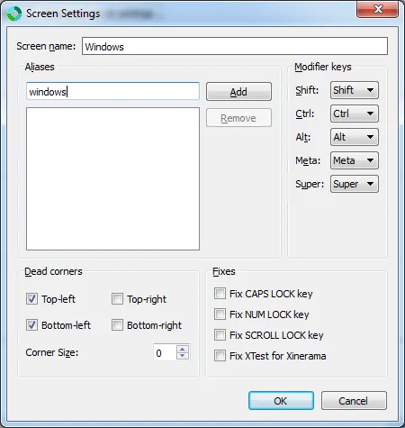
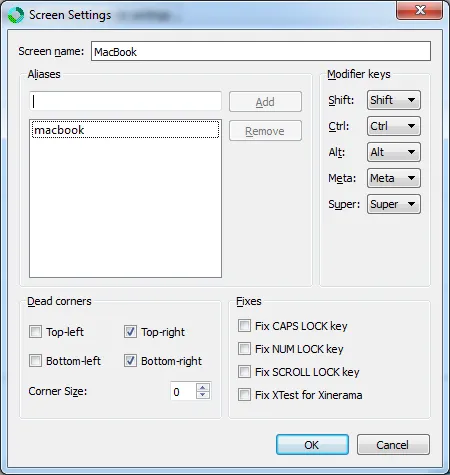
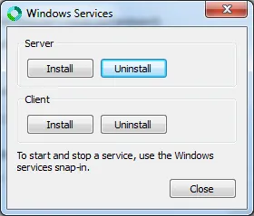
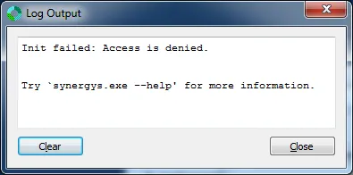
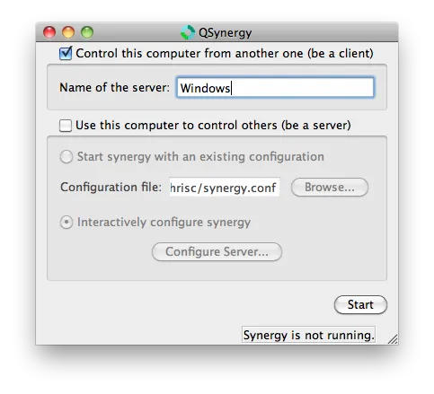

I've been developing the [Saturday MP](http://saturdaymp.com/ "Saturday Morning Productions") website, which was developed using [Ruby on Rails](http://rubyonrails.org/ "Ruby on Rails"), on Windows using [Rad Rails](http://www.aptana.com/products/radrails "Rad Rails").  Unfortunately developing on Ruby on Rails on Windows has a couple drawbacks:

1. It's hard to install Ruby and/or Rails on Windows.  It's getting easier with the [Ruby Installer](http://rubyinstaller.org/ "Ruby Installer") but still a pain.
2. The production environment is Linux which can make it hard to debug a problem that only appears in one environment

I've started migrating my development envrionment to a MacBook Pro which is Linux based and then I can try [TextMate](http://macromates.com/ "TextMate") which I hear so much about.  I hear a lot about TextMate.  Like I mean a lot.  Hopefully it will live up to my expectations and also cure cancer.

The main problem I have with moving my development environment to the Mac is physically interacting with the Mac via the keyboard and mouse.  There is no comfortable way to position the MacBook on my desk and type on it for long periods of time.  What I would really like to do is use my existing desktop keyboard and mouse with my MacBook.

The first thing I tried was setting up [VNC](http://en.wikipedia.org/wiki/Virtual_Network_Computing "VNC").  Mac OS X comes with a VNC server by default, all you need to do is turn it on via System Preferences-->Sharing.  Then pick Screen Sharing.  Once that is done I installed a VNC client on Windows such as [Ultra VNC](http://www.uvnc.com/ "Ultra VNC") or [Tight VNC](http://www.tightvnc.com/ "Tight VNC").

While VNC worked it wasn't quite optimal.  It's hard to position my MacBook for typing there is room for it to act as an extra monitor.  It would be nice to have my desktop monitors as well as my MacBook "monitor" all running at the same time.  Also VNC doesn't scale well from my wide screen hi-res laptop display to my not-as-wide-screen-hi-res desktop monitors.

Next I looked at [KVM switches](http://en.wikipedia.org/wiki/KVM_switch "KVM Switch") but they are expensive and you still need to reach out and click a button to switch between computers.  I'd much rather have VNC where I can switch between computers with the click of mouse rather then a physical click.

Finally I stumbled upon [Synergy](http://synergy-foss.org/ "Synergy") which lets you share one keyboard and mouse between multiple computers with different operating systems.  Synergy works by declaring one computer as your main/server computer where the mouse and keyboard are connected and several remote/client computers that will share the mouse and keyboard.

Below are the steps I took to get Synergy working with my computers.  It closely follows the steps outlined in this handy [Synergy 1.4 guide](http://www.dusanvuckovic.com/tutorials-2/interoperability/multiple-computers-with-one-keyboard-and-mouse-synergy/ "Synergy 1.4 Guide").  For reference I'm running Windows 7 64-bit and Mac OS X 10.6.

1) [Download](http://synergy-foss.org/download/ "Download Synergy") and install Synergy to my Windows desktop.

2) Windows will be the Synergy server.  If you are using Windows 7 you might need to run Synergy as Administrator by right-clicking on the Synergy Start Menu item and choosing Run as Administrator.  This is so we can install it as a Windows Service later.

Click the Server checkbox as shown below.  Then click the Configure Server... button.

[](http://saturdaymp.wpengine.com/wp-content/uploads/2011/07/synergyservermain.png)

3) At first the Server Configuration screen will just have one computer listed but in our case we want to add our MacBook.  Add the MacBook by clicking on the monitor on the top right and drag it into the gird.

[](http://saturdaymp.wpengine.com/wp-content/uploads/2011/07/synergyserverconfig.png)

4) Now configure each monitor by double clicking on them and setting them up as shown below.  Don't forget that Macs like to put ".local" at the end of the computer name.  So if your MacBook is called MyApple its network name will be MyApple.local.

[](http://saturdaymp.wpengine.com/wp-content/uploads/2011/07/synergyserverconfigleft.png)

[](http://saturdaymp.wpengine.com/wp-content/uploads/2011/07/synergyserverconfigright.png)

5) Now run Synergy as a Windows Service.  Do this by going back to the main Synergy screen and choose Edit-->Services from the menu.  Then click Install.

[](http://saturdaymp.wpengine.com/wp-content/uploads/2011/07/synergyserverservice.png)

If you get the following error then you need to run Synergy as Administrator.

[](http://saturdaymp.wpengine.com/wp-content/uploads/2011/07/synergyserverserviceaccessdenied.png)

6) To run Synergy open up the Windows Services, as admin if needed, and start the service.

7) Now the tricky part, setting up the Mac client.  There is no nice installer. You have to manually copy some files around.  First download synergy for the Mac.  Then copy the binarys to the bin folder and set them up to run the following commands:

```
sudo cp synergy* /usr/bin
sudo chown root /usr/bin/synergy*
sudo chmod 777 /usr/bin/synergy*
```

8) Install [QSynergy](http://www.volker-lanz.de/software/qsynergy "QSynergy") for the Mac.  The previous step just installed the Synergy command line tools.  QSenergy is a nice user interface so you don't have to muck around with config files.

To install drag the QSenergy folder from the Downloads folder to the Application folder.  Then double click on the QSenergy icon to run it.

9) Setup QSenergy as shown below then click Start.

[](http://saturdaymp.wpengine.com/wp-content/uploads/2011/07/qsenergy.png)Now you should be able to move your mouse between the two computers.  To disable keyboard sharing right click on the Synergy icon in the notification area and choose Quit.

P.S. - The Windows key, the key with the wavy flag thingy, becomes the Mac's Command key.

P.P.S. - When playing a game, especially a full screen game, turn off Synergy otherwise your mouse might leave the full screen game to your Mac.  Not good during multiplayer games.

P.P.P.S. - Make sure you ask Ada's permission before you use her cordless mouse.
