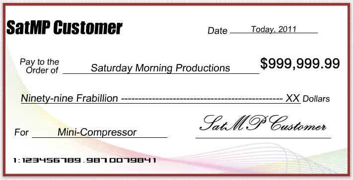
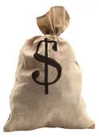

Let’s get this straight.  If anyone wants to give us money, we’ll gladly take it.  We’d be even happier if it was money for the sale of [Mini-Compressor](http://www.saturdaymp.com/mini_comp "Mini-Compressor"), but we’re not too picky.

We currently accept payment through all major credit cards as well as [Paypal](https://www.paypal.com/ca/cgi-bin/webscr?cmd=_flow&SESSION=eOGwPZx8Q3gYJkaVRWE8yNoyAXhrvfAOfy-k1MZGuyx9uk_fDi0kQY-75J0&dispatch=50a222a57771920b6a3d7b606239e4d529b525e0b7e69bf0224adecfb0124e9b61f737ba21b08198b897c0dd9782f17cd822063ff41faaba "Buy Mini-Compressor"), though an account is not required.   We’ve toyed with alternative ideas.  And by alternative, we really mean alternative.  Like, big fat novelty cheques:

\[caption id="attachment\_555" align="aligncenter" width="450" caption="It's signed, it's good!"\]\[/caption\]

Or a cloth bag with a dollar sign on it:

\[caption id="attachment\_556" align="aligncenter" width="109" caption="Re-usable Bag"\]\[/caption\]
