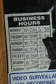

There’s a barber shop in our neighbourhood.  He’s recently cut his hours.  I’ve never met him before but I imagine he’s near retirement and would like to spend his hard earned money on trips and precious time with the grandkids.  I kinda imagine him to be like the [Wealthy Barber](http://www.chapters.indigo.ca/books/The-Wealthy-Barber-Gold-Edition-David-Chilton/9780968394731-item.html?ikwid=the+wealthy+barber&ikwsec=Books "The Wealthy Barber").  Anyway.  He cut his hours.  He’s only open limited hours 4 days a week.  Ironically, his shop is next to a former bank.  I got a few laughs when I told Chris it would be funny if we could get pictures of the new barber’s hours next to the bank’s hours.

Here at [Saturday MP](http://www.saturdaymp.com/ "Saturday Morning Productions"), we don’t keep banker’s (or barber’s) hours.  Being a developper, Chris naturally gravitates to odd hours.  And odd habits.  Plus, he’s an early riser.  Me?  I’m a night owl.  My productivity is highest in the mid-afternoon, around the time Adorable Daughter gets off school, or near home time if I was in a traditional office setting.  Doh!  Chris tries to take an after-lunch nap whenever he can.  And, when it comes down to it, if there’s a deadline or something pressing, we’ll put in late hours.  And, who can forgot our namesake?  Saturday Mornings!
