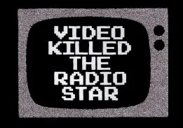

When music videos first came out, I think music\* stars thought this would be a clever way to market their music – you know, appeal to the visual learners.  I don’t think they thought it would essentially quadruple their workload – learning ‘acting’ parts/dance moves – not to mention hiring of directors, writers, models, dancers.

While we don’t make any music videos at Saturday MP, I can’t help but relate to this model and blame the Internet for making us more work.  Sure, we sell [Mini-Compressor](http://www.saturdaymp.com/mini_comp "Mini-Compressor") on the Internet.  We market on the Internet.  We look up movie times on the Internet.  We love the Internet.  It has made us money, but it has made us more work too.

It’s no longer good enough for us to have an awesome software product.  Now we have to deal with SEO (I thought that was CEO spelled funny) and AdWords.  Not to mention blogging semi-regularly so visitors to our site don’t think we’re defunct.  And don’t get me started on FaceBook and Twitter.

Think about the last time you hunted for a plumber.  If it didn’t have e-mail, a website and fancy graphics, did you automatically discount it as not a good plumber and went to the next guy?  How about restaurant?  Same thing?  No menu online?  Skip it.

There’s so much pressure!

If you’ve come here to check out [Mini-Compressor](http://www.saturdaymp.com/mini_comp "Mini-Compressor"), here’s the final word.  It’s a great product.  We love it.  We use it.  Tell a friend!

If you’ve come here to check out [Chris or Ada](http://www.saturdaymp.com/consulting "Chris and Ada"), we’re legit too.

Thanks for paying attention.

\* pop, rock, rap, whatevah
