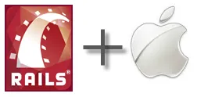

My notes for installing Ruby on Rails on 3.1 on Mac OS X 10.6.  This is not a tutorial or a how-to, just the notes I took as I tried to get Ruby on Rails up and running.

[](http://saturdaymp.wpengine.com/wp-content/uploads/2011/12/railsplusmac.png)

1) By default Ruby 1.8.7 is installed on the Mac and I've installed X-Code 4.

2) Surf the web a bit and find [this website](http://blogs.justenougharchitecture.com/?p=82) that talks about [Mac Ports](http://www.macports.org/ "Mac Ports").  Download and install Mac Ports.

3) In a terminal install ruby via the ports by doing:

```
sudo port install ruby19
```

5) Ruby 1.8.7 is still installed and is still the default.  Read on how to change that and find out about [RVM](http://beginrescueend.com/ "RVM").  Try RVM instead of MacPorts.  First remove Ruby 1.9.2 installed by MacPorts:

```
sudo port uninstall ruby19
```

Then uninstall MacPorts.  More details [here](http://guide.macports.org/chunked/installing.macports.uninstalling.htm "Uninstalling Mac Ports").

```
sudo port –f uninstall installed
```

You can also do some clean-up by running the following:

```
sudo rm -rf
/opt/local /Applications/DarwinPorts
/Applications/MacPorts
/Library/LaunchDaemons/org.macports.*
/Library/Receipts/DarwinPorts*.pkg
/Library/Receipts/MacPorts*.pkg
/Library/StartupItems/DarwinPortsStartup
/Library/Tcl/darwinports1.0
/Library/Tcl/macports1.0
~/.macports
```

5) Install RVM.

```
bash << (curl -s href="https://rvm.beginrescueend.com/install/rvm">https://rvm.beginrescueend.com/install/rvm)
```

Then update your bash profile:

```
echo '[[ -s "$HOME/.rvm/scripts/rvm" ]] && . "$HOME/.rvm/scripts/rvm" # Load RVM function' >> ~/.bash_profile
```

Now if you open a new terminal window you should be able to type in RVM and get something.

6) Install Ruby 1.9.2:

```
rvm install 1.9.2
```

7)      Then make ruby 1.9.2 the default ruby to use:

```
rvm use 1.9.2</pre>
ruby –v
```

The last command ruby –v should now say 1.9.2.

8)      Gems should be installed already.  Update it to the latest version

```
gem update --system
```

9)      Install Ruby on Rails using Ruby Gems:

```
gem install rails
```
