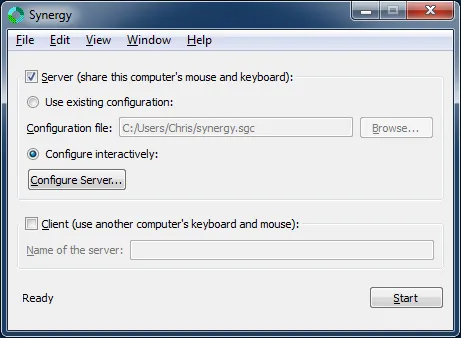
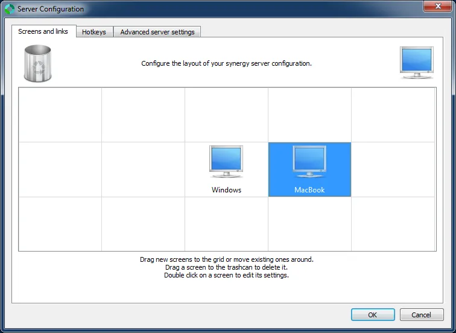
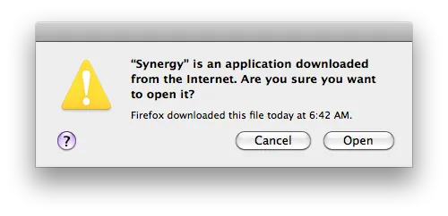
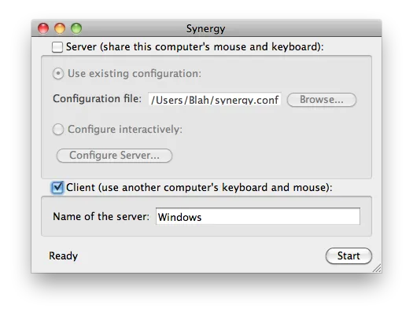

This replaces my [previous install instructions](http://nftb.saturdaymp.com/2011/07/18/share-a-keyboard-between-a-pc-and-a-macbook/ "Share a Keyboard Between a PC and a Mac") for Synergy. With the latest [Synergy](http://synergy-foss.org/ "Synergy") 1.4.5 Beta release it’s even easier to install on the Mac because you no longer need to install [QSynergy](http://www.volker-lanz.de/software/qsynergy "QSynergy").

Just a reminder that I am running Windows 7 desktop and Mac OS X 10.6 on a MacBook Pro.

There are still bugs with this Synergy such as double clicking on the Mac not working and copy pasting only working from Windows to the Mac but not the other way around.  I'm a bit behind the Mac upgrade curve and am still using 10.6 X.  Maybe upgrading to Mac OS X 10.7 (Lion).

The steps to install Synergy are:

1) [Download](http://synergy-foss.org/download/ "Download Synergy") and install Synergy to my Windows desktop.  My Windows computer will be the Synergy server. If you are using Windows 7 you might need to run Synergy as Administrator by right-clicking on the Synergy Start Menu item and choosing Run as Administrator.

Click the Server checkbox as shown below. Then click the "Configure Server…" button.

2) At first the Server Configuration screen will just have one computer listed but in our case we want to add our MacBook. Add the MacBook by clicking on the monitor on the top right and drag it into the gird.

3) Now configure each monitor by double clicking on them and setting them up as shown below. In my case I have my MacBook on the right of Windows monitors.  Don’t forget that Macs like to put “.local” at the end of the computer name so if your MacBook is called MyApple its network name will be MyApple.local.

4) I don’t run Synergy as a Windows Service anymore. Instead I just start it as needed via the start menu. This is a personal preference so I can easily stop Synergy if I’m going to play games.

5) Installing on the Mac is now much easier. Synergy for the Mac now comes with a nice interface so you don’t need to install QSynergy anymore. Download the Synergy for the Mac, which is a dmg file. Double click the dmg file and drag the Synergy file to the applications folder as you would any other Mac application.

6) When you first run Synergy on the Mac you might get the warning below. You can safely answer open.

7) Run Synergy on the Mac and set it up as shown below.

8) Click start and you should be able to share your keyboard between the two computers.
