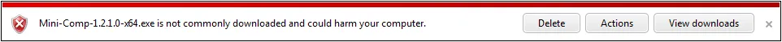

> ### If you don’t eat your meat, you can’t have any pudding!  How can you have any pudding if you don’t eat your meat!
> 
> #### \- [Pink Floyd](http://en.wikipedia.org/wiki/Pink_Floyd "Pink Floyd"), [Another Brick in the Wall](http://www.youtube.com/watch?v=YR5ApYxkU-U "Another Brick in the Wall Video")

Microsoft's [SmartScreen Filter](http://windows.microsoft.com/en-CA/windows7/SmartScreen-Filter-frequently-asked-questions-IE9 "SmartScreen FAQ") is the bane of small Independent Software Vendors (ISV) everywhere.  Maybe that is a little harsh, and I have no proof that SmartScreen Filter is a problem for other ISVs, but it has, and as of this writing, still is a problem for Saturday Morning Productions.  Besides, that first sentence is a good sensationalist sentence, perfect for a newspaper article or blog post.

So what is SmartScreen Filter?  It's a technology in [Internet Explorer](http://windows.microsoft.com/en-CA/internet-explorer/download-ie "Internet Explorer") that tries to prevent users from visiting websites and downloading software that might harm their computer. That is a noble goal and one I fully support.  The problem is the implementation.

SmartScreen Filter works by checking if the software being downloaded has been downloaded by other people.  If lots of people have downloaded the software and haven't reported any problems then SmartScreen Filter thinks the software is safe and tells the user so.  If lots of people have downloaded the software but reported problems then SmartScreen Filter warns the user about downloading and installing the software.  That part is fine.

The problem is SmartScreen does not trust new software by default and when a user tries to download and install said software they get a nasty message in red like the one below.

How many people are going to be downloading software that displays that message?  Thus starts the problem with SmartScreen filter:

> ### If no one downloads your software, SmartScreen won’t trust you!  How can SmartScreen trust you if no one can download your software!

So begins my epic quest to get [Mini-Compressor](http://saturdaymp.com/mini_comp "Mini-Compressor") off SmartScreen’s naughty list and onto the nice list.  This includes getting a [code signing certificate](http://en.wikipedia.org/wiki/Code_signing "Code Signing Certificate"), trying to get Windows 7 certified, which has the long winded name “Windows 7 Software Logo Program” ([WSLP](http://msdn.microsoft.com/en-us/windows/dd203105.aspx "Windows Software Logo Program")), and other unknown perils.  I wonder how far I will get?

[Here be dragons](http://en.wikipedia.org/wiki/Here_be_dragons "Here be dragons").

[Part 2: Getting a Code Signing Certificate](http://nftb.saturdaymp.com/dealing-with-microsofts-smartscreen-filter-part-2-getting-a-code-signing-certificate/ "Dealing with Microsoft’s SmartScreen Filter Part 2: Getting a Code Signing Certificate")
