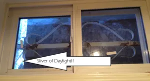
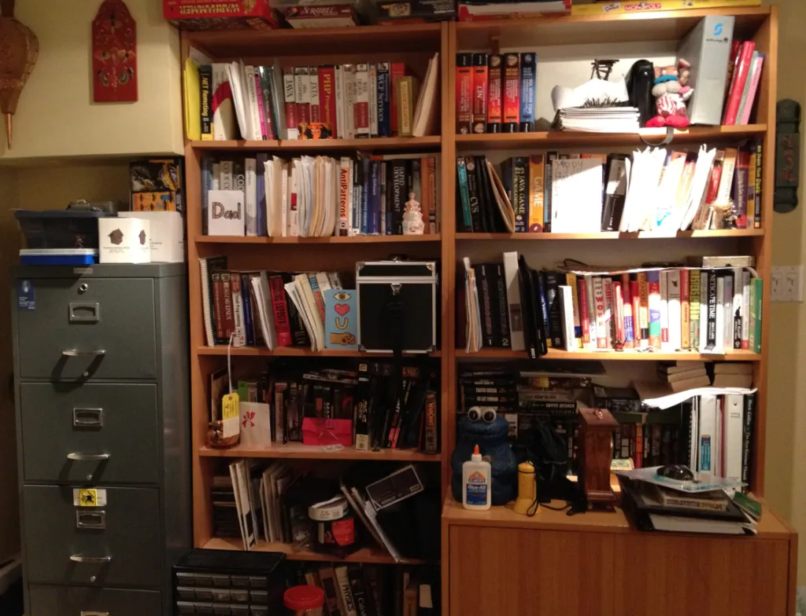

Some of you have asked for a little more detail on our physical workspace, as an extension on our [series](http://nftb.saturdaymp.com/working-together-part-1/ "Working Together - Part 1") - [working with a spouse](http://nftb.saturdaymp.com/working-together-part-2/ "Working Together - Part 2").

This may be taken as a belated February Hallmark Holiday post.

Our basement-based office is in the basement.  We cannot make this clearer when we say only one of us gets the window seat.  As in, there is only one window seat.  I like the afternoon sun hitting me as I, ahem, analyze businesses.  Chris doesn’t like it near him as he develops software.  I got the window seat.

The entire space is 11 feet (3.35 m) by 12.58 feet (3.84 m) so, really, that sunlight is going to shine.

In this 11 feet (3.35 m) by 12.58 feet (3.84 m) space, we have the following furniture:

- 2 Swedish self-assembled book shelves
- 1 second hand filing cabinet
- 2 folding tables
- 1 printer/scanner sitting on 1 re-imagined night table
- 1 Dad-built desk
- 1 folding table that is modified to my height and functions as a desk
- 1 shredder
- 1 garbage can
- 1 [Mira](http://www.hermanmiller.com/products/seating/performance-work-chairs/mirra-chairs.html "Love my chair") chair
- 1 [Aeron](http://www.hermanmiller.com/products/seating/performance-work-chairs/aeron-chairs.html "Love my chair") chair
- 1 ginormous whiteboard
- 1 bulletin board
- 1 phone
- Various personal effects
- Lots of blinking lights that I’m told power the internet
- 1 cookie jar

This is where the magic happens.  This is where Mini-Compressor and other secret projects are conceived and developed.  This is where support calls are answered.  This is where we consult when not on client site.

If you ever find you and your spouse co-owning a basement-based software and consulting company, we think you can get your best result by building an exactly 11 feet (3.35 m) by 12.58 feet (3.84 m) room in your basement, cramming it with the above furniture items, getting awesome chairs and giving the window seat to the person who is least like a vampire.

Then let your creativity flow.

