This is part 2 of dealing with [Microsoft's SmartScreen](http://windows.microsoft.com/en-CA/windows7/SmartScreen-Filter-frequently-asked-questions-IE9 "SmartScreen Filter") Filter.  You can find the first part [here](http://nftb.saturdaymp.com/dealing-with-microsofts-smartscreen-filter/ "Dealing with Microsoft's SmartScreen Filter Part 1").

I figured the best way to deal with SmartScreen filter was to get [Mini-Compressor](http://www.saturdaymp.com/mini_comp "Mini-Compressor") [Windows 7 certified](http://en.wikipedia.org/wiki/WHQL_Testing "Certified for Windows").  Windows 8 had just been released but I figured if I could get Windows 7 certified upgrading to Windows 8 certification shouldn't be a problem.  At the time I had not tested Mini-Compressor on Windows 8 but I had done lots of testing on Windows 7.

I found the Windows 7 certification site at:

[https://sysdev.microsoft.com](https://sysdev.microsoft.com)

I logged in with a Microsoft account and was then told I need to create a company account.  To do that I need a code signing certificate.  I knew I would eventually need a code signing certificate but didn't think I would need one so quickly in the process.  I clicked the link to code signing certificate from VeriSign for $99.

[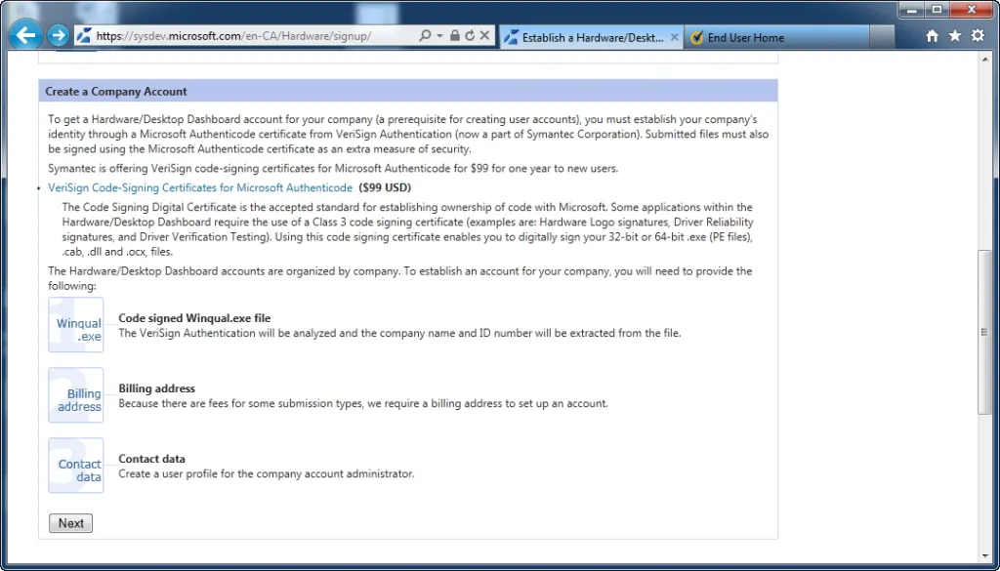](http://nftb.saturdaymp.com/wp-content/uploads/2013/03/01-Create-Company-Account.png)

Once on the Symantic site I was prompted for some information and to link my Windows Live ID:

[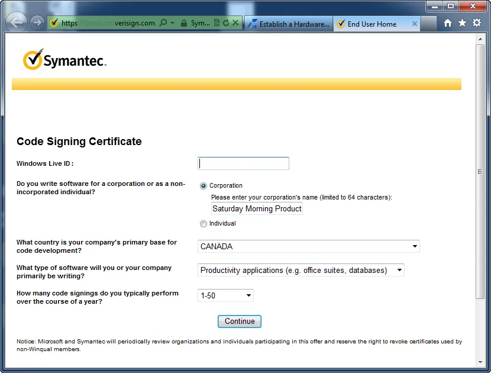](http://nftb.saturdaymp.com/wp-content/uploads/2013/03/02-CodeSigningCert.png)

An e-mail is then sent to you to confirm your e-mail address.  Follow the directions in the e-mail.

[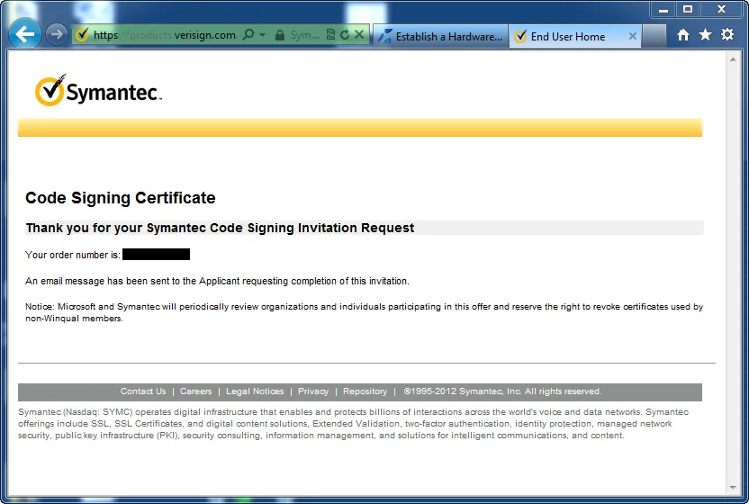](http://nftb.saturdaymp.com/wp-content/uploads/2013/03/03-CodeSigningInvitaionRequest.png)

I was then prompted for the type of certificate I wanted.  I chose Microsoft Authenticode.

[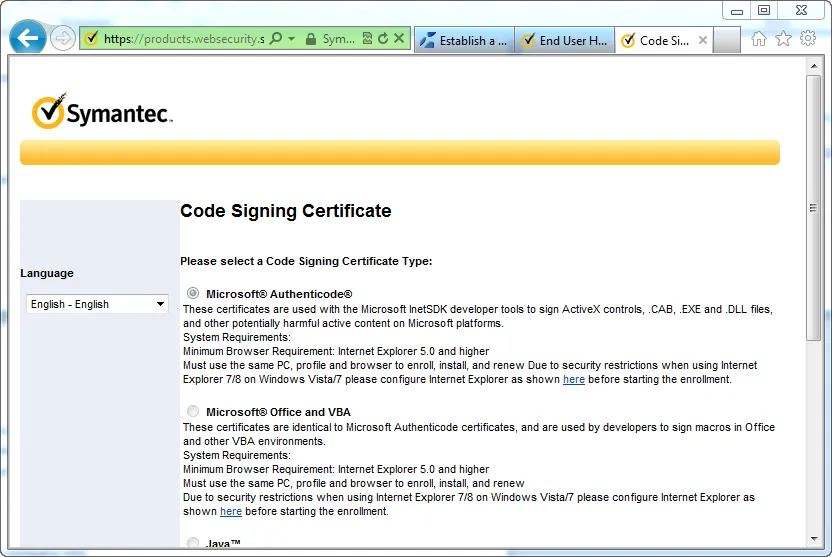](http://nftb.saturdaymp.com/wp-content/uploads/2013/03/04-CodeSigningTypeOfCert.png)

Then I had to pick validity period and a couple of other options.  I had to choose one year because I was getting the special Microsoft discount.  I also choose to Enable Auto CSR Generation.  This lets your browser generate the keys for your certificate rather than using a third party tool.

[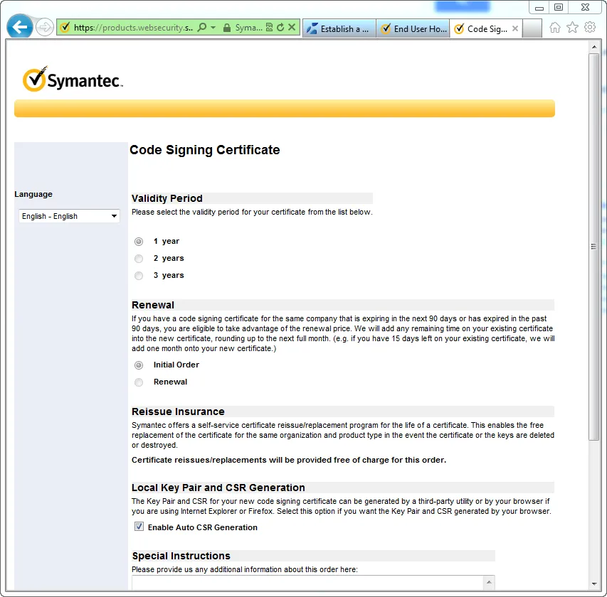](http://nftb.saturdaymp.com/wp-content/uploads/2013/03/05-CodeSigningValidity.png)

Then the code signing certificate is generated.

[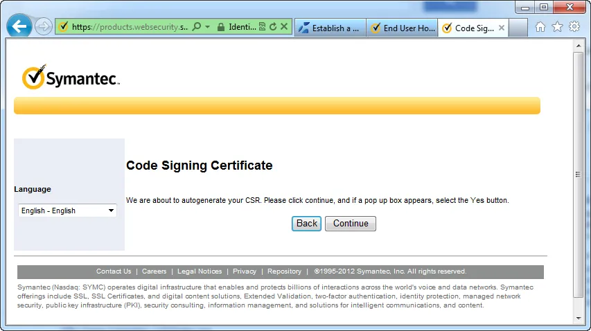](http://nftb.saturdaymp.com/wp-content/uploads/2013/03/06-CodeSigningAutoGenCsr.png)

[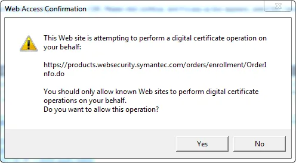](http://nftb.saturdaymp.com/wp-content/uploads/2013/03/07-CodeSigningConfirmPopup.png)

Now that the keys are generated I need to enter some information about Saturday Morning Productions, contact info, and finally some billing information.

[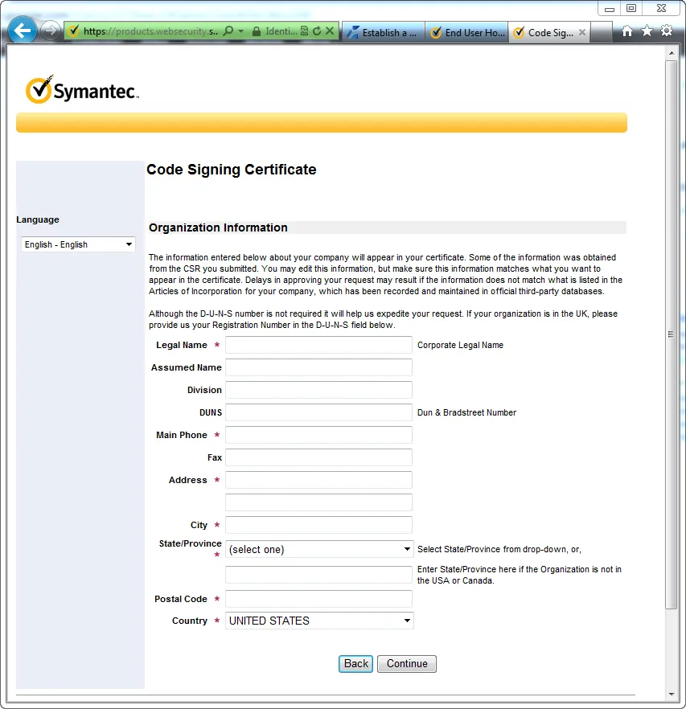](http://nftb.saturdaymp.com/wp-content/uploads/2013/03/08-CodeSigningOrganizationInfo.png)

[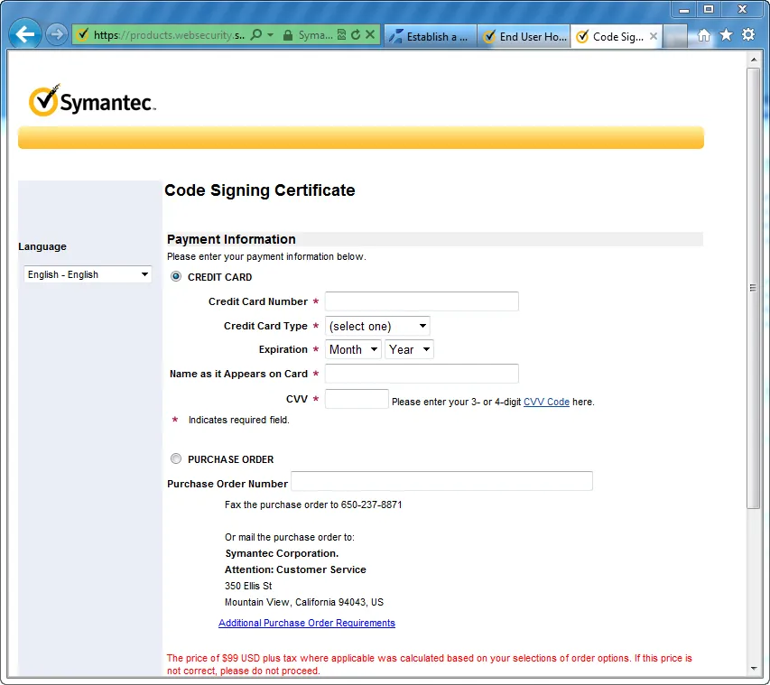](http://nftb.saturdaymp.com/wp-content/uploads/2013/03/10-CodeSigningPayment.png)

Finally you get an order summary.

[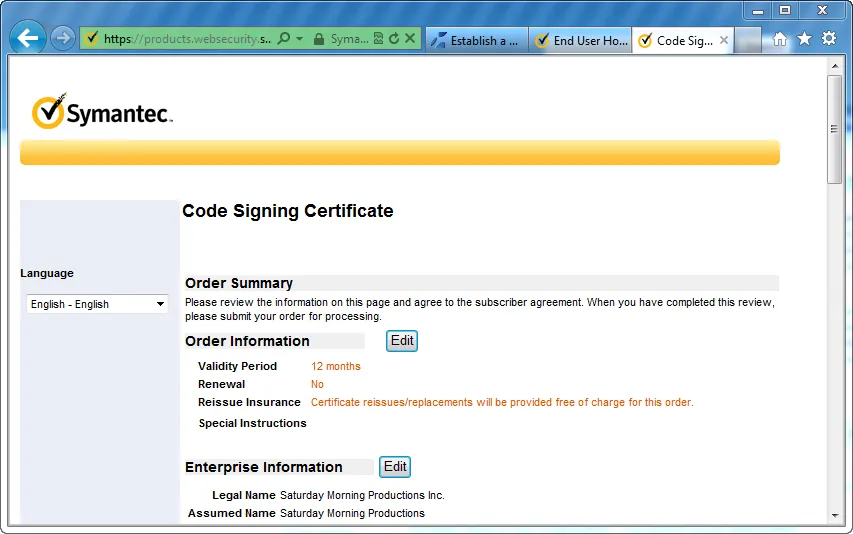](http://nftb.saturdaymp.com/wp-content/uploads/2013/03/11-CodeSigningSummary.png)

The certificate is ready but Symantec won't give it to me until they verify that I'm actually Saturday Morning Productions.  They did this by e-mailing me and requesting documents.  In my case they asked for business registration documents which I provided them.  Unfortunately the phone number on my business registration documents was out of date.

They asked for a phone bill with my company phone number.  That turned out to be a problem as well because my phone bill, for some reason, only had my personal name on it, not Saturday Morning Productions.  As a last resort I got a notary letter.  Luckily we know someone who is an excellent real estate lawyer.

This process took a week or two.  Thankfully the people at Symantec where polite and patient during the whole process

Once they accepted my notary letter I was prompted to pick-up my certificate.  It is important that you use the same computer that generated the certificate to download the certificate.  Once you have downloaded the certificate you can transfer it to another computer.

[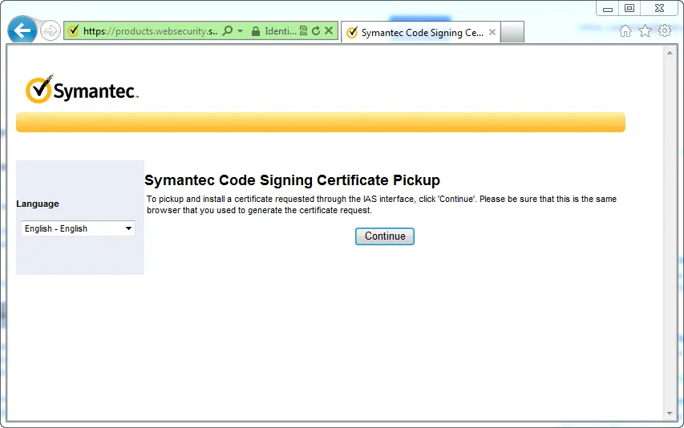](http://nftb.saturdaymp.com/wp-content/uploads/2013/03/12-CodeSigningCertPickup.png)

[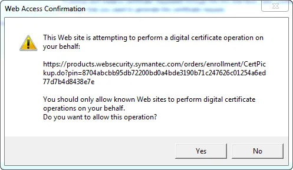](http://nftb.saturdaymp.com/wp-content/uploads/2013/03/13-CodeSigningConfirm.png)

[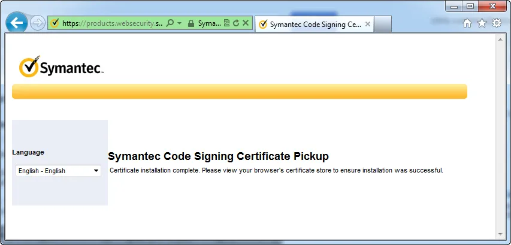](http://nftb.saturdaymp.com/wp-content/uploads/2013/03/14-CodeSigningCertPickupComplete.png)

To confirm that you have the certificate open up Internet Explorer and then open the options dialog.  Then click the Content tab and then click the Certificates button.  You should see your new certificate in the Personal tab.

[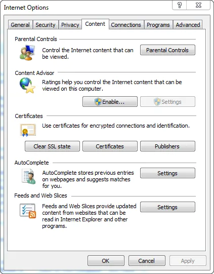](http://nftb.saturdaymp.com/wp-content/uploads/2013/03/15-ViewCertInIE.png)

[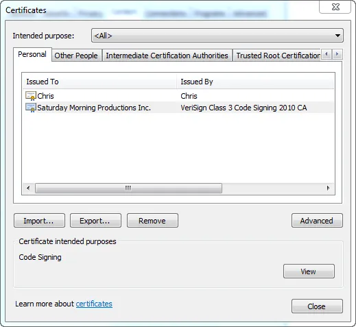](http://nftb.saturdaymp.com/wp-content/uploads/2013/03/16-ViewCertInIE.png)

To export the certificate so we can get it on our build machine you need to, unsurprisingly, click the export button.  Then follow the steps in the wizard.  In my case I left all the defaults as this was my first time.  After I was sure the export worked I went back and removed the key.

[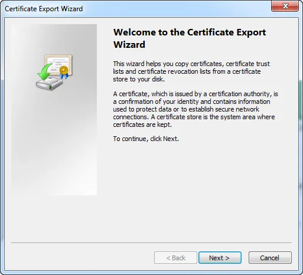](http://nftb.saturdaymp.com/wp-content/uploads/2013/03/18-ExportCertWelcome.png)

[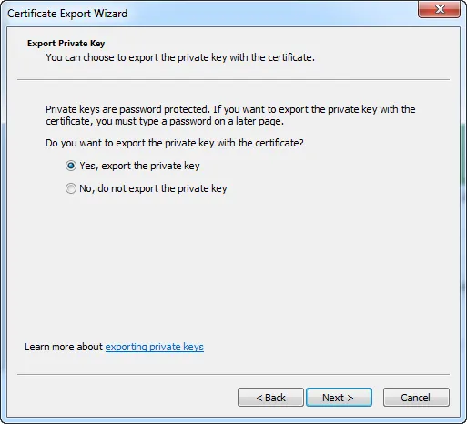](http://nftb.saturdaymp.com/wp-content/uploads/2013/03/19-ExportCertPrivateKey.png)

[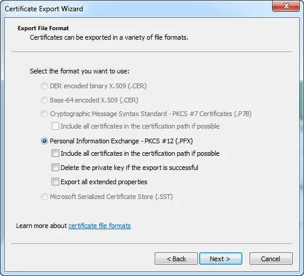](http://nftb.saturdaymp.com/wp-content/uploads/2013/03/20-ExportCertFileFormat.png)

Make sure you enter a good password and don't lose/forget the password.

[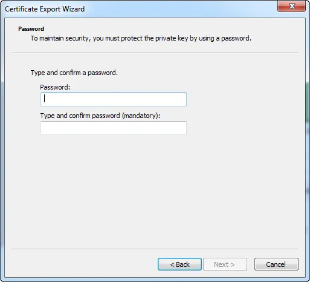](http://nftb.saturdaymp.com/wp-content/uploads/2013/03/21-ExportCertPassword.png)

Finally choose where to save your key.  Choose a safe location that is backed up and hopefully encrypted.

[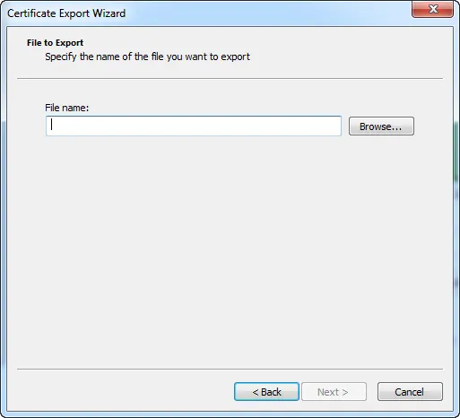](http://nftb.saturdaymp.com/wp-content/uploads/2013/03/22-ExportCertFile.png)

You know you have a valid code signing certificate when you can use it to sign installers and executables.  I'll detail how to actually sign stuff in another post.
