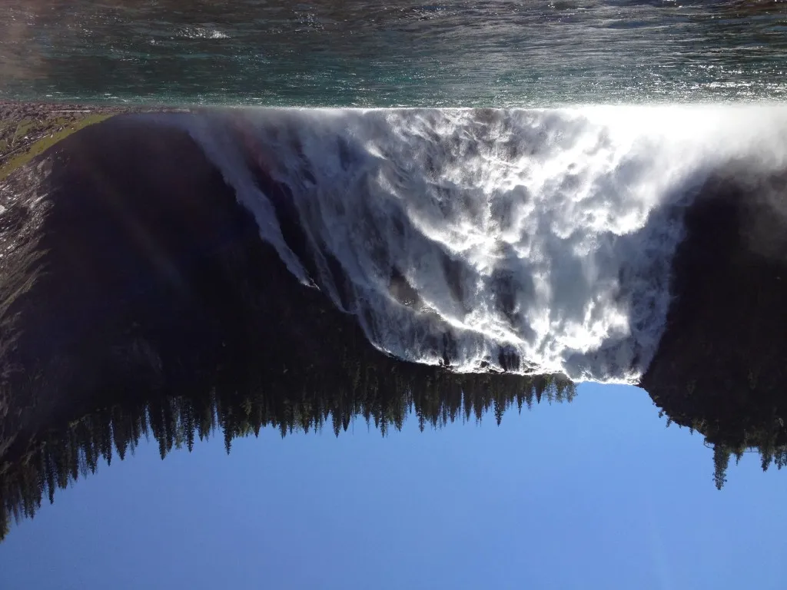
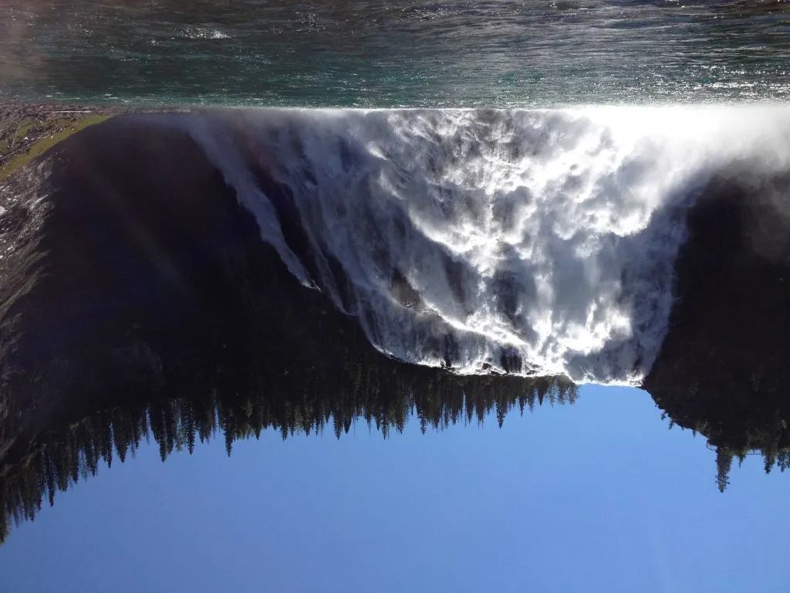

To continue with the Mini-Compressor Monday series, we have another beautiful summer vacation photo to share and another Mini-Compressor happy ending to tell.

[**Kinuseo Falls**](http://nftb.saturdaymp.com/wp-content/uploads/2013/10/Kinuseo-e1381168467425.jpg "Saturday Morning at Kinuseo Falls") **in Northern British Columbia**

**Total photo size: 2,576 KB** **Taken with iPhone 4S**

Breathtaking?  Yup!  Immediately shareable?  Not quite.

\[showhide type="post" more\_text="Show more..." less\_text="Show less..."\]

The Uncle_\*_ who so graciously boated us to the falls that early Saturday Morning, forgot his camera so we wanted to email this picture, plus a few others of our silly picnic on the sandbar and the ones of the Norwegian cousin getting soaked…  It took 16.4 seconds to attach the uncompressed jpeg alone.  It would take another bit of time to attach the rest, and send the email.

It took 7.3 seconds to upload to the [Saturday MP Flickr](http://www.flickr.com/photos/104243102@N02/ "Saturday MP Flickr Photos") site.  That is, 7.3 seconds for this one shot.  Again, start that stopwatch for all the rest of our river shenanigans.

The bottom line: why waste all this time when you just let Mini-Compressor do the walking?

|    | **Full-size photo** | **Photo compressed 75** | **Photo compressed 50** |
| --- | --- | --- | --- |
| **Attach to Email** | 16.4 seconds | 7.2 seconds | 10.5 seconds |
| **Upload to Flickr** | 7.3 +2.7 seconds | 2.7 + 2.6 seconds | 8.1 + 2.0 seconds |

Now, to those worried about quality-loss, we say relax!

Take a look at the same photo after compressing to quality of 75%.  Not much difference?

**Kinuseo\_75.jpg** **Compressed Image Quality = 75** **Compressed Image Suffix = \_75** **File Size: 1,099 KB**

How about after compressing the image to quality of 50%?

**Kinuseo\_50.jpg** **Compressed Image Quality = 50** **Compressed Image Suffix = \_50** **File Size: 530 KB**

Now, the trained eye can detect a little loss in quality: the sun’s rays are a little fuzzy and the sky is not as crisp.  There is no colour quality loss.

You get the idea that it was a bright beautiful day, the water was chilly and falls were stunning.  If you look close enough, you can still feel the spray of the falls and hear the squeals of the kiddies.  Overall, the memories of the amazing day are intact.

And your post-vacation photo show off_\*\*_ time is well-spent.  Thanks, Uncle and Mini-Compressor for the great memories!

Do you have any summer memories to share?  How about one where Mini-Compressor saves the day?

_\* Hypothetically speaking.  Not The uncle – he’s real – but he doesn’t have email.  The times clocked are real, though._

_\*\* The Uncle lives in the country.  If he had internet access, it would likely be dial-up service.  Speed is important for him – both his boat and his hypothetical photo downloads._

\[/showhide\]
