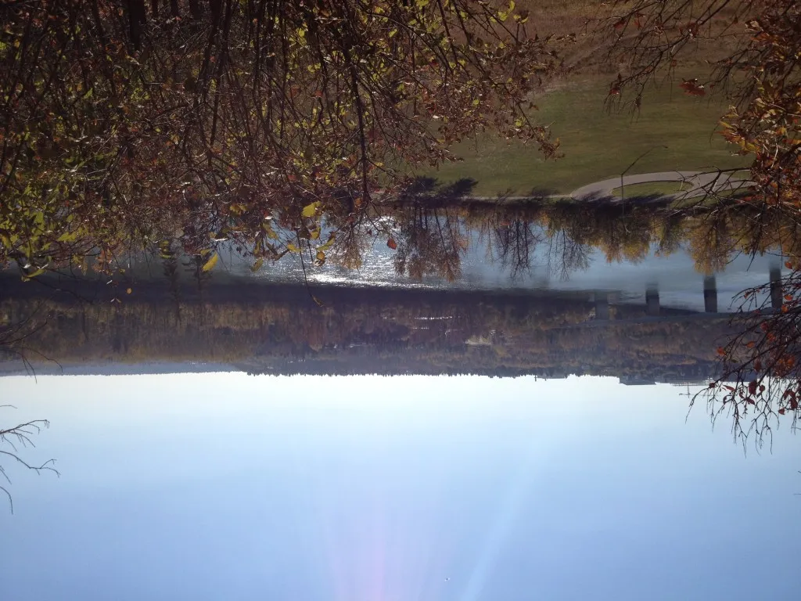

People all across Canada celebrated Thanksgiving this weekend, including this Saturday MP family!

Here we are thankful for four distinct seasons, a plentiful harvest (cough, behemoth garden), record sales, gainful contracts and wonderful customers!

Here is a photo of Edmonton’s famed river valley, taken last October.

**October 2012.jpg **Total photo size: 2,931 KB**** **Taken with iPhone 4S**

I snapped it to show off to friends who live abroad.  With one right-click, I was able to resize the photo to email.

\[showhide type="post" more\_text="Show more..." less\_text="Show less..."\]

**October 2012\_75** **Compressed Image Quality = 75** **Compressed Image Suffix = \_75** **File Size: 1,026 KB**

With 2 more right-clicks, I was able to resize the photo twice more!

**October 2012\_50** **Compressed Image Quality = 50** **Compressed Image Suffix = \_50** **File Size: 642 KB**

**October 2012\_25** **Compressed Image Quality = 25** **Compressed Image Suffix = \_25** **File Size: 405 KB**

Why so many right-clicks?  I was mostly curious to see what the quality loss would be with reducing the image size.  Here are the notes I took of the details.  I invite you to click on each image to see if you can see the same things:

- The shadow cast by the street light in the lower left of the photo is slight less crisp with compression index of 75.
- The sky is a bit streaky with compression index of 50.
- The sun’s rays are noticeably fuzzier with compression index of 25.
- The detailing of the grassy portion of the photo begins to get lost with compression index of 25.
- The colour of the river is slightly 'pixelized' with compression index of 25.
- The teeny tiny bird at the top centre of the photo is still there throughout, and barely distinguishable.

\[/showhide\]

Speaking of image size, we want to clarify ‘resizing’ and ‘reducing’ and ‘compressing’:  the original photo was 3264 pixels wide by 2448 pixels in height.  The dimensions of the photos do not change with each compression, only the size of the jpeg file.  That's what we mean by reducing an image size.  Remember, Mini-Compressor started as a tool to [easier email baby photos](http://saturdaymp.com/mini_comp_backstory "Mini-Compressor Origins") with little to no quality loss.  Since our mission is accomplished, we love to share this baby with you too!

Chris will have to explain the science behind the compression index and the size of the photos i.e. why using a compression index doesn’t just cut the number of KB in half?  But that's for another post.

We’ll also tackle upload times to Facebook and [Flickr](http://www.flickr.com/photos/104243102@N02/ "Saturday MP Flickr Photos") and email attachment times in another post.

In the meantime, we hope you’re enjoying autumn, wherever you are.
