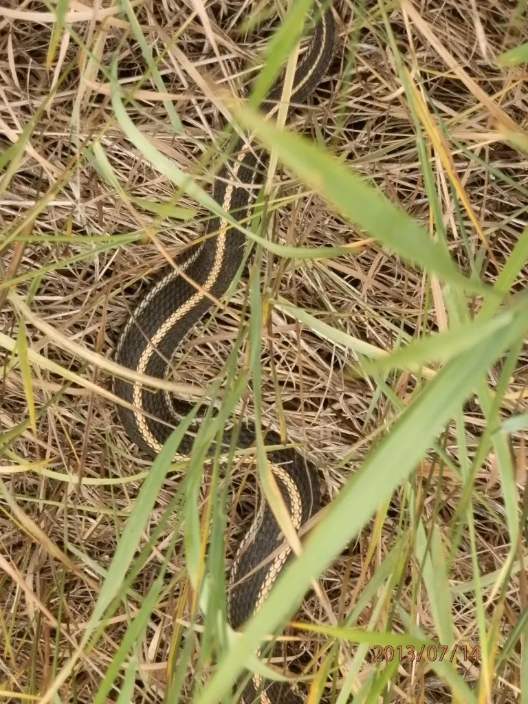

We ate ice cream, climbed mountains, gardened and worked.  Yeah, worked.

Aside from breaking [sales](http://saturdaymp.com/news/monthly_sales_record_tied) [records,](http://saturdaymp.com/news/now_trending) we were also coming up with other ways to explain our wares.

So, today, we unveil: Mini-Compressor Monday_\*_

In the vernacular of the geeky world I live in, Mini-Compressor Mondays is a series similar to "Yarned by You" and "Fashion Friday", where the blog posts focus on the practical applications of Mini-Compressor.

Today, for our inaugural post, we present this snake, cleverly named Snake-y.

**Original Snakey** **Total photo size: 1,786 KB** **Taken with Olympus SZ-10**

Snake-y’s photo was taken at a family reunion this July.  Needless to say, this reunion crasher was an instant celebrity.  When we returned, his photo was immediately shared.  The problem was emailing a photo that is 1,786 KB along with several other ones from the weekend.  It would take forever!  Uploading to the reunion Facebook page - along with the 48 other real stars of the show?  We estimate a good chunk of the work day!

I took Snake-y’s original photo and right-clicked on it.  Mini-Compressor did the rest of the work!

\[showhide type="post" more\_text="Show more..." less\_text="Show less..."\]

I wasn’t sure what compression index to use and experimented.  May I present… Snakey, Compressed:

**Snakey\_75** **Compressed Image Quality = 75** **Compressed Image Suffix = \_75** **File Size: 1,099 KB**

**Snakey\_50** **Compressed Image Quality = 50** **Compressed Image Suffix = \_50** **File Size: 738 KB**

**Snakey\_35** **Compressed Image Quality = 35** **Compressed Image Suffix = \_35** **File Size: 588 KB**

**Snakey\_25** **Compressed Image Quality = 25** **Compressed Image Suffix = \_25** **File size: 495 KB**

When you look at Snakey\_75, you can still see the detailing of the green and brown grass.

The same can be said for Snakey\_25!  The photos are virtually identical - even the pesky date stamp in the right corner is just as brisk as the original image – without being as large a file as the original.  Now that’s time well spent!

\[/showhide\]

_\*Hey, tell you what?  You create your own software and you can name your own blog series?  How’s that sound?_
