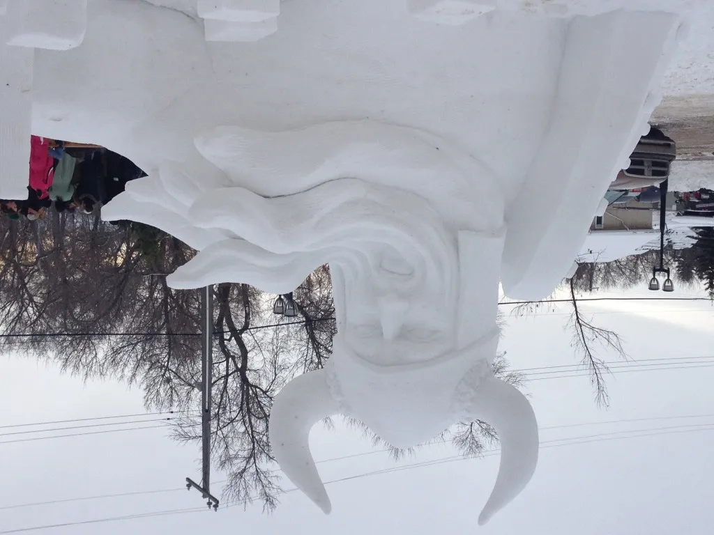
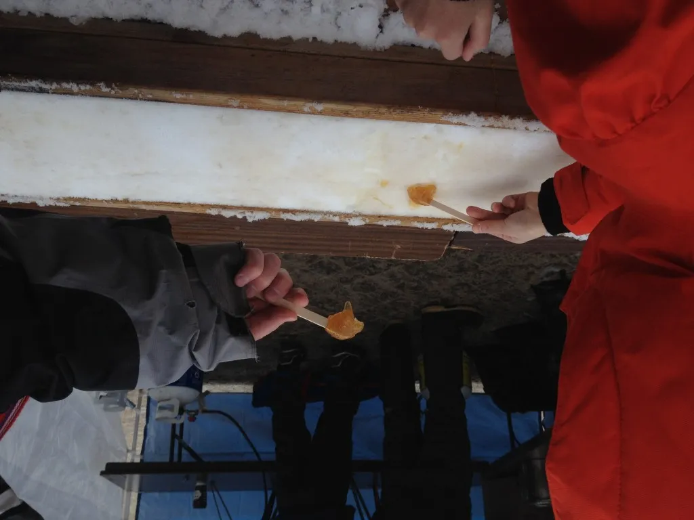
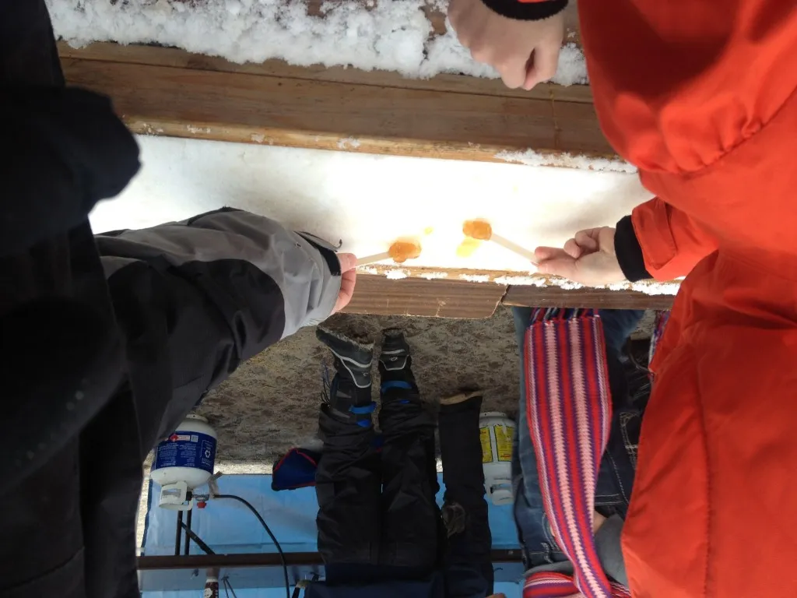

Those of you in this part of the world will know Edmonton was lucky enough to escape that nasty phenomenon known as the [Polar Vortex(TM) 2014](http://en.wikipedia.org/wiki/2014_North_American_polar_vortex "Brrrrr") that happened last week. However, those of you who know of this part of the world will know we’ve suffered through sub-zero temperature for weeks now (with no catchy brand-name, other than the tag known as “Winter”)_**\***_.

The SatMP family ventured out of the basement and took advantage of the mild temperatures by visiting the [Deep Freeze Festival](http://deepfreezefest.ca/ "Edmonton's Deep Freeze Festival").  It was a lot of fun.

Here are 3 notable shots taken with my iPhone 4: a Norse god Snow Sculpture and 2 of ‘the kids’ experiencing a traditional Quebecois [_Cabane a Sucre_](http://en.wikipedia.org/wiki/Sugar_house "Cabane a Sucre").

\[caption id="attachment\_979" align="aligncenter" width="640"\] Norse Guy  
Full Size = 1.99 MB\[/caption\]

\[caption id="attachment\_981" align="aligncenter" width="640"\] Yum  
Full Size = 2.01 MB\[/caption\]

\[caption id="attachment\_977" align="aligncenter" width="640"\] Cabane a Sucre  
Full Size = 1.86 MB\[/caption\]

Like the time it took for that maple syrup to be slurped up, it also only took seconds to compress the photos (with no quality loss_**\*\***_):

\[caption id="attachment\_980" align="aligncenter" width="640"\] Norse Guy\_90  
Compressed Size = 1.13 MB\[/caption\]

\[caption id="attachment\_982" align="aligncenter" width="640"\] Yum\_90  
Compressed Size = 1.07 MB\[/caption\]

\[caption id="attachment\_978" align="aligncenter" width="640"\] Cabane a Sucre\_90  
Compressed Size = 0.97 MB\[/caption\]

We hope you’re find ways to keep warm in your parts of the world!

_**\*** And those of you know really know Edmonton, know that we’re wise enough to both embrace Winter as well as curse it. Go Festival City!_

_**\*\*** In fact check out the fuzzy horn things on Norse Guy's helmet.  Still impressively fuzzy._
