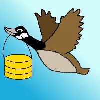

Migratory animals keep finding me, no matter where I find myself in life. Allow me to introduce myself: my name is Liv, and I am a new member of the Saturday Morning Productions team. I have never taken a computer class in my life, other than keyboarding on a rickety Apple with "Alphaworks" on one of those giant black floppy disks when I was in junior high, but I somehow found myself sitting at a table with a rather techno-savvy crowd.

It started with a smiling goose.

I am a wildlife biologist who tends to work more in the food industry than directly in the world of science. I studied migratory caribou for nearly a decade, but like my study animal, wanderlust got to me and I ended up working at a restaurant where I met Ada. We clicked right away and, when we both left to pursue other interests, wanted to continue working together. Ada and Chris broached the subject of me growing the social media aspect of Saturday Morning Productions, to which I happily agreed.

However, when I learned about their [Migrator](https://bitbucket.org/saturdaymp/migrator) program, which "migrates" large databases, an image sprang to mind. A happy goose carrying a database icon. I sketched it out and coloured it in. A smiling goose, wings in a big "V" toting a yellow cylinder, all set against a bright blue sky. I created a digital version and soon the Migrator logo was hatched. It struck me immediately. Another migratory animal found me; geese are certainly a case study in terms of animals that undertake long-distance seasonal migrations. This helpful goose, i.e., me, will help you smile when you need to migrate a large set of data, and provide some humour out there in the world of twitter and Facebook.

 

