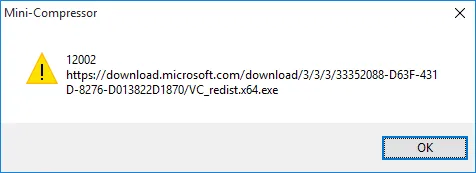
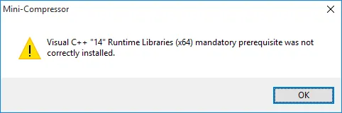

**Update:** The below issue has been fixed in Mini-Compressor version 1.6.1 which can be found on our [Download page](http://saturdaymp.com/downloads).  Thank you for your patience.

We have confirmed an error when installing Mini-Compressor.  If you get one of the errors below, or something similar, we have a workaround until the error is fixed.

_12002 https://download.microsoft.com/download/3/3/3/33352088-D63F-431D-8276-D013822D1870/VC\_redist.x64.exe_

_Visual C++ "14" Runtime Libraries (x64) mandatory prerequisite was not correctly installed._

The workaround is to manually install the Visual C++ 14 Runtime Libraries which you can find at:

[https://www.microsoft.com/en-ca/download/details.aspx?id=48145](https://www.microsoft.com/en-ca/download/details.aspx?id=48145)

Sorry for the inconvenience and we will let you know when this issue is fixed.
