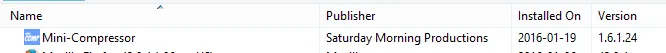

We’ve recently had some inquiries regarding Mini-Compressor on Windows 10. More specifically, customers who have been using it without problems, and are now experiencing trouble after upgrading to Windows 10 from Windows 7 or 8.

We hope this will help those of you potentially with this problem.

First of all, Mini-Compressor works on Windows 10.  The problem seems to be when users upgrade to Windows 10.

After successfully upgrading to Windows 10, you need to uninstall Mini-Compressor then re-install it. If you’re not sure how to do this, here are the steps.

1\. Go to your Windows Start bar and search for “Control Panel”

2\. In Control Panel, click on “Uninstall a Program” under “Programs”

 

 

3\. In the Name column, right click on “Mini-Compressor” and choose “Uninstall”.

This should take a few minutes.  Once it is finished, “Mini-Compressor” will no longer appear in the Name column and we will start fresh.

4\. Go to where you downloaded**\*** the Mini-Compressor Install program and double-click on it to install.  It should take a few minutes.

5\. When it is complete, you will be able to right-click on your photo file in the Windows File Explorer, and get the Mini-Compressor menu choice in your right-click menu, just like before.

**\*** Remember, after you have purchased Mini-Compressor once, you can re-download it from [www.saturdaymp.com/downloads](http://www.saturdaymp.com/downloads) when needed.  Just enter the email address that you used to purchase Mini-Compressor.  A download link will be emailed to you.

If you still need help, by all means, send us an email at support(at)saturdaymp.com, describing what errors or problems you got along the way.
