I do all my development inside virtual machines.  This allows me to keep separate development environment for different projects and clients.  I wanted to keep this tradition for developing mobile applications but that turned out to be a bit of challenge.

The [Xamarin Android Player](https://xamarin.com/android-player) and the [Genymotion emulators](https://www.genymotion.com) both use [VirtualBox](https://www.virtualbox.org/) to emulate the Android phone or tablet.  This works great if you don't develop in a virtual machine.  If you develop inside a virtual machine you run into a major problem:  you can't run a virtual machine inside a virtual machine.

At least with VirtualBox.  It appears that other virtualization products, such as [Parallels](http://www.parallels.com/) and [VMWare](http://www.vmware.com/) can do this but I use VirtualBox so that was a no go.

That said, I did try installing VirtualBox inside a guest Windows 10 VirtualBox but that didn't work.  No surprise there as all the documentation said it wouldn't but I'm stubborn/stupid that way.

The solution is to have two separate virtual machines running at the same and have them talk to each other.  The first guest virtual machine is your development environment (e.g. Windows 10, Visual Studio 2015, etc).  The second virtual machine is the Android emulator.  To do this you will need enough RAM to run both at the same time.  I would also recommend a SSD hard drive.  In my case I use 9 GB of RAM (5 for development environment virtual machine, 2 for the Android emulator, and 2 GB for my base OS).

[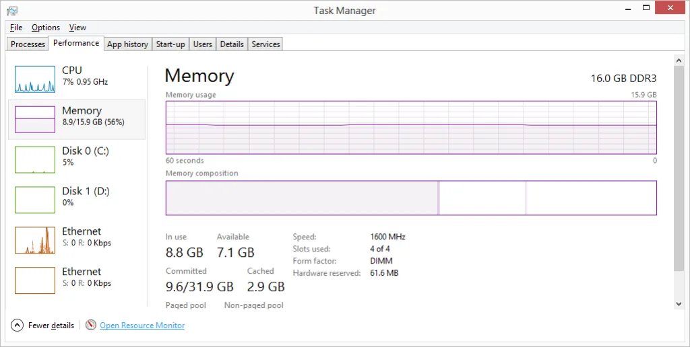](http://nftb.saturdaymp.com/wp-content/uploads/2015/11/MemoryUsed.png)

To hook into the emulator from your development environment for debugging, some VirtualBox configuration is required.  First, install your Android emulator.  During the install of the of the emulator it will prompt to install VirtualBox but you can ignore this if you have VirtualBox already installed.

Then, download and install a virtual device such as HTC One or Nexus S (KitKat).

[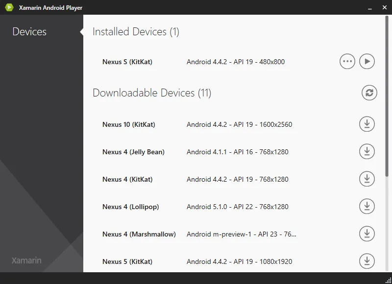](http://nftb.saturdaymp.com/wp-content/uploads/2015/11/XamarianAndroidPlayerInstalledDevices.png)

[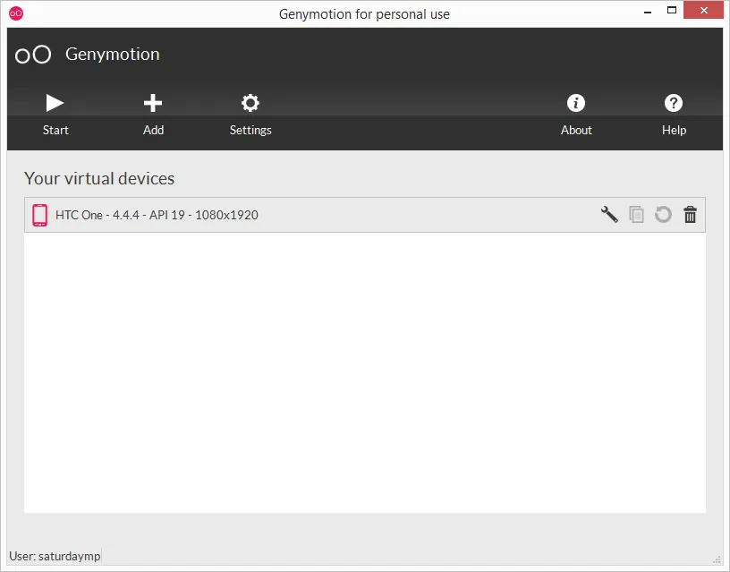](http://nftb.saturdaymp.com/wp-content/uploads/2015/11/GenymotionInstalledDevices.png)

Open up VirtualBox and you should see the emulators as machines.  I had to black out some of the machine because they are named after clients.  The Android emulators are listed at the bottom with the last one being the one created by the Xamarin Android Player and the second last one created by Genymotion.

[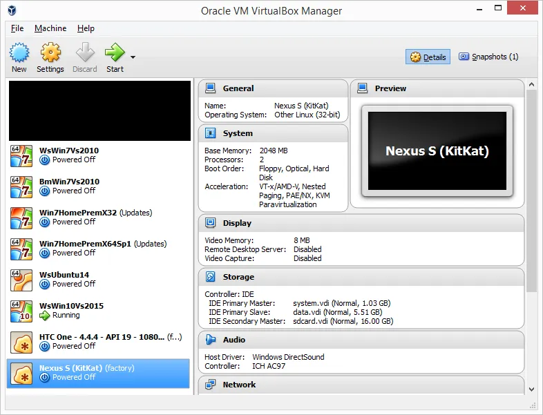](http://nftb.saturdaymp.com/wp-content/uploads/2015/11/VirtualBoxWithAndroidEmulators.png)

Check the network settings for the emulators.  There should be two network adapters.  One set to a Host-only Adapter and one set to NAT.

[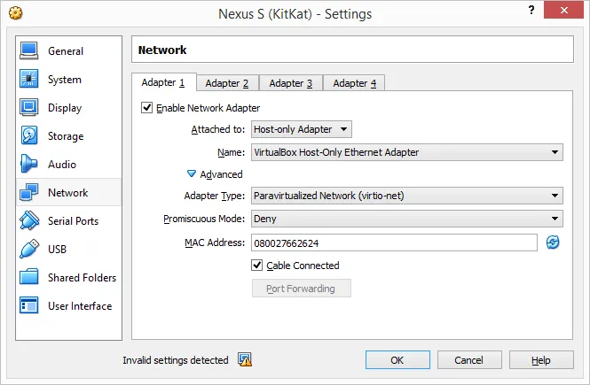](http://nftb.saturdaymp.com/wp-content/uploads/2015/11/NexusSKitKatAdapter1.png)

[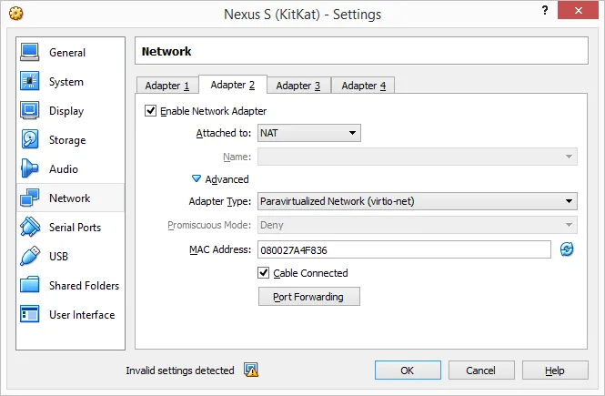](http://nftb.saturdaymp.com/wp-content/uploads/2015/11/NexusSKitKatAdapter2.png)

The one setting to pay attention to is the Name setting for the Host-only Adapter.

**Note:** For some reason the Xamarin Android Player (at least version 0.6.5) will install a new Host-only Adapter.  So instead of saying "VirtualBox Host Only Ethernet Adapter" it might say "VirtualBox Host Only Ethernet Adapter #2".  In either case take note of this name.

Now open up the network settings for the development environment virtual machine.  You probably only have one network adapter enabled and it will be either set to NAT or Bridged.  Whatever the case leave it as is.  Then enable a second adapter and set it to Host-only Adapter.  Then make sure the Name field is the same as the emulator name you noted above.

[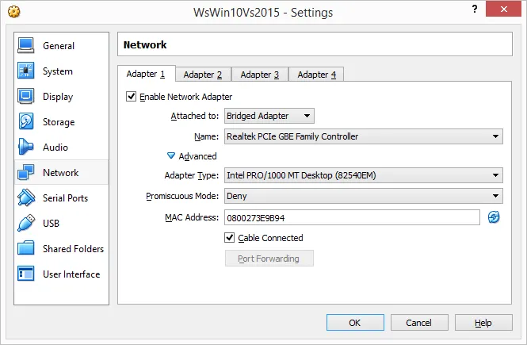](http://nftb.saturdaymp.com/wp-content/uploads/2015/11/WsWin10Vs2015Adapter1.png)

[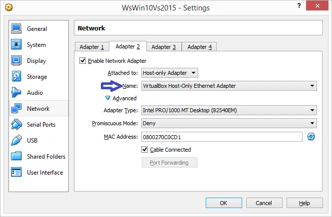](http://nftb.saturdaymp.com/wp-content/uploads/2015/11/WsWin10Vs2015Adapter2.png)

Now start up your development virtual machine.  In my case it's a Windows 10 with Visual Studio 2015 with Xamarin.  Inside Visual Studio click the Open Android Adb Command Prompt button.

[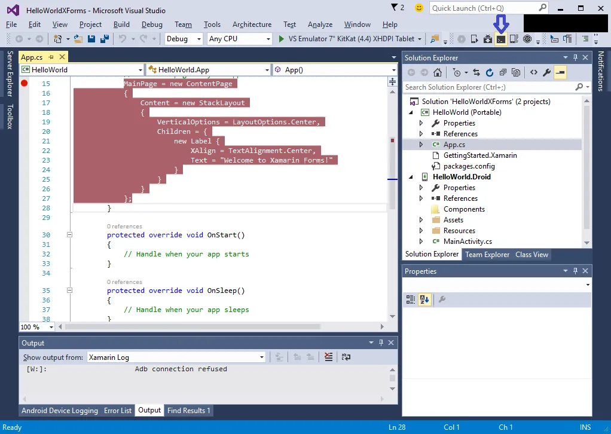](http://nftb.saturdaymp.com/wp-content/uploads/2015/11/OpenAndriodAdbToolbarButton.png)

Then type

```text
adb connect <IP address to Android emulator>
```

To determine the IP address of the Xamarin Android Player click the gear icon.

[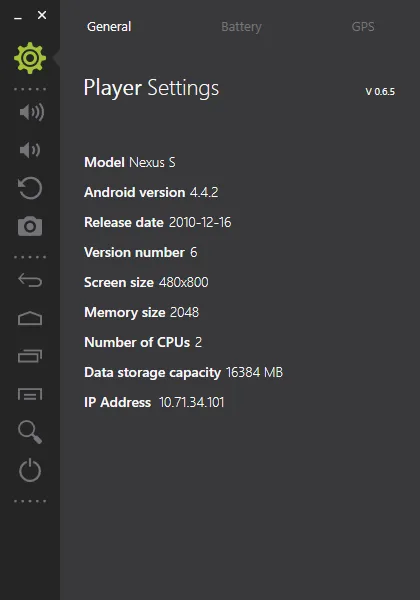](http://nftb.saturdaymp.com/wp-content/uploads/2015/11/XamarianAndroidPlayerIpAddress.png)

To get the Genymotion IP address you need to go to the VirtualBox interface, select the running VM, and then click show.  The IP address is listed there.

[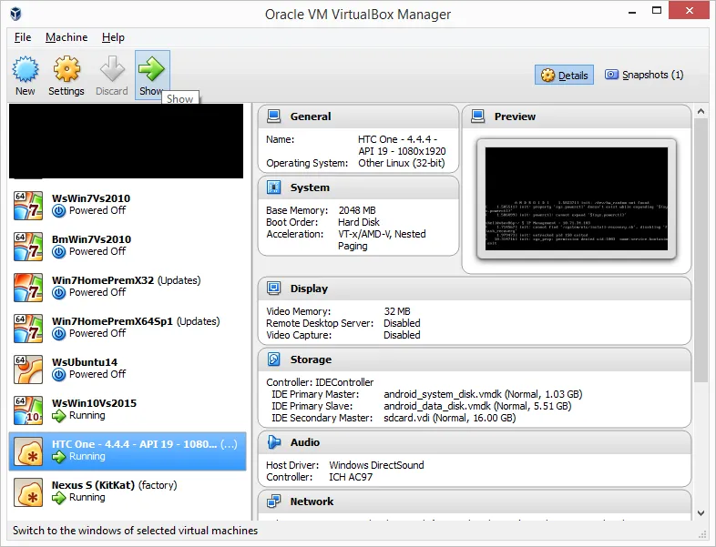](http://nftb.saturdaymp.com/wp-content/uploads/2015/11/VirtualBoxShowButton.png)

[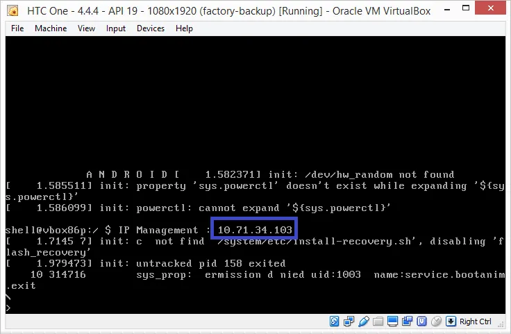](http://nftb.saturdaymp.com/wp-content/uploads/2015/11/GenymotionIPAddress.png)

After you run the adb connect command you should see something like:

```text
$>adb connect 10.71.34.101
connected to 10.71.34.101:5555
```

As you can see it uses port 5555.  If you can't connect make sure port 5555 on your host machine is open.  In Windows you need to open this port in your public networks firewall.

Now in Visual Studio your new emulator connection should auto-magically appear.

[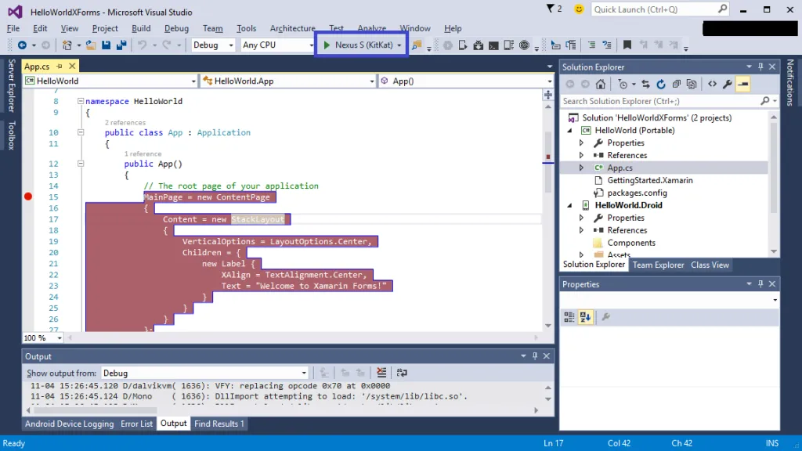](http://nftb.saturdaymp.com/wp-content/uploads/2015/11/EmulatorInVisualStudioRunButton.png)

When you click run it should compile your application and upload it to the emulator for debugging.  If everything works you should see something below.  Notice the breakpoint has been hit.

[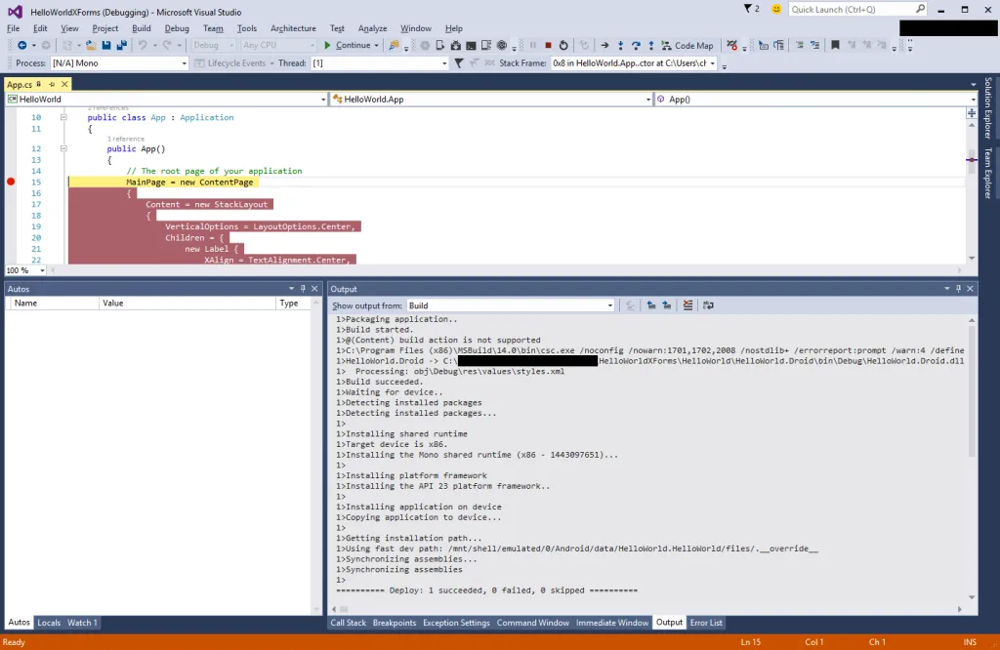](http://nftb.saturdaymp.com/wp-content/uploads/2015/11/BreakPointInVisualStudio.png)

In your emulator, assuming you continued after the breakpoint, you should see your application in the emulator.

[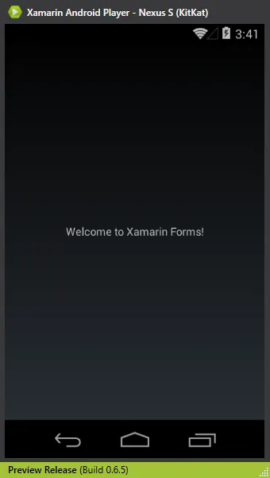](http://nftb.saturdaymp.com/wp-content/uploads/2015/11/WelcomeToXamarinFormsInEmulator.png)

[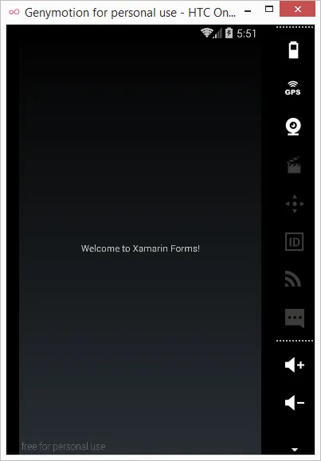](http://nftb.saturdaymp.com/wp-content/uploads/2015/11/WelcomeToXamarinFormsInGenymotion.png)

## Potential Problem

There is only one problem I've encountered.  Sometimes the uploading of the application to the emulator is very slow.  Like very, very, very slow.  So slow it's basically stuck.  During compile and deploy in Visual Studio you will get stuck at the "Installing `<something>`" line.

[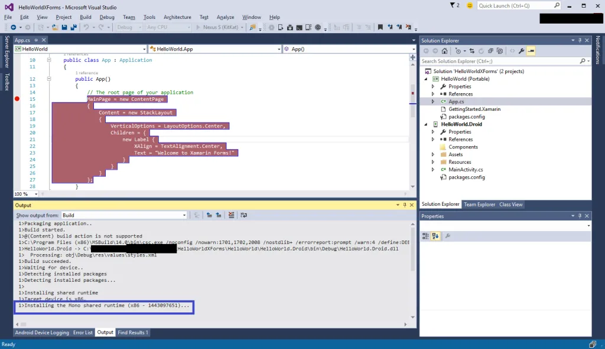](http://nftb.saturdaymp.com/wp-content/uploads/2015/11/AndroidEmulatorStuckInVisualStudio.png)

You can also see the problem if you try to adb push something.  It will look like:

```text
adb push -p <*.apk> /data/app
Transfering: 327680/16414148 (1%)
```

It will be stuck at some low percentage and might move up a percent in a couple minutes. For some reason if you do a pull of a large file it won't get stuck and will be downloaded from the emulator in a couple seconds.

My guess is this is a problem with VirtualBox networking but don't quote me on it.  Just for reference I'm using VirtualBox 5.0.8 with extensions installed.  Anyway, to fix the problem you need to refresh the Host-only adapter.

While your development environment virtual machine is still running, open up the host-only adapter configuration.  Then make a change to the adapter to force it to refresh. I usual change the Promiscuous Mode setting.  It doesn't matter what you set it to.  Then click OK to force the refresh.

[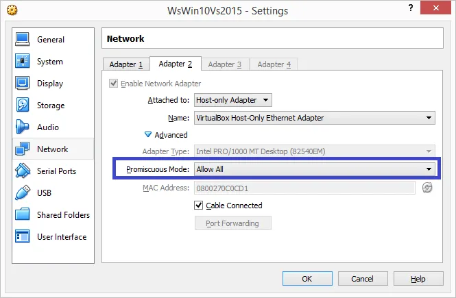](http://nftb.saturdaymp.com/wp-content/uploads/2015/11/RefreshDevelopmentVMHostOnlyAdapter.png)

It might also work if you refresh adapter inside the guest Windows machine but I haven't had as much luck doing that.  If you know of a different way to fix this problem please let [me know](http://www.saturdaymp.com/contact).
