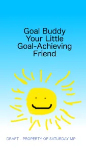
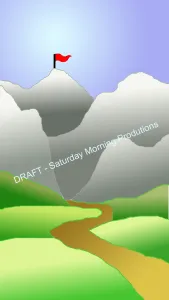

 

\[caption id="attachment\_1141" align="alignleft" width="169"\] The very first Splash Screen. That sun can see dead people.\[/caption\]

I spent the better part of last Sunday doodling on an ancient version of Photoshop (ver. 5.5, but I'm dating myself), working on the welcome screen for our Goal Buddy App. I laboured over rolling green hills (going to town with the 'gradient' tool), soaring mountains (gradient!) and ethereal blue sky (gradient!). It's the first _serious_ version of the splash screen yet, and I wouldn't argue that the previous version was a strange three-way mix of scary, hilarious and creepy.

The previous version had "Creepy Sun" right in the middle of a painfully blue screen. The sun itself had a demented, crooked smile, and two eyes that didn't quite point in the same direction. I think Chris named it "Creepy Sun." In my own defense, it is really hard to draw with a mouse!

I was thinking about Creepy Sun the last time I was at the gym. I was dangling from the chin-up bar like a wounded orangutan. No matter which muscles I flexed, I couldn't raise myself up. I'm really good at

\[caption id="attachment\_1142" align="alignright" width="169"\] The next version. 90% less creepy and 30% more inspirational.\[/caption\]

the "down" part of chin-ups, though. I've got that down pat. I started to think, as I was hanging there, that I am still at the Creepy Sun stage of this whole law enforcement endeavour. I'm definitely sticking to the small goals I've set (i.e., exercise, studying for entrance exams, wearing aviator sunglasses every time I drive), but there is still a long road ahead. Just like designing the splash screen and other graphics for Goal Buddy, there will be many iterations and I don't know quite how the end product will look, but stick with me and we will find out!
