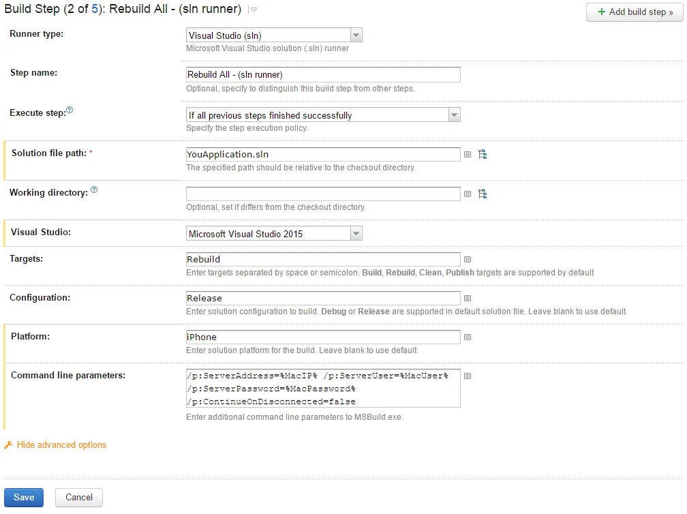
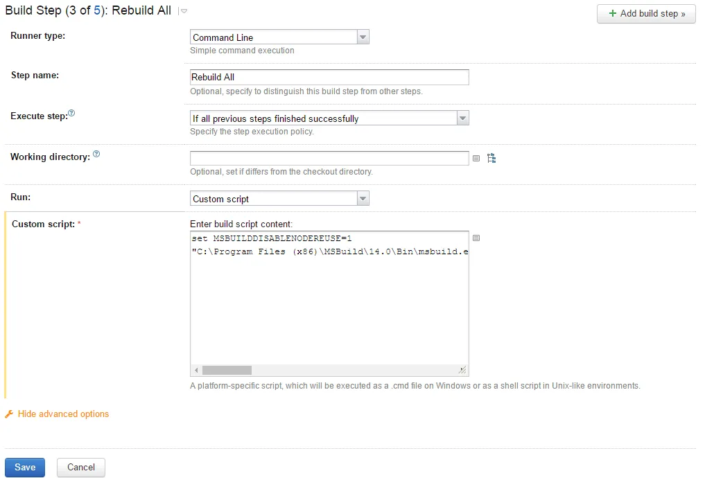

After upgrading to Visual Studio Xamarin 4.1 from 4.0 our TeamCity build suddenly stopped working.  Actually it was working but won't stop working.  The build would get hang after rebuilding out solution to create the IPA file.

The step in question looked like:

[](http://nftb.saturdaymp.com/wp-content/uploads/2016/06/SolutionRunnerThatHangs.png)

The TeamCity logs looked like:

```text
[09:23:28][Foo\Foo.iOS\Foo.iOS.csproj] _SayGoodbye
[09:23:28][_SayGoodbye] SayGoodbye
[09:23:28][SayGoodbye] Compute signature for bin\iPhone\Release\FooiOS.app
```

The build would also hang if I logged into the build machine and ran the msbuild via the command line.  However, the build would not hang if built via Visual Studio.

The error only occurs when creating the IPA file.  If compiling non-IPA project, even a iOS project that doesn't create a IPA, everything works as expected and msbuild ends when it should

Fixing the problem involved telling msbuild to quit once it's done.  You can do this by setting and environment variable and/or msbuild arguments.  I did both because why not.  The environment variable should be set like:

```text
MSBUILDDISABLENODEREUSE=1
```

The command switch in question is:

```text
msbuild YourApp.sln /m:4 /nr:false /t:rebuild
```

The /nr switch tells msbuild to quite once it's done.  The /m switch tells how many cores to use.  This actually won't help with the issue but it does speed up my build a bit.

To read more about the above fixes see these Stackoverflow links:

[http://stackoverflow.com/questions/13510465/the-mystery-of-stuck-inactive-msbuild-exe-processes-locked-stylecop-dll-nuget](http://stackoverflow.com/questions/13510465/the-mystery-of-stuck-inactive-msbuild-exe-processes-locked-stylecop-dll-nuget)

[http://stackoverflow.com/questions/3919892/msbuild-exe-staying-open-locking-files](http://stackoverflow.com/questions/3919892/msbuild-exe-staying-open-locking-files)

In TeamCity I tried adding the environment variable as a environment property but that didn't work.  Adding the /nr switch as a parameter to the Solution Runner also didn't work.  I had to create command line build step as shown below.

[](http://nftb.saturdaymp.com/wp-content/uploads/2016/06/CommandLineBuildStep.png)

The script that is cut off looks like:

```text
set MSBUILDDISABLENODEREUSE=1
"C:\Program Files (x86)\MSBuild\14.0\Bin\msbuild.exe" YouApp.sln /m:4 /nr:false /t:rebuild /p:Configuration=Release /p:Platform=iPhone /p:ServerAddress=%MacIP% /p:ServerUser=%MacUser% /p:ServerPassword=%MacPassword% /p:ContinueOnDisconnected=false
```

By the time you read this this issue will hopefully be resolved but maybe someone will find the above helpful.  That or it's just me experiencing it due to some weird configuration issue.

P.S. - Xamarin 4.1 also moved and renamed the where the IPA gets created and this will also break you build scripts.  The IP is now created in a time-stamped folder just to make it more of a challenge for your script.  You can read more about it:

[https://forums.xamarin.com/discussion/67044/ipa-output-location](https://forums.xamarin.com/discussion/67044/ipa-output-location)

Again hopefully this will be fixed the IPA file created in a non-time-stamped location.

**Update (August 16th, 2016):**

The problem of MSBuild not ending was fixed in the latest Xamarin for Visual Studio release (4.1.2.18) so it's no longer an issue.  Ignore my above blog post.

That said  my above solution didn't fully fix the problem.   What I ended up doing was creating a PowerShell script to kill MSBuild.  In TeamCity after the compile step create a PowerShell build step with the following script:

```text
Stop-Process -processname msbuild
```

This build step is no longer needed but I include it here for completeness sake.
