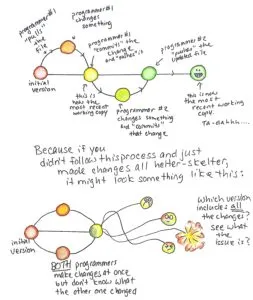
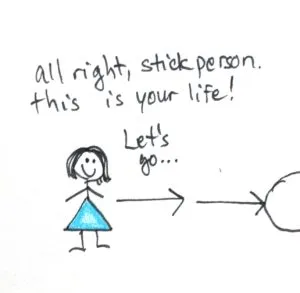
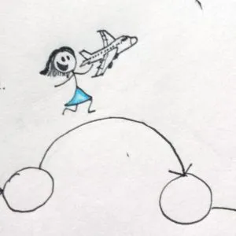
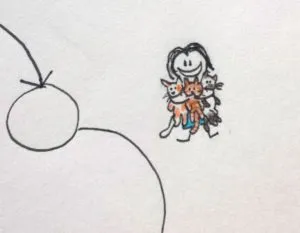
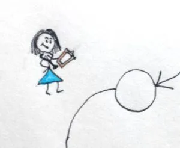
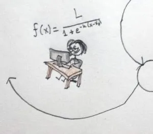
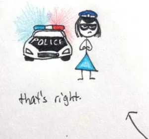

Several weeks ago, Chris gave Ada and I a mini-workshop on "[version control](https://en.wikipedia.org/wiki/Version_control)." Wondering what that is? (I certainly was, at the time) In non-programmer's terms, version control describes how, when several people are working on the same code, they make sure that they are working on the most up-to-date version that includes everyone's edits. Version control uses some pretty entertaining jargon; for example, you "pull" the most recent version of a file, and then "push" the changes you've made. Each change must be "committed" to update the file. That way, there aren't a slew of working copies floating out there and no one knows which is the most recent version. Visually, you could think of it like this:

 

A few days later, Ada mentioned that the whole push/pull thing was a lot like going through various stages of life, wherein one "pushes" a life change (like starting university or a job) into your life and that change becomes integrated (i.e., committed) into the main branch (i.e., the master copy) of your life. I wondered what it might look like on paper...

The earliest thing I remember wanting to be was an airline pilot. Don't ask me why. Jumbo jets impressed my 7 year old self.

I think veterinarian came next. (foreshadowing for cats?)

Then physician (glad I got that out of my system as an undergrad!).

Then research scientist. That actually lasted for quite a while.

 

This overlapped with restaurateur (not going to elaborate that one today...). This is where things got confusing...I think it was a "multiple working copies and I don't know which version is the most up to date one" kind of situation.

 

And here we are at the Officer Sunglasses version. There are tons of changes in this version (more than I have space for here). Looking back at the chain of command, I can see how all past changes lead to this one, even if that isn't immediately apparent. So don't be afraid to push changes. Push it. Push it real good!
