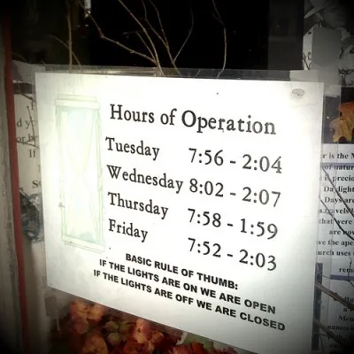

I am about 1 month early on my traditional “what I learned this summer” blog post, but I'm learning so felt the need to write it down!  For those following along at home, here are the lessons covered: [2012](http://nftb.saturdaymp.com/what-we-did-this-summer-and-two-discoveries-we-made/), [2013](http://nftb.saturdaymp.com/what-we-did-this-summer-2013/), and [2014](http://nftb.saturdaymp.com/mm-end-of-the-summer-rainbow/).

And now, in the midsummer of 2016, amid the rainstorms, travelling fairs and mosquito bites, I declare that I am learning a lot.  The software developer that I’m married to ([Chris](http://saturdaymp.com/about)) is a lot like an artist or a [Granville Island](http://granvilleisland.com/) shopkeeper.

Sure, I get it – we’re in the middle of developing our [Goal Buddy app](http://nftb.saturdaymp.com/how-goal-buddy-got-its-name/) and there’s only so many hours in between camping and out of town guests.  What if, though, the mood strikes like a clap of lightning?  Off he goes running to chain himself to the basement computer!  Do not disturb, Darling Daughter, when he’s got his early morning revelations and late night inspirations.  You should try dining with him!  I’m proud to know him well enough when he has his “thinking” face on.  Yes, you may be dismissed from the table… I'm sure Joni Mitchell's family dealt with that too.

While the results are hardly visible like a Jackson Pollock painting, Chris’s dedication to his art is admirable.  There can be so many distractions when your home office is at home, and so many more during the summer when everyone else is on vacation or having backyard sleepovers.

It’s still nice to know that when a particularly cool lightning show hits, he’s able to come upstairs and witness it with us.  Then back to the Goal Buddy Salt Mines he goes.  I wonder if writers like Kristan Higgins and Danielle Steele are the same way.

Save

Save

Save

Save
