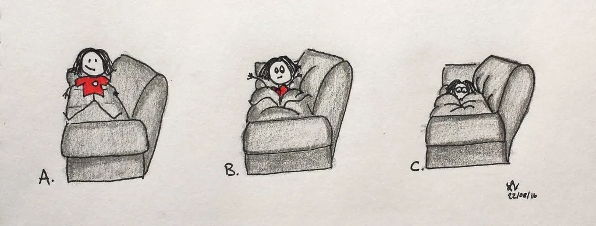
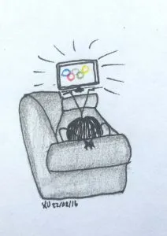
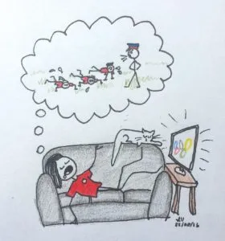
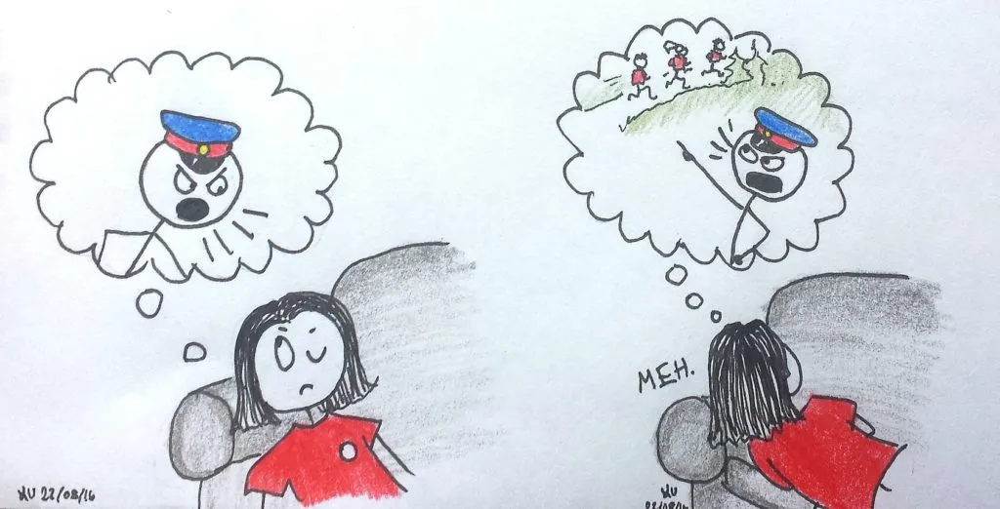
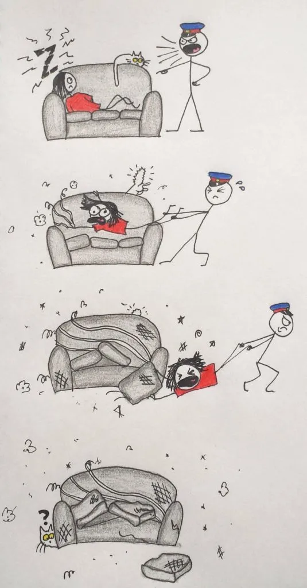

Routines are great. Sure, they can be difficult to get up and running, but once you have one, things don't feel quite right when you miss part of it. For the last many months I have been going to the gym every other day. For the last month, I've been going to [Run With Recruiters](http://www.joineps.ca/NewsAndEvents/Run%20with%20Recruiters.aspx) twice per week. I was feeling pretty darn good about that and was in the best shape of my life. I wrote all these things on my calendar, and felt a great sense of accomplishment every time I looked at it.

Change was a-coming. My parents were heading to Scandinavia for three weeks and needed a house sitter. Of course I wanted to help them, but it meant leaving my routine completely and trading city life for small town Saskatchewan life. No fancy gym. No group of EPS hopefuls to run up and down stairs with. I wondered how I would adapt.

I had noble visions of running country roads (and hills...there are indeed hills in Saskatchewan) and going to the small gym in my home town. But eventually, my days started to look like this (see above).

The siren song of the Olympics was very strong, and I found myself velcroed to the couch.

I started to wonder what everyone was up to back in Edmonton. I would look at the clock on Mondays at 5 and imagine that everyone in the RWR group was pounding out pushups and burpees. Meanwhile, I convinced myself that watching the Olympics counted as exercising.

However, a month went by very quickly. The party was ending, and soon it would be time to get my sorry self back into my regular routine.

I would like to report that I burst out my front door and ran stairs like a champ the minute I got home. The first few days of getting back in my workout routine went more like this, though (see below).....

Nothing to see here, folks. Move it along.

I did get a few good runs and workouts in, but sticking to a routine out of the usual context was tough. It's especially tough when no one is keeping tabs on you, or expects to see you in a certain place at a certain time. Being self-accountable takes a tremendous amount of discipline.

Now that I'm back (and the Olympics are over), it's time to restart the routine and get back to working on Goal Buddy. The concept of self-accountability is a primary driver in GB's development. It's definitely challenging to stick to a routine when there aren't other humans to answer to, but it's not impossible! Good thing it's a while before the next Olympics are on...
