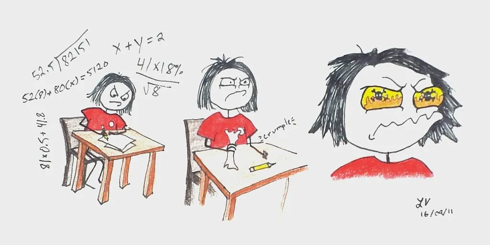
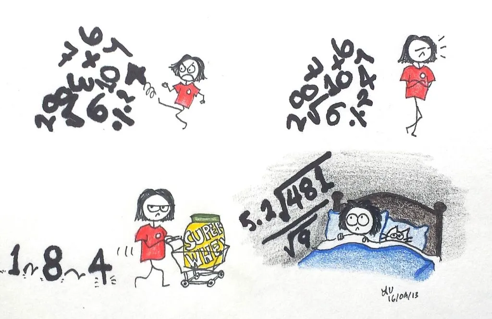

Math.

Few people tell me that they love math.

It brings back memories of sitting in a small, windowless room, back in grade 11, with my math tutor. My tutor smoked cigars. Lots of cigars. He smelled like a giant cigar. I really didn't want to be there, but my math grades were abysmal. I tried - superficially, at best - to memorize the patterns of algebra, but desire to receive a non-abysmal grade in that class was overshadowed by a large teenage helping of "not giving a ..."

I did pass (somehow), and went on to become a decent statistician in university. The beauty of stats, though, is that you rarely do the computations by hand. You just need to know _what ki__nd_ of analysis need be done on a dataset, plug it into a computer program, and voila. I was so used to doing those analyses that I started to think I was good at math.

Wrong. When a computer does all the analyses for you, it doesn't mean squat.

I have reached a point in my grander goal that I do not like. Inevitably, there are parts of a goal that you really loathe. For some, it might be getting up early or changing your eating habits. For me, it's re-learning how to do math by hand. Math is part of the written entrance exams for nearly all police services, EPS included. Yours truly could not do long division to save her life.

Math is worth a significant portion of the exam. I sat down one afternoon, flipped open the study manual, and started math-ing. Ok, first you see how many times the first number goes into...no, wait, what do I do with this decimal...wait, I think you move it over here... no. System failure. Stupid math. I decided to ignore it completely. However, things you ignore have a nasty way of following you around and permeating everything you do. Math was always there, like a malevolent dog that followed me home.

Ignoring it wasn't making it go away.

There was only one thing left to do. Just study. No way around it. As loathsome a task as math is, refusing to acknowledge its existence is futile. Every goal has nasty bits. In the wise words of Yoda: "Do or do not. There is no try." Even with math.
