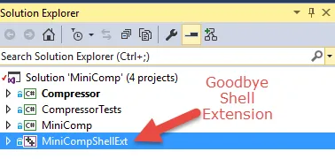
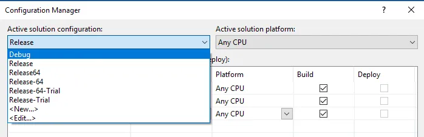
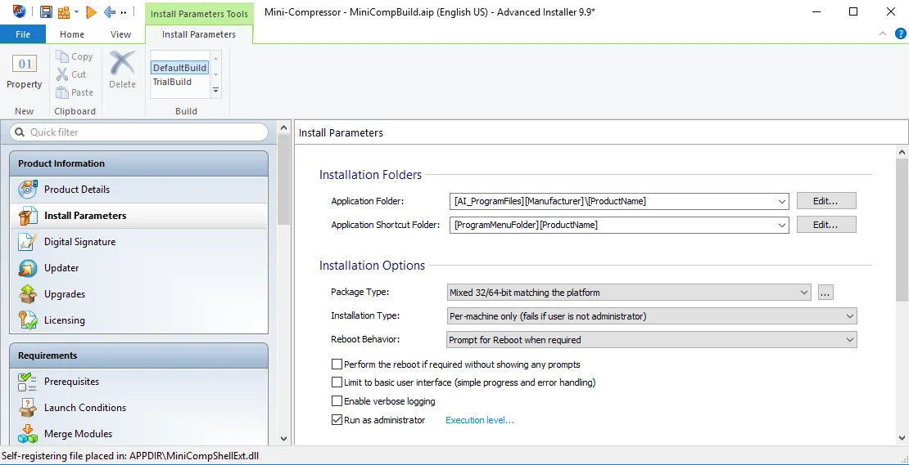
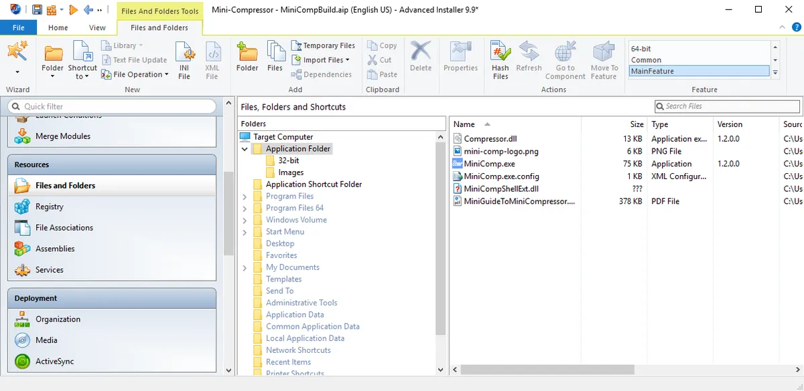
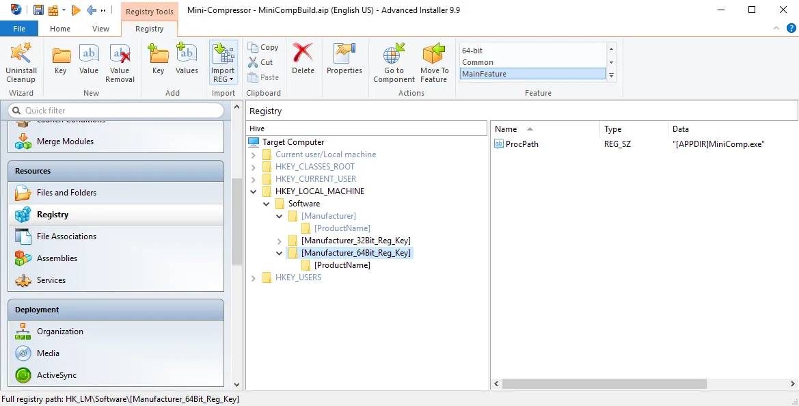
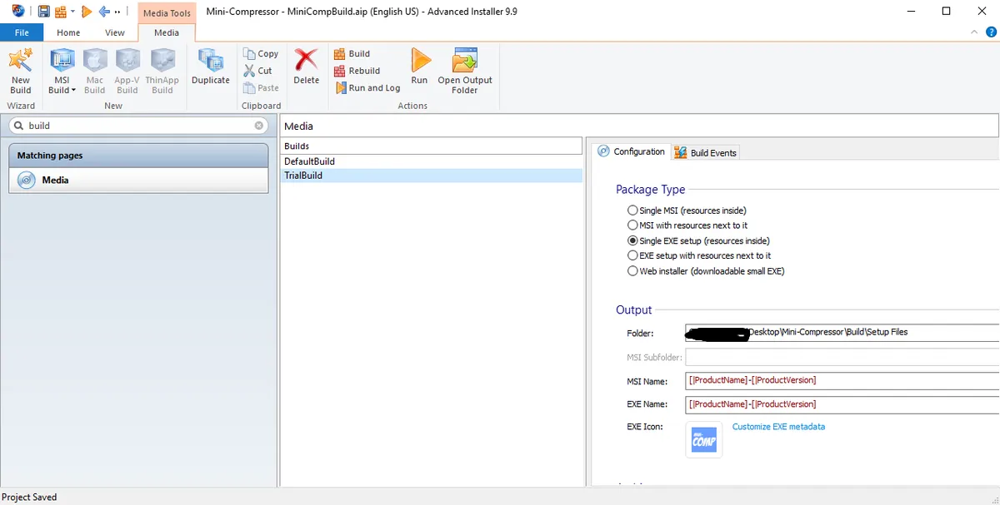
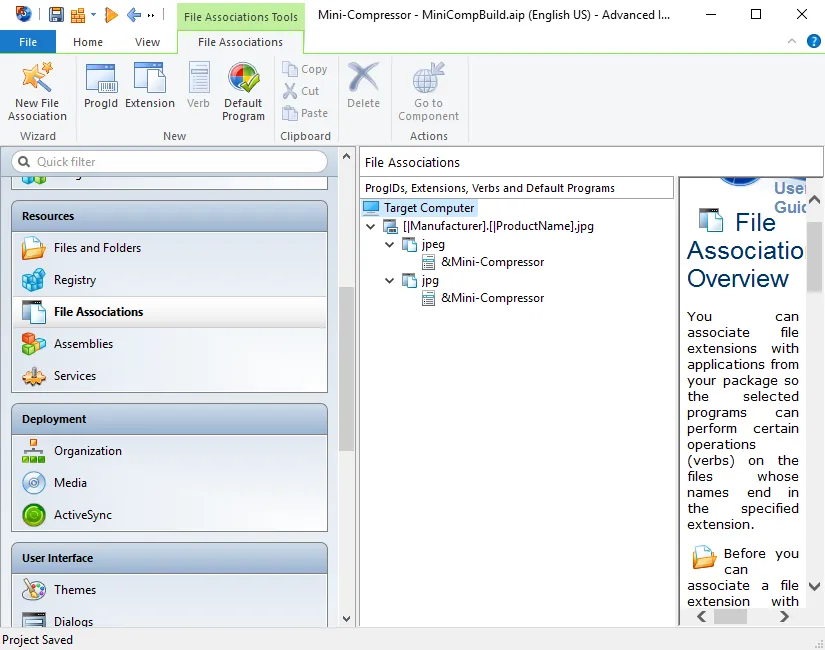
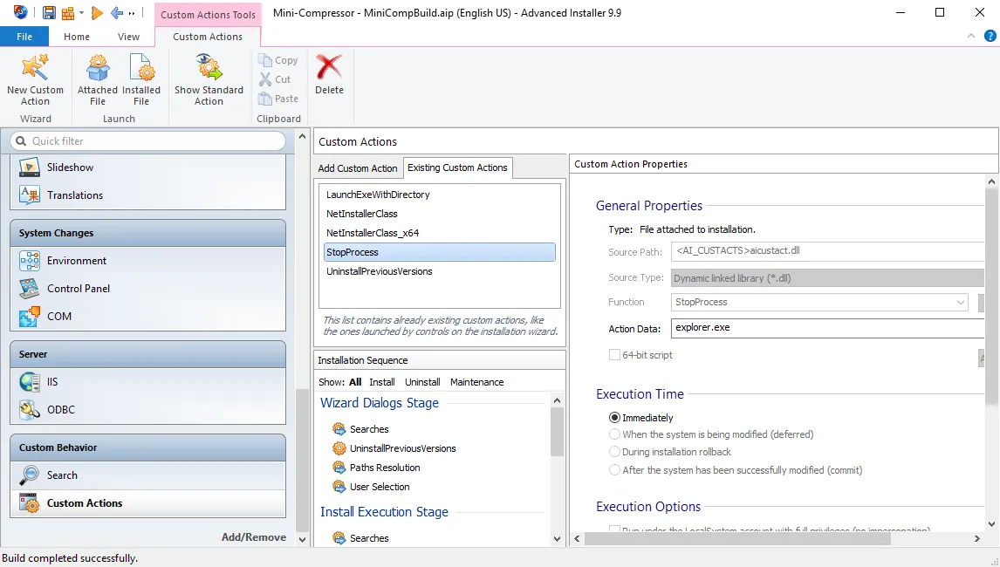
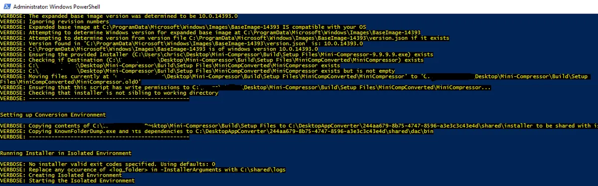
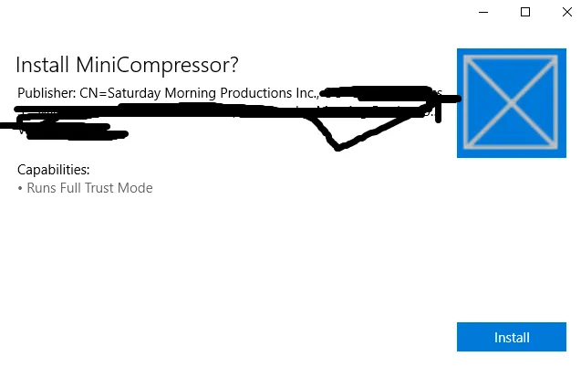

I was inspired to get Mini-Compressor to UWP into the Windows 10 Store a while back this summer. I saw this video several months ago when it was called Project Centennial:

[https://channel9.msdn.com/Events/Build/2015/2-692](https://channel9.msdn.com/Events/Build/2015/2-692)

Then a couple weeks ago there was a form you could fill out and a Microsoft employee would help you convert your application.  So I filled out the form about my tiny little application called [Mini-Compressor](http://saturdaymp.com/mini_comp) and was surprised when I heard back.  The fellow was very helpful but in the end we couldn't get Mini-Compressor ported to UWP.

Spoiler: UWP applications can have custom context menu items but not for \*.jpeg files.

So why am I writing this if we failed?  Because I think there is still something to learn from my failure.  Same reason scientist should [publish failed experiments](https://www.elsevier.com/connect/scientists-we-want-your-negative-results-too).

Also I setup a goal to post something and figured this would do.  So without further ado here are the notes I took.

# Doing Research

Read about [converting applications and the requirements](https://msdn.microsoft.com/en-us/windows/uwp/porting/desktop-to-uwp-root).  Right away I saw potential show stopper: [Shell Extensions](https://en.wikipedia.org/wiki/File_Explorer#Extensibility) are not supported in UWP.  There where a couple other minor issues, like registry entries not allowed in the machine hive, but I could work around those.  The whole point of Mini-Compressor is to right click on a file or folder to compress the images.  Being the optimistic guy I am I think there might be a way around this so I decide to proceed.  With the help of my new Microsoft contact we made good progress.

The next thing I read was setting up the [Desktop App Converter](https://msdn.microsoft.com/windows/uwp/porting/desktop-to-uwp-run-desktop-app-converter) program.  It's actually not too hard, just follow the instructions.  I'll show you my instructions a little later.

# Upgrade to .NET 4.6.2

Before I did anything I updated Mini-Compressor to .NET 4.6.2.  This was actually pretty painless.  I just picked each C# project and upgraded it to .NET 4.6.2.  Everything still compiled, tests passed, and the automated build succeeded.

# Remove the Shell Extension Project

The [Shell Extension](https://msdn.microsoft.com/en-us/library/windows/desktop/cc144067%28v=vs.85%29.aspx?f=255&MSPPError=-2147217396) is what allows users to right click a folder or file to compress them.   In Mini-Compressor this is the MiniCompShellExt project and is responsible for adding the Mini-Compressor menu item to the popup menu that appears when you right click on the folder or file.  It’s also responsible for determining the file(s)/folders clicked on and passing them to the actual Mini-Compressor program.

It’s sad to have to remove this because this is the hardest part of Mini-Compressor to write.  At least for me.  I had to learn how Shell Extensions work and remember C++ (hadn’t been used since university).  It was also the key feature of Mini-Compressor.  You could right click on a file or folder and compress them.

A moment of silence for the MiniCompShellEx project.

[](http://nftb.saturdaymp.com/wp-content/uploads/2016/10/RemoveShellExtension.png)

Thanks to TortoiseSVN and other Tortoise projects,  I modeled my Shell Extension off these projects.

[TortoiseSVN](https://tortoisesvn.net/) [TortoiseGit](https://tortoisegit.org/) [TortoiseHg](http://tortoisehg.bitbucket.org/)

## Remove Unused Build Configurations

Now that we no longer have the Shell Extension project we can remove some build configurations.  Currently Mini-Compressor has 6 build configurations. The MiniCompShellExt was a C++ project and needed a separate compile for x86 and x64 operating systems.  Mini-Compressor also has a trail and paid-for builds.

[](http://nftb.saturdaymp.com/wp-content/uploads/2016/10/BuildConfigurations.png)

Side note: Why the trial and paid for-builds?  The answer is Mini-Compressor didn’t use a key to unlock it after you purchased it.  Instead a trial check was hard coded into the application.  Similar idea to a demo version of a game versus the full release version. I was not a big fan of keys because people tend to lose them, at least back in the day.  Now that is less of an issue with everyone saving their key to e-mail.

Back on topic, just keep the Debug and Release builds.  No need for the x64 builds and trial builds.  Actually now that I think of it how does Microsoft Store handle demos?  I should check that out.

# Update the Installer

I used [Advanced Installer](http://www.advancedinstaller.com/) to create the installer for Mini-Compressor.  I used Advanced Installer because it let me create a single install for both 32-bit and 64-bit applications.  This is no longer needed.

Actually running the Microsoft Bridge application on the single install exe does not work.  What I really want is a single platform, 64-bit, installer.  To make this happen I made the below changes to my existing project.

### Package Type: 64-bit (AMD64, EM64T)

[](http://nftb.saturdaymp.com/wp-content/uploads/2016/10/AdvancedInstallerChangePackageType.png)

### Remove 32-bit and Shell Extension files.

[](http://nftb.saturdaymp.com/wp-content/uploads/2016/10/AdvancedInstallerRemoveFiles.png)

### Remove registry entry required for shell extension.

[](http://nftb.saturdaymp.com/wp-content/uploads/2016/10/AdvancedInstallerRemoveRegistryEntries.png)

### Remove trial build.

[](http://nftb.saturdaymp.com/wp-content/uploads/2016/10/AdvancedInstallerRemoveTrialVersion-1.png)

### Add File Associations. (this actually did nothing but I was hoping it would help)

[](http://nftb.saturdaymp.com/wp-content/uploads/2016/10/AdvancedInstallerAddFileAssoications.png)

### Remove Stopping the Explorer process and .NET Installer.

[](http://nftb.saturdaymp.com/wp-content/uploads/2016/10/AdvancedInstallerStopExplorerProcess.png)

I am using an old version of Advanced Installer (version 9.9, current version is 13.1) and don’t have a license for the new version.  Maybe in the future I’ll update to the new version so I can build AppX applications directly instead of running the Microsoft Bridge.

# Setup the Desktop App Converter

Download the [Desktop App Converter and the wim image](https://www.microsoft.com/en-us/download/details.aspx?id=51691).  Then open a [PowerShell](https://msdn.microsoft.com/en-us/powershell/mt173057.aspx?f=255&MSPPError=-2147217396) as admin and type the following to setup the image:

```text
PS C:\> Set-ExecutionPolicy bypass

PS C:\> .\DesktopAppConverter.ps1 -Setup -BaseImage .\BaseImage-1XXXX.wim –Verbose
```

This can take a while and only needs to be done once.

# Run the Desktop App Converter

Again in PowerShell run the following command:

```text
PS C:>.\DesktopAppConverter.ps1 
-Installer "<path>\Mini-Compressor-9.9.9.9.exe" 
-InstallerArguments "/qn" 
-Destination "<path>\MiniCompConverted" 
-PackageName "MiniCompressor" 
-Publisher "<Full publisher name on your code signing certificate>" 
-Version 9.9.9.9 
-MakeAppx –Verbose
```

This command takes the existing installer exe and installs it in the wim image you setup earlier.  The process runs some tests on the install process and also notes what file and other install actions are taken.  It then creates a AppX install file.

[](http://nftb.saturdaymp.com/wp-content/uploads/2016/10/ConverterCreateAppx.png)

 

Sign the Appx package.  Do this using the [Visual Studio command line](https://msdn.microsoft.com/en-CA/library/ms229859\(v=vs.110\).aspx) and the Saturday MP cert.

```text
PS C:>signtool.exe sign 
-f saturdaymp.pfx 
-p <password>
-fd SHA256 
–v MiniCompressor.appx
```

If you don't have a code signing certificate then you can [create your own certificate](https://msdn.microsoft.com/windows/uwp/porting/desktop-to-uwp-signing).

Now you can double click your AppX application on a Windows 10 machine and it will get installed.  Notice it didn't include any of the nice images I had in my old installer.

[](http://nftb.saturdaymp.com/wp-content/uploads/2016/10/InstallAppxMiniCompressor.png)

# No Right Click

I encountered some small issues following the above steps but overall it was relatively painless.  Unfortunately when I was done I couldn't right click on anything using Mini-Compressor.  I could run the application from the Start menu but no right click.  That said I kind of knew this would happen based on my [initial research](https://msdn.microsoft.com/en-us/windows/uwp/porting/desktop-to-uwp-root).

I talked to the helpful fellow at Microsoft and he said there is a way to add [shell extensions in AppX applications](https://msdn.microsoft.com/en-us/windows/uwp/porting/desktop-to-uwp-extensions).  You need to add the following to your AppX manifest file:

```
<Extensions>
  <uap3:Extension Category="windows.fileTypeAssociation">
    <uap3:FileTypeAssociation Name="imagefiles">
      <uap:DisplayName>Image Files</uap:DisplayName>
      <uap:SupportedFileTypes>
        <uap:FileType>.jpg</uap:FileType>
        <uap:FileType>.jpeg</uap:FileType>
        <uap:FileType>.blah</uap:FileType>
      </uap:SupportedFileTypes>
      <uap2:SupportedVerbs>
        <uap3:Verb Id="Compress" MultiSelectModel="Player" Parameters="&quot;%1&quot;">Compress</uap3:Verb>
        <uap3:Verb Id="CompressExtended" MultiSelectModel="Player" Extended="true" Parameters="&quot;%1&quot;">Compress Extended</uap3:Verb>
      </uap2:SupportedVerbs>
    </uap3:FileTypeAssociation>
  </uap3:Extension>
</Extensions>
```

Note that after updating the manifest file I needed to re-create the Appx file.  I did this by running the following command:

```
makeappx.exe pack -d PackageFiles -p Output
```

Notice that I added the jpg, jpeg, and blah types.  At first I added just the jpg/jpeg types but that did not seem to work.  When I added the blah type I could right click on blah files.

Turns out certain [file types are reserved](https://msdn.microsoft.com/en-us/windows/uwp/launch-resume/reserved-uri-scheme-names) and can't be used.  Of course the jpg/jpeg file types can't be used.  That made me sad.  Maybe in the future if Microsoft makes the jpg/jpeg not reserved then maybe I'll try upgrading Mini-Compressor again.

So that is the end of my long journey.  While it didn't end the way I wanted it to, I did learn some things and wanted to share them with you.  That, and as I said at the beginning, I think it's important to share successful as well as failed experiments.

Save

Save

Save
