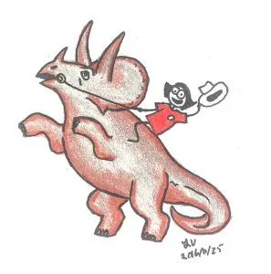
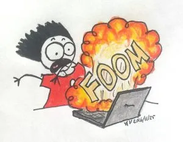
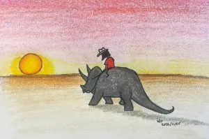

Using old technology is a bit like driving a Model T on the Indy Speedway. It can be a bit scary, but most of the time it is incredibly frustrating and everything seems to be zooming past at a mind-boggling rate of speed.

Case in point: I have a version of Photoshop from 2002. It's a robust program that I know inside out. It can do a lot of things, and when it came out, it was pretty mind-blowing. But, it's from 2002. That means it is 14 years old. In Computer Years, that is like comparing something from the Jurassic Period to Present Day.

This ancient program is on my ancient laptop, which is also from 2002. I've never had cause to replace it, because it still works after all these years. However, it cannot go on the internet. It could 14 years ago, but I feel like if I plugged an ethernet cable into it now, it would probably burst into flames and then explode. I have a much newer computer - I'm clearly on the internet as I am writing this - but the old one has retained its usefulness because it has Photoshop.

And so, I've been doing a lot of artwork for Goal Buddy (and for other things like Migrator) on the Ancient Beast, as it is known. Drawing on it is really hard. Do you remember Scary Sun? Yeah. I can't unsee it either. That's what happens when I try drawing with the touchpad mouse. I am still puttering away, trying to draw background things (thank goodness for the "gradient" tool), but then I am constantly switching between sitting on the floor with the laptop to sitting at the desk with the _real_ computer. Plus, I am saving things on USB keys and going back and forth between the one with internet and the one without. If this sounds inefficient, you are right.

It's why I have resorted to hand-drawing art for the blog posts, and most of the art you've seen is drawn with ink and pencil crayon, then scanned. It seems a little preposterous that going back to good ol' pencil and paper is faster than using a computer program, but that's what happens when you use old technology! I'm still finding uses for my ancient Photoshop, and until it is no longer useful, I will continue to use it. It's like driving the Model T. It is slow, but you get there eventually and mostly in one piece.

 

Save
