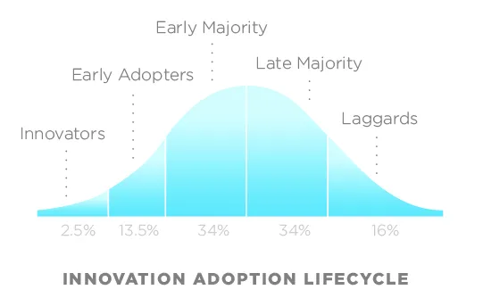

If you have worked with Xamarin for longer than me (i.e. one year) then you probably already know about PCL bait and switch technique, especially if you consumed one of the many [Xamarin plugins](https://github.com/xamarin/XamarinComponents).

As usual I'm late to the party.  It's November 2016 and the [first article](http://log.paulbetts.org/the-bait-and-switch-pcl-trick/) I found was written May 2014.  There is also a good video about the bait and switch technique for creating [Xamarin plugins](https://university.xamarin.com/guestlectures/using-developing-plugins-for-xamarin) which I think was recorded in September 2014.  That said, I'm more an Early Adopter or Early Majority than an Innovator.

Back to bait and switch.  I'm not a fan of it because of its strict requirements for it to work.  A separate project is required for each environment you want to target.  For example BaitAndSwitch.PCL, BatiAndSwitch.Droid, BaitAndSwitch.iOS, etc.

Separate projects are not the problem.  The problem is each of the separate projects must have the same [namespace, version numbers, and assembly names](https://blog.xamarin.com/creating-reusable-plugins-for-xamarin-forms/).  You also need to share the common interface file between all the projects.  You can then switch out the DLLs for each different platform.

My problem is this seems [hacky](http://ericsink.com/entries/pcl_bait_and_switch.html).  It gets my smelly code senses tingling.  Maybe my senses shouldn't be tingling.  The technique is used in most of the existing Xamarin plugins.

For now I won't use that technique but I reserve the right to change my mind.  I've been wrong before, as my wife can tell you.  Who knew you could [cook bacon and eggs in a paper bag](http://realfamilycamping.blogspot.ca/2011/08/paper-bag-eggs-classic-camping-recipe.html)?

P.S. - My programming music this time is the [Okeefe music](http://www.okmusicfoundation.org/).  It's kids playing rock songs, such as [Slipknot](http://www.slipknot1.com/).  The kids are talented and this video is funny.



 

Save

Save

Save

Save

Save

Save
