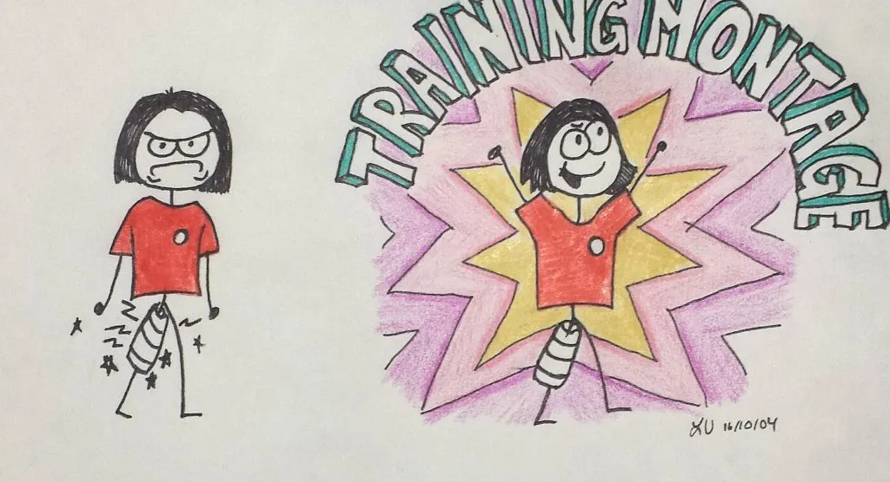
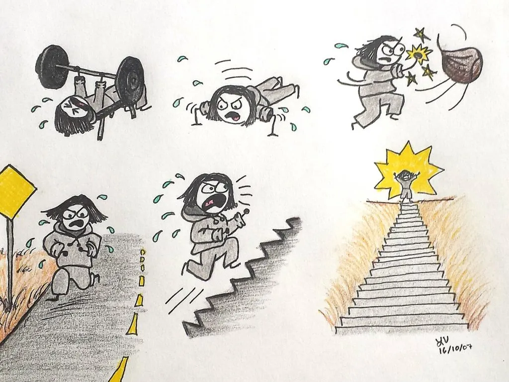

Unforeseen circumstances.

It isn't a phrase that makes you jump for joy. Instead, it is a vaguely menacing combination of words that foretells of something throwing your plans off the rails. For me, it was a leg injury. If you have been following this blog series, you'll know that I have been training to apply to the Edmonton Police Service. Things were falling into place. I had collected all the supporting documents for my application (transcripts, first aid certification and so forth), and was studying hard to write the entrance exams. I was in the best shape of my life, thanks to working with a personal trainer.

Then came the unforeseen circumstances. One frosty September morning, my leg felt peculiar as I sprinted up a set of stairs in the river valley. I ignored it, thinking I should "suck it up, buttercup." I trained the next day and the day after, and the pain screamed at me until I couldn't ignore it. By Saturday morning, I couldn't walk. I knew that something had gone majorly wrong.

I discovered that I'd strained part of my quad in my left leg (the _rectus femoris_ muscle, to be exact) and it might be several months before it was healed. My life flashed before my eyes. I was ready to go in and slay those entrance exams and had hoped to do the physical exam soon thereafter. But now I could hardly walk and had no idea how long it would take to heal. At that moment, it felt like my big plans had crashed and burned like a plane falling out of the sky.

Being the logical person that I am, I wallowed in misery for a day or two, and then formulated a plan. TRAINING MONTAGE! Stretching. Physio. Exercise. Rest. Repeat. Preferably set to music.

Flash forward two months and my leg is finally almost at its pre-injury state. It's been slow going, but I knew that if I pushed it too hard too soon, I would be worse off. The take-home message here is that unforeseen circumstances are inevitable. You don't have control over them. The only thing you have control over is how you react.

Grey tracksuit optional but recommended.

Save
