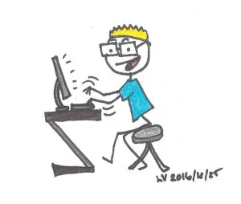

Merry Christmas everyone! We can hardly believe how quickly 2016 has gone by and that the new year is almost here.

So many things have happened that it's going to be a challenge to summarize them all here without making you read for the next hour. But hey, challenges are fun! This year Ada got a brand-new full time job that she will start in the new year. She and her family also traveled to Hong Kong and China, and saw tons of interesting things including the Great Wall and the Forbidden City. Chris worked hard on developing Goal Buddy (as did Ada!), as well as his other computer projects. He said that his big goal is to become a better communicator.

I (Liv, that is) had one heck of a year too. I started the huge goal of joining EPS, and that meant ramping up my fitness to unforeseen levels, and as I write this I am proud to say that I have cleared the first hurdles and have my physical assessment (the APREP) coming up in January. When I started working out seriously in March, I could barely deadlift 60 pounds and couldn't do a chin-up to save my life. I'm now proud to say I can deadlift nearly 200 pounds and do wide-grip pull-ups as well as chip-ups.

Thanks for joining us on this journey, and we look forward to achieving goals with you in 2017! Merry Christmas to all and to all a good night.
