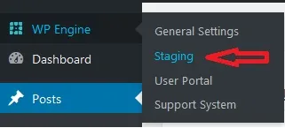
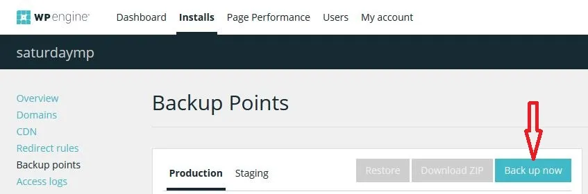
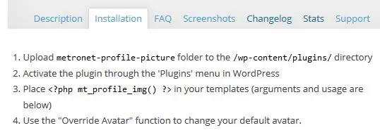
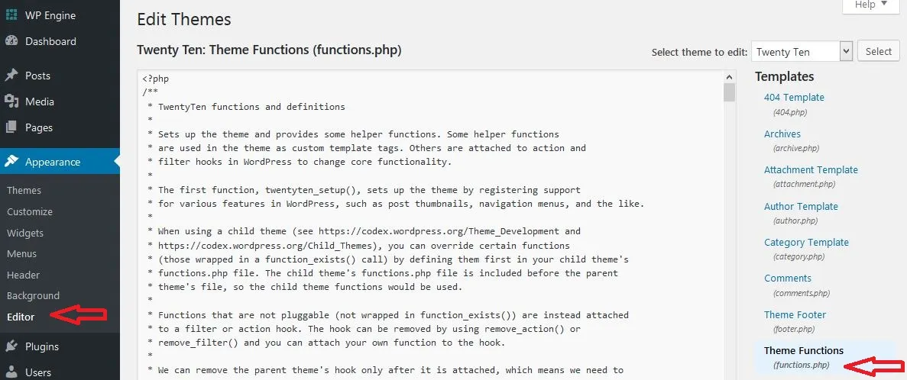
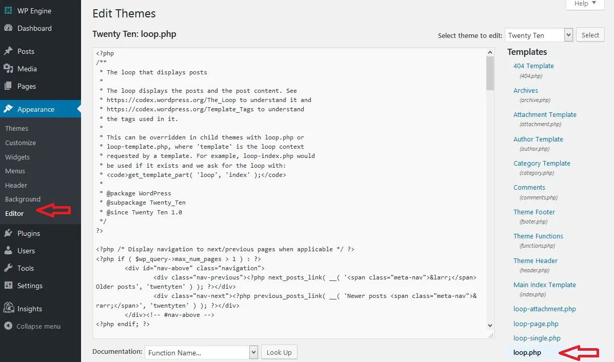

You may have noticed that our smiling faces now accompany our posts. This is to prevent confusion among our long time readers who may think that Chris is joining the Edmonton Police (he’s not, Liv is) or that Liv has a behemoth garden (she doesn’t, I do). Also, so you can see our smiling faces.

If you are looking to do the same for your blog, you can follow the steps I took.

## Step 0 - Research (and know what you're looking for)

The real issue we were facing was not being able to add a profile picture unless we had Gravatar accounts.  We wanted to use pictures uploaded to our media library.  I researched how to add a profile photo from our media library to our Wordpress blog.  I read technical stuff I didn’t really understand.  You might too.  It's important to note which ones you looked at but won't work, and why, if that's important to you.  Note which ones you want to try out.

## Step 1 - Try it out and choose your plugin

Try your solution(s) on a Staging server. Find this under WPEngine --> Staging.



Life does not have an undo button, but luckily your blog does.

I originally chose [User Photo](https://wordpress.org/plugins/user-photo) but after installing the plugin, Wordpress alerted me that it was outdated and pointed me to [User Profile Picture](https://wordpress.org/plugins/metronet-profile-picture).  Good thing I tried this all in Staging first.  Once you're satisfied with the results, bring it into Production.

## Step 2 - Back up your blog

Go to WP Engine User Portal and back up.



 

## Step 3 - Follow the installation instructions

This may be easier said than done since I really didn’t understand the technical stuff that I read.

 I understood 1. Download the plug-in file, upload the folder to the directory and 2. Activate the plugin (hint: there are buttons that say “Add New” and “Upload Plugin” and “Install Now”).  From there I was admittedly lost.

It said “3. Place code-y stuff in your templates and 4. Use the "Override Avatar" function to change your default avatar.”

Knowing what I know now and having done this once in staging, I would advise reversing the two steps:

3\. Use the "Override Avatar" function to change your default avatar and 4. Place code-y stuff in your templates.

This is so we could get our smiling faces in a row, add them to our profiles, and then plug in those proverbial Christmas lights.  It's your choice.

On your side menu, go to Appearance --> Editor. On the right Templates menu, click on Theme Functions (footnote _functions.php_)



I scrolled down to the bottom of the code-y part and added

```
 add_filter( 'mpp_avatar_override', '__return_true' );
```

so the "Override Avatar" checkbox would be checked by default.  You may not want this, but we did.

4\. is still gibberish to me, but after some playing around, and with the help of a code-cracking genius husband/business partner, we deciphered this to mean “make changes to _loop.php_, which is the code for what to display for each of the blog posts (loop, you get it?)”

We opened _loop.php_.

On your side menu, go to Appearance --> Editor. On the right Templates menu, click on _loop.php_)



We played around a bit, not really knowing how to go about this.  Admittedly, Chris is rusty in php land.

We scrolled around on the blog and thought out loud “well, we’d want our smiling faces to be near where it says our usernames. i.e. Posted on by...” We searched for the words “Posted on” and found it was a variable called

```
twentyten_posted_on()
```

We put this block/chunk of code before the 3rd instance of it.

```
<?php
if (function_exists ( 'mt_profile_img' ) ) {
    $author_id=get_the_author_meta( 'ID' );
    mt_profile_img( $author_id, array(
        'size' => array(32,32),
        'attr' => array( 'alt' => 'Author Image' ),
        'echo' => true)
    );
}
?>
```

We also wanted our faces to be smaller than the default “thumbnail” size, so I learned a bit about php arrays from here and chose 32 pixels by 32 pixels. We also changed the Alternative Text to read “Author Image”. That’s it!

Armed with this, you too can run your own OAAPP.

Save

Save

Save

Save

Save

Save

Save

Save

Save

Save

Save

Save

Save

Save
