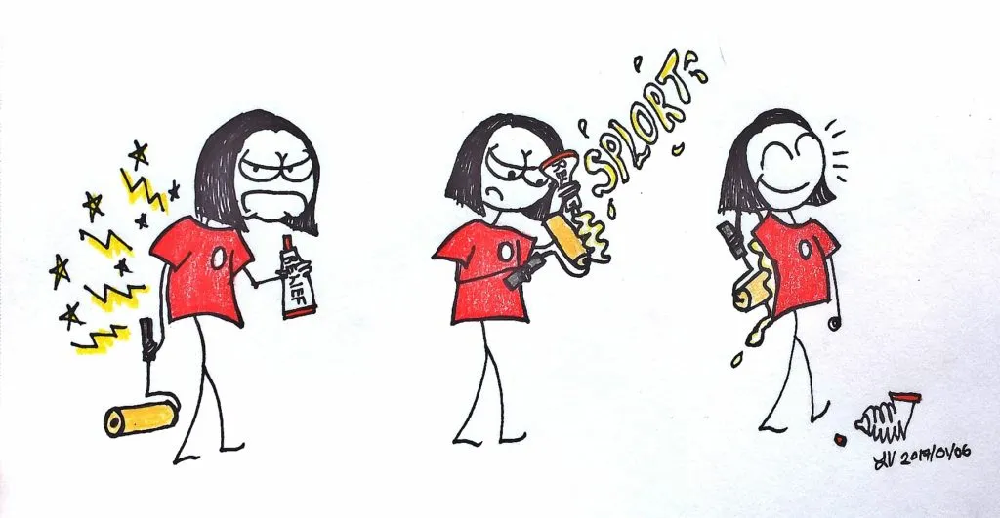

Wow, we are already one week into 2017. The Christmas decorations are put away, the leftovers are eaten, and I have to get used to writing the correct year. So far it's going well, although my brain had a glitch last week where I kept writing "2012."It's also the time where I keep getting asked what my New Year's resolutions are. My standard answer has been "get more sleep and eat more food." It's not really a serious answer, because I am not a fan of New Year's resolutions.

Here's why. It's pretty easy to get caught up in the idea that a new year magically brings a clean slate where all past indiscretions are deleted and all the food you've eaten suddenly doesn't have calories. I get that the start of a new year, symbolically, means a whole year ahead to make better choices. However, our past choices tend to follow us. Change is tough, and it is so easy to become disillusioned by the second week of January once it sinks in how difficult our resolutions are.

Instead, I think it's more realistic to make very small changes. They don't have to be on New Year's Day to be effective or meaningful either. Maybe just one small change (like going for a ten minute walk every other day) at a time. That way, it isn't overwhelming or discouraging. That is what we are hoping the Goal Buddy app will accomplish: help establish a pattern of small, positive choices that are cumulative towards a grander goal.

As for me, I am going to try skiing once per week. I went this morning and I already know I'll need a paint roller covered in Rub-A535 tomorrow...

Save
