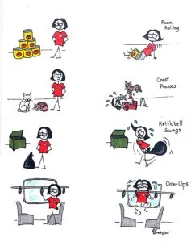

Update: My last blog post was about my unsuccessful attempt at the APREP, which is the physical assessment part of the Edmonton Police Service's hiring process. I passed on my second attempt, which was on February 13! It went so much better the second time, and not just because I didn't wipe out (although not wiping out did help).

Here's what was really different: my attitude. The first time I attempted the APREP, I was thinking about all the people I was afraid to let down. Ultimately, I was afraid of letting myself down, and not just all the people who were supporting me. It was the worst possible attitude I could have approached the situation with, because if you tell yourself "don't screw up" then chances are, you are going to screw up.

I was determined to pass the second time, and I knew my attitude would make or break me. A friend lent me a book on sports psychology ("Mind Gym" by Gary Mack. I highly recommend it.), and I powered through it. Major league and Olympic athletes go through the same thing, I found, even though you don't see what's going on in their heads when you watch a hockey game or the Olympics on TV. The author of the book stated that most successful athletes have a pre-game ritual that they go through every time they have a game, and it is often a form of visualization. In other words, if you visualize yourself succeeding, chances are much better that you will. The author said it should be like "your own highlights reel" that you play in your head before something important.

So I gave it a try. I visualized being completely at peace, yet with razor focus. I thought of the time I went skiing and didn't fall down on a big hill (don't you dare laugh!). I remembered how excited and happy and proud I felt, and how I couldn't wait to feel that again when I ran the APREP. And all those people I didn't want to let down? I thought of how I couldn't wait to tell them how well I did, and how much gratitude I felt towards them.

As Yoda famously said, "Do or do not. There is no try." I did, and I passed with flying colours. It doesn't matter how big or small your goal is. If you believe you can do it, you can.

Afternote: I wanted to draw a cartoon to fit this post, but instead drew one about budget-friendly working out. I was putting stuff away in the pantry, and it suddenly dawned on my that I could use a large can of tomatoes to roll out my quads!

