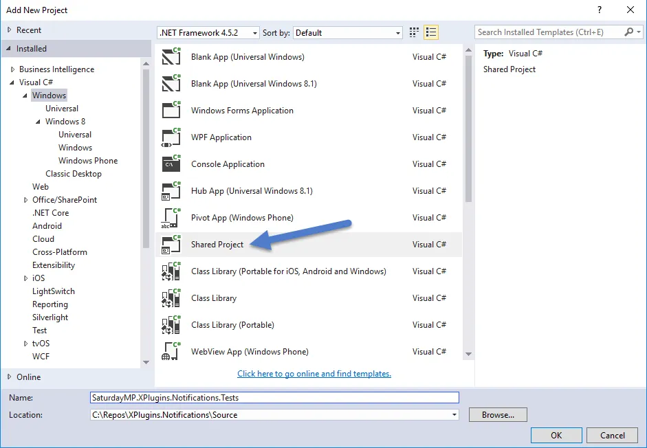
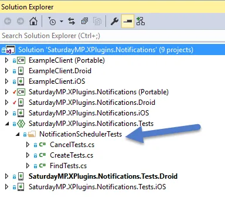
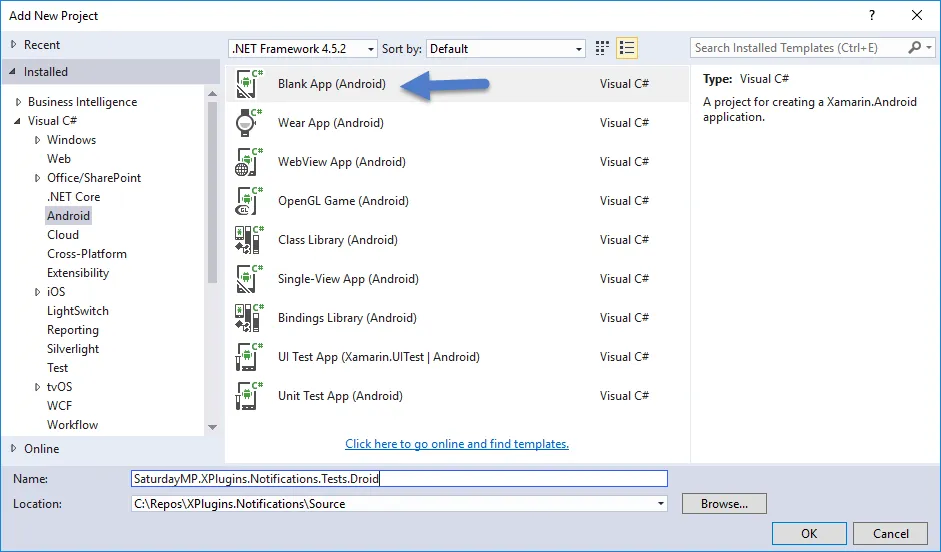
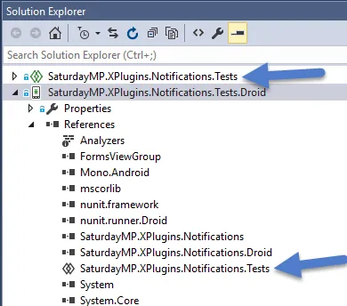
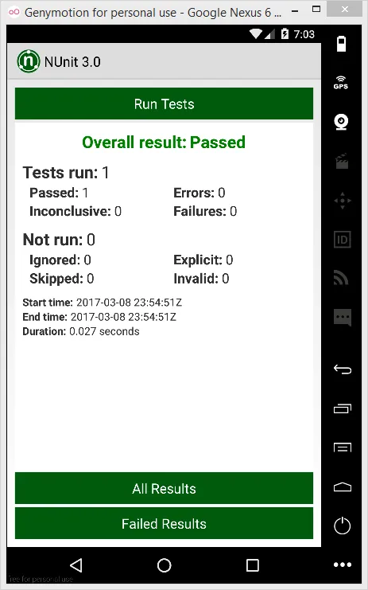
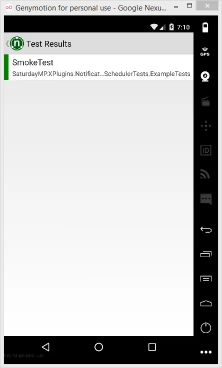
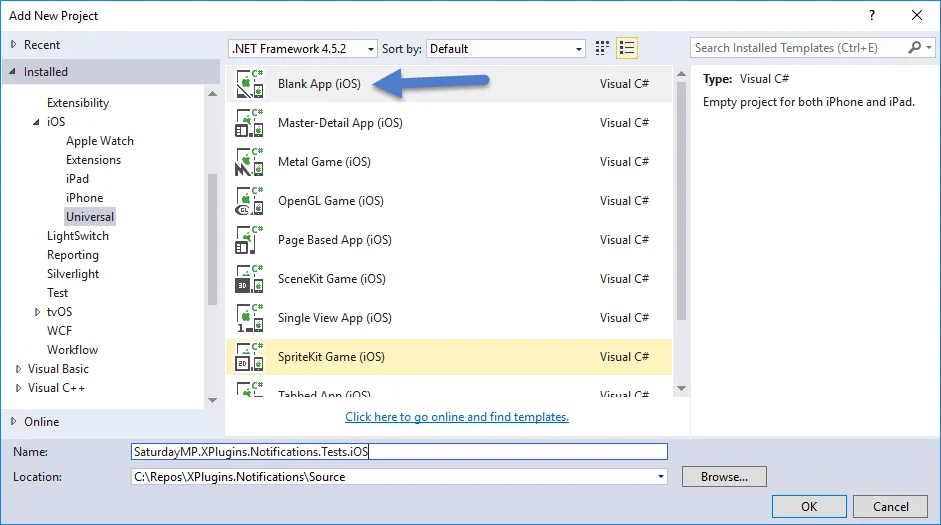
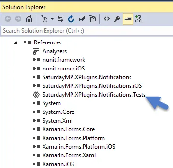
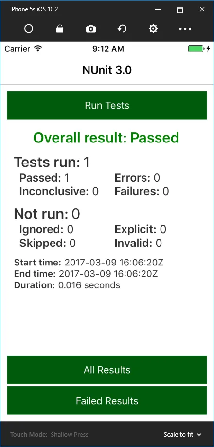
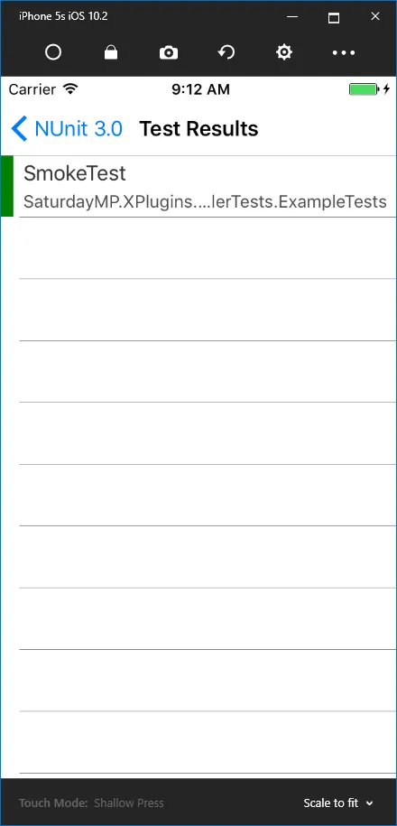

I'm currently working on a [notification plugin](https://github.com/saturdaymp/XPlugins.Notifications) for [Xamarin Forms](https://www.xamarin.com/forms) and wanted to setup some unit tests.  The problem is my code accesses the device-specific notification systems in iOS and Android.  This means I can't just run my unit tests on Windows.  Instead I need to run the unit tests in a iOS or Android environment.  In my case this means an emulator.

How to do that?  Use the [NUnit 3 Xamarin Runners](https://github.com/nunit/nunit.xamarin).  It was not clear how to correctly create the test projects but the way that worked for me was this.

## Create a Shared Project For the Tests

What is a shared project?  I don't remember the exact problem I had but I first tried creating a [portable project](https://developer.xamarin.com/guides/cross-platform/application_fundamentals/code-sharing/).  That failed for some reason I can't remember so I switched to a shared library.

This will be the project your tests will reside in once you write them.  For example in the XPlugins Notifications project I have the following tests.

You won't have any tests but should create one now just for testing.  Create a test that simply passes or fails.  Something like the below.

\[csharp\] \[TestFixture\] class ExampleTests { \[Test\] public void SmokeTest() { Assert.That(true); } } \[/csharp\]

Since this is a shared project we can't actually run it.  The shared project needs to be included in an Android or iOS project.

## Create Droid Test Project

First the Droid project.  It's just a standard Android application.

In the new Android project add a reference to your test's project.

Then you need to add the following code to the MainActivity classe's OnCreate method:

\[csharp\] // This will load all tests within the current project // and run them. var nunit = new NUnit.Runner.App {AutoRun = true}; \[/csharp\]

The full OnCreate method will look something like this:

\[csharp\] protected override void OnCreate(Bundle savedInstanceState) { base.OnCreate(savedInstanceState);

Xamarin.Forms.Forms.Init(this, savedInstanceState);

// This will load all tests within the current project var nunit = new NUnit.Runner.App {AutoRun = true};

LoadApplication(nunit); } \[/csharp\]

Now you should be able to run your test.  Set the droid project as your startup project and run it either on your device or your favourite emulator.  You should get the below output if everything is working.

## Create iOS Test Project

Creating the iOS test project is similar to the Android.  First add a basic iOS project.  In our case we add a universal iOS project.

Add a reference to your test project.

Then add the code snippet to run the tests to the FinishedLaunching method in the AppDelegate class.

\[csharp\] // This will load all tests within the current project var nunit = new NUnit.Runner.App {AutoRun = true}; \[/csharp\]

The full FinishedLaunching method will look something like this:

\[csharp\] public override bool FinishedLaunching(UIApplication app, NSDictionary options) { Forms.Init();

// This will load all tests within the current project var nunit = new NUnit.Runner.App {AutoRun = true};

LoadApplication(nunit);

return base.FinishedLaunching(app, options); } \[/csharp\]

Now the tests should run on an iOS device.

## Writing a Test for a Specific Platform

Your tests might require a reference to a specific platform.  If that is the case then you can use a compiler directive.

\[csharp\] #if \_\_ANDROID\_\_ \_schedulerToTest = new Notifications.Droid.NotificationScheduler(); #elif \_\_IOS\_\_ \_schedulerToTest = new Notifications.iOS.NotificationScheduler(); #else throw new Exception("Invalid envrionment.") #endif \[/csharp\]

An example of a test file looks like this:

\[csharp\] /// &lt;summary&gt; /// Tests to make sure notifications can be found. /// &lt;/summary&gt; \[TestFixture\] internal class FindTests { /// &lt;summary&gt; /// The schedule to test. /// &lt;/summary&gt; private INotificationScheduler \_schedulerToTest;

/// &lt;summary&gt; /// Load the correct scheduler based on the environment we are in. /// &lt;/summary&gt; \[OneTimeSetUp\] public void OneTimeSetUp() { #if \_\_ANDROID\_\_ \_schedulerToTest = new Notifications.Droid.NotificationScheduler(); #elif \_\_IOS\_\_ \_schedulerToTest = new Notifications.iOS.NotificationScheduler(); #else throw new Exception("Invalid envrionment.") #endif } /// &lt;summary&gt; /// Should find a created notification. /// &lt;/summary&gt; \[Test\] public void NotificationExists() { // Create the notifiaction to find. const string expectedNotificationTitle = "Test Notification"; const string expectedNotificationMessage = "This is a test notification.";

var expectedNotificationId = \_schedulerToTest.Create(expectedNotificationTitle, expectedNotificationMessage, DateTime.Now.AddHours(1));

// Try to find it. var resultNotification = \_schedulerToTest.Find(expectedNotificationId);

Assert.That(resultNotification, Is.Not.Null); Assert.That(resultNotification.Title, Is.EqualTo(expectedNotificationTitle)); Assert.That(resultNotification.Message, Is.EqualTo(expectedNotificationMessage)); } } \[/csharp\]

Remember these tests require items specific to the iOS or Android environment.  In this case notifications.  If you are just testing business logic that does not require a feature on a specific device then just add a standard Class Library project to hold your tests.

Save

Save
