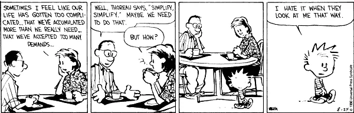

The great philosopher Henry David Thoreau once said: "Simplify, simplify."

I actually didn't know that Thoreau said that until I saw a reference to that quote in a Calvin & Hobbes comic. But that's another story.

You might be wondering why we at Saturday Morning Productions haven't written any blog updates about our Goal Buddy App project. Well, that's because we have reached a bit of an impasse. Our master-coder Chris has written quite a few updates on the first version, which focused on scheduling tasks and having reminders for those tasks. It was cool seeing the app come together. But we started to wonder: how was this any different than using a calendar app?

It was time to take a big step back. Was it an instance of not seeing the forest for the trees? Or maybe Goal Buddy needed to be follow Thoreau's advice and simplify. Here's what we did. Chris pared the app back to a bare-bones state to focus on just accomplishing three goals per day. The thinking behind this is that focusing on a small and achievable set of daily goals reinforces positive choices for getting things done. (I like to joke that I can remember three important things per day. If I have to remember anything else, something inevitably gets bumped out of the queue!) The beauty of this approach is that, like the app itself, it is simple, straightforward, and realistic.

Perhaps with the original iteration of Goal Buddy, we had too much complexity right off the bat. Approaching it from this simpler stance will allow us to see what would make for useful additions for future versions. I guess we will be taking Thoreau's (and Calvin's parents') advice!

(source: [gocomics.com](http://www.gocomics.com/calvinandhobbes/1990/08/15))
