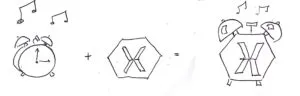
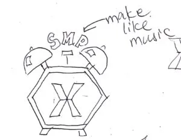
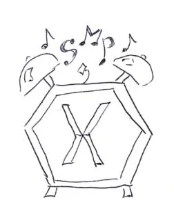
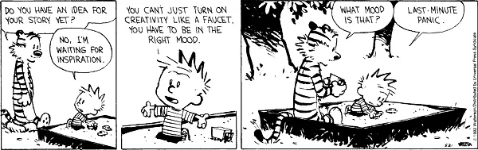

Lately, Chris has been working on Xamarin notifications in Android, which you would have gathered from his recent blog posts. I have been tasked with designing an icon to go with this work. I've designed a few things before (Scary Sun being my best work), but this task seemed to be especially vexing.

How would I come up with something that captures the concepts of Xamarin, Saturday Morning Productions,  and notifications? It seemed like a lot to fit into a very small space. Now, when I think of being notified for something, I immediately think of bells. Like alarm clock bells. I drew a few iterations of an icon with a bell, but honestly, they looked kinda dumb. I'm not sure anyone would look at them and connect the three things together that I just mentioned. I wondered if I would get a flash of inspiration if I just let it percolate around my brain a bit.

The problem with that approach is that time becomes a very loose concept. Before I knew it, a whole week had passed. Tricky things, those weeks. I had to send something to the team! I started at a blank piece of paper, hoping creativity would find me. 

I looked at the Xamarin logo again. _You know, I could probably make that shape into an alarm clock..._I thought. So I drew some legs and bells on the Xamarin logo and added some music notes. You know, to imply sound. But how to fit in the SMP reference? After a chat with Ada and Chris, they suggested turning "SMP" into musical notes themselves. _It's just crazy enough that it might work_, I mused. They were right. Even thought it wasn't my proudest moment for leaving something to the last minute, I am pleased with the results.

And, just for good measure, here is the Calvin & Hobbes post that inspired this post!

(Source: [Calvin & Hobbes](http://www.gocomics.com/calvinandhobbes). These days Calvin and Hobbes seem to sum up most of my concepts!)
