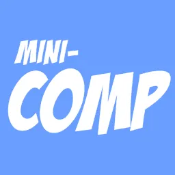

I hope you had a great summer vacation.  We sure did and are trying squeeze in a mini-vacation before the summer is officially over after the [Labour Day long weekend](https://www.statutoryholidays.com/labourday.php).

Now that your summer vacation is over you want to share your pictures with friends, family, subscribers, and strangers on the Internet.  How do you do that?

Today you just login to [Facebook](https://www.facebook.com/), [Flickr](https://www.flickr.com/), [Snapchat](https://www.snapchat.com), [iCloud](https://www.icloud.com/), [Google Photos](https://photos.google.com/) (formally Picasa), [Shutterfly](https://www.shutterfly.com/), etc, and upload your pictures.  If you took the pictures with your phone your picture might have been auto-magically uploaded to iCloud or Google.  You don't need to worry about the size of the picture or how much memory it consumes.  Often the service will compress your picture on the fly as needed.

It's even easy to send pictures directly to one or a couple people by attaching the photos to an e-mail or text message on your phone.  The size limits for both e-mail and text attachments is very generous.  For example GMail allows [25MB attachments](https://support.google.com/mail/answer/6584?co=GENIE.Platform%3DDesktop&hl=en).  No need to compress, at least most of the time.

Why am I rambling about image compression?  Because Saturday MP sells [Mini-Compressor](https://www.saturdaymp.com/mini_comp), a program to compresses images.  Is Mini-Compressor still relevant today?  Is it worth my time and money to continue to support and sell it?

If you still use Mini-Compressor please let us know.  If you don't please also let us know.  You can let us know via [e-mail](mailto:support@saturdaymp.com), [Facebook](https://www.facebook.com/saturdaymp/), or [Twitter](https://twitter.com/saturdaymp).  Haven't heard of Mini-Compressor before and don't know if you need it then try it for [free](https://www.saturdaymp.com/mini_comp) (click the Try Now button).

I'm also curious if people would be more comfortable buying Mini-Compressor on the [Windows Store](https://www.microsoft.com/en-ca/store/apps) instead of the Saturday MP website.  If I did release Mini-Compressor on the Windows Store it would lose the right click feature ([link with eye glazing technical details](https://nftb.saturdaymp.com/notes-on-converting-mini-compressor-to-uwp-application-trying-to-at-least/)).  I always thought that was one of the best features of Mini-Compressor but maybe I'm wrong.

If you are a current user of Mini-Compressor don't worry it won't disappear.  In the worst case, I'll open source it and make sure the existing installers and executables are freely available.  Finally thank you for using Mini-Compressor, I hope it made you life better in some small way.
