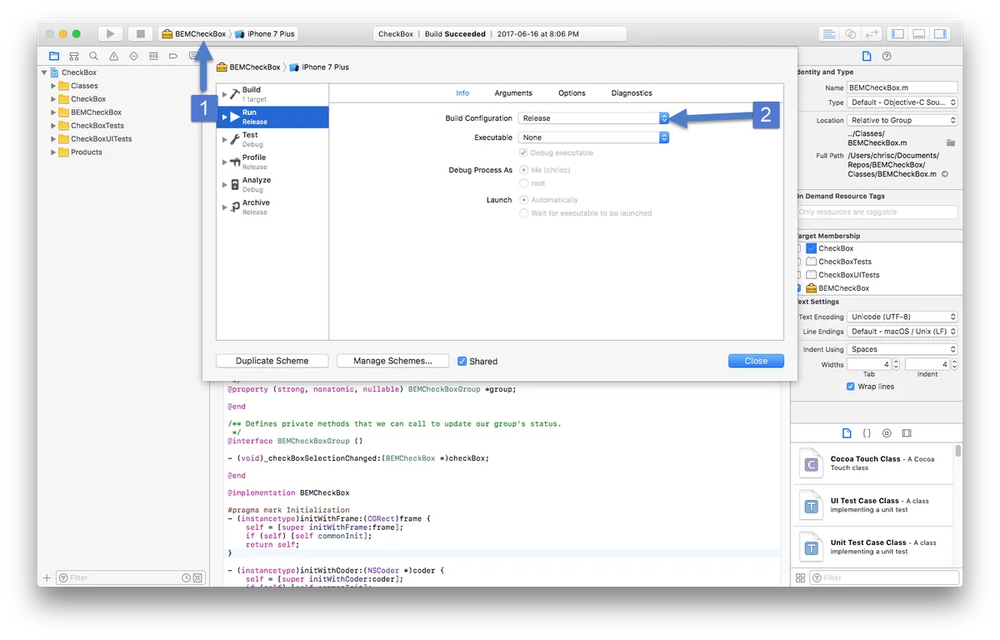
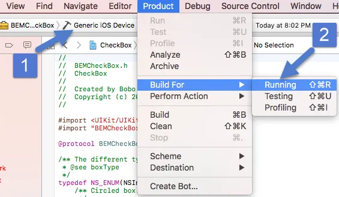
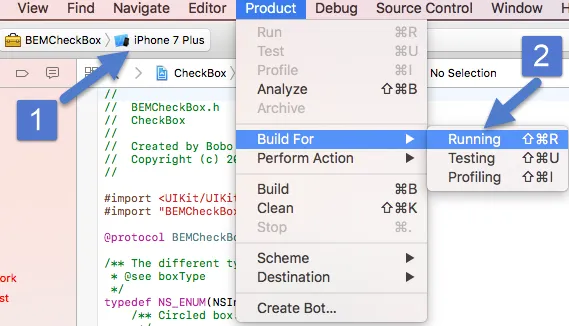
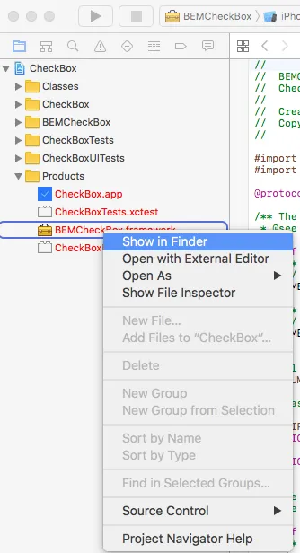
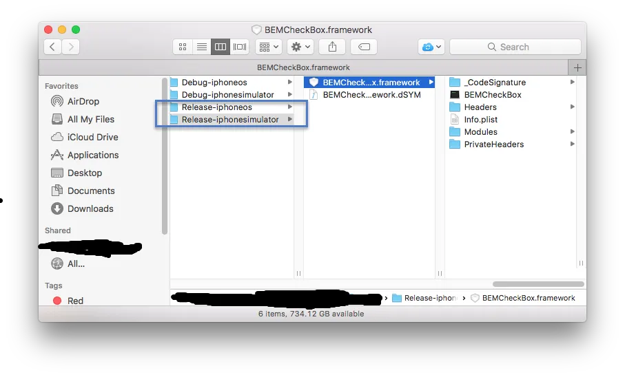

There is no checkbox for [Xamarin Forms](https://www.xamarin.com/forms) applications.  This is a problem because I wanted a checkbox in a application I'm working on.  A switch wasn't going to cut it.

After a bit of research I found that Android had [native checkbox](https://developer.android.com/reference/android/widget/CheckBox.html).  Half my problem was solved.  I celebrated by eating a cookie.

Then I ran into a problem because iOS does not have a native checkbox control.  I found others had solved this problem by creating a iOS button and adding a checkbox image to it.  One image for checked and one for unchecked.  This works but it means I can't easily change the colour, size, etc. of the checkbox.  Any changes would require me to create new images.  Using MS Paint or GIMP is not my strong suit.

Then I found [BEMCheckBox](https://github.com/Boris-Em/BEMCheckBox) which does everything I need it to.  It also allows for circle and square checkboxes.  But wait, BEMCheckBox is in Objective-C.  How does I reference it in my Xamarin project?  [Native bindings](https://developer.xamarin.com/guides/ios/advanced_topics/binding_objective-c/walkthrough/) to the rescue!

Step one is compile the native library using Xcode.  Download the code and open it in Xcode.  Then make sure the project is being built for release.  If you are like me and not very familiar with Xcode the exact steps are:

1. Click the BEMCheckBox project and choose edit schema.  In the dialog pick Run on the left and Info in the middle.
2. Then change the build configuration to Release.

Next we need to build the library.  Actually we need to build it twice, once for the iOS simulators (x86 and x64 architectures) and once for physical iOS devices (ARM architectures).  To build for a iOS device make sure the area beside the BEMCheckBox says Generic iOS Device.  Then pick Product->Build For->Running from the menu.

Then switch the Generic iOS Device to any iOS simulator and do the same thing.

To find the two builds you just created right click on the BEMCheckBox.framework in the Products folder and choose Show in Finder.

You should see both a Release-iphoneos and Release-iphonesimulator folders.   You might also see Debug-<os> folders but you can ignore those.

That is it for part 1.  Good work, help yourself to a cookie.  In [part 2](https://nftb.saturdaymp.com/today-i-learned-how-to-create-a-xamarin-ios-binding-for-objective-c-libraries-part-2-combining-libraries/) we will combine the two libraries into one.  If you don't combine the builds then the library will only work on the simulators or physical devices in Xamarin not both.  Obviously we want the framework to work with both.  Finally you can find a working example of BEMCheckBox in Xamarin iOS [here](https://github.com/saturdaymp/XPlugins.iOS.BEMCheckBox).

 

P.S. - I really like cookies.  They are my favourite desert dessert.

P.S.S. - [Why is desert and dessert so similar?](http://snarkygrammarguide.blogspot.ca/2012/11/desert-vs-dessert-easy-way-to-remember.html)

Chocolate pudding It no phase me But you got cookie So share it maybe



Save
