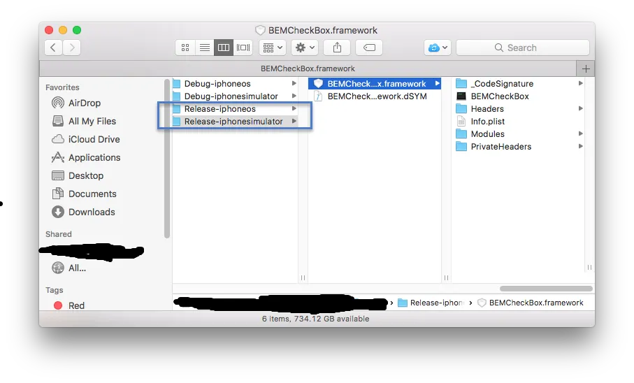
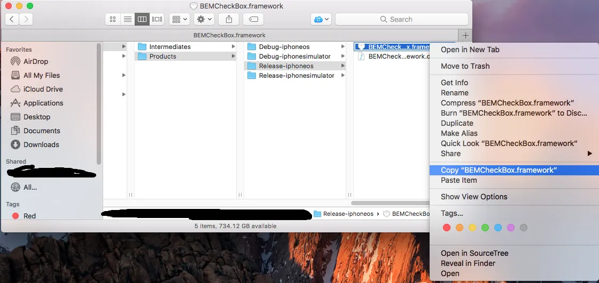
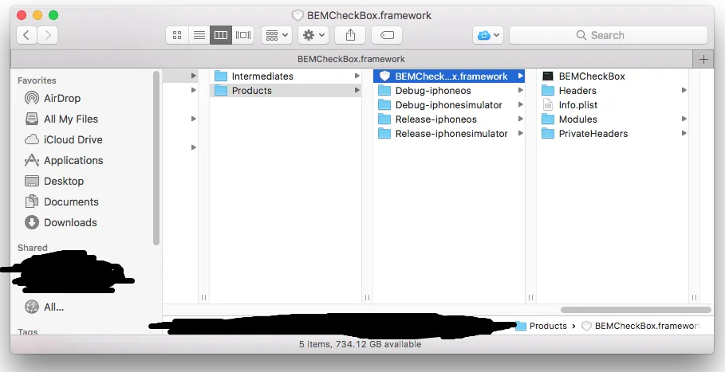

This is part 2 of creating a iOS Binding for the Objective-C Library [BEMCheckBox](https://github.com/Boris-Em/BEMCheckBox).  In [part 1](https://nftb.saturdaymp.com/today-i-learned-how-to-create-a-xamarin-ios-binding-for-objective-c-libraries-part-1-compiling-the-objective-c-library/) we compiled the Xcode project into two separate libraries.  One for iphones (ARM architecture) and one for iOS simulators (x86/x64 architecture).

In this post I'll discuss how to combine two libraries into one that contains all the architectures.  If you fail to combine the libraries then you will get errors when you bind to Xamarin.  If you only have the iphone library then it won't run on the simulator and vice versa.

Just a reminder that you should have the Release-iphoneos and Release-iphonesimulator builds as shown below.

[](https://nftb.saturdaymp.com/wp-content/uploads/2017/07/CompiledFrameworksInFinder.png)

To combine the libraries requires the use of the [lipo tool](https://ss64.com/osx/lipo.html).  Before we lipo these libraries we first need to get setup.  To start with copy the Release-iphoneos/BEMCheckBox.framework folder to the Products folder as shown below.

[](https://nftb.saturdaymp.com/wp-content/uploads/2017/07/CopyBEMCheckBoxFramework.png)

[](https://nftb.saturdaymp.com/wp-content/uploads/2017/07/ResultsOfCopyingBEMCheckBoxFramework.png)

It actually doesn't matter if you copy the iphone or simulator folder.  Inside that folder is the compiled library along with some other such as uncompiled header files.  The library file can be found at BEMCheckBox.framework/BEMCheckbox.  This file will be different between the iphone and simulator releases but the header files will be the same.

Our goal is to replace the BEMCheckbox compiled library that only supports ARM with one that supports all the architectures.  This is where we use lipo.  Open up a terminal window on your Mac and navigate to the Products folder.  Then enter the following command:

```text
lipo -create -output BEMCheckBox.framework/BEMCheckBox Release-iphoneos/BEMCheckBox.framework/BEMCheckBox Release-iphonesimulator/BEMCheckBox.framework/BEMCheckbox
```

This will combine the iphone and simulator libraries into one library and replace the one we in the products folder with the combined one.  To make sure everything worked as expected run the file command as shown below.

```text
file BEMCheckBox.framework/BEMCheckBox
```

You should get the following output or something similar:

```text
BEMCheckBox.framework/BEMCheckBox: Mach-0 universal binary with 4 architectures: [i386: Mach-0 dynamically lined shared library i386] [x86_x64: Mach-0 dynamically lined shared library x86_x64] [arm_v7: Mach-0 dynamically lined shared library arm_v7] [arm64: Mach-0 dynamically lined shared library arm64]
BEMCheckBox.framework/BEMCheckBox (for architecture i386): Mach-0 dynamically linked shared library i386
BEMCheckBox.framework/BEMCheckBox (for architecture x86_x64): Mach-0 dynamically linked shared library x86_x64
BEMCheckBox.framework/BEMCheckBox (for architecture arm_v7): Mach-0 dynamically linked shared library arm_v7
BEMCheckBox.framework/BEMCheckBox (for architecture arm64): Mach-0 dynamically linked shared library arm64
```

You can also use the lipo command tool to check the library.

```text
lipo -info BEMCheckBox.framework/BEMCheckBox
```

You should see something like:

```text
Architectures in the fat file: BEMCheckBox.framework/BEMCheckBox are: i386, x86_x64, arm7, arm64
```

A screen show of all the commands looks like:

[](https://nftb.saturdaymp.com/wp-content/uploads/2017/07/LipoCommandScreenShot.png)

We now have one library that will work with Xamarin and both iOS simulators and physical iPhones.  Like combining a chocolate and peanut butter cookie.  In [Part 3](https://nftb.saturdaymp.com/today-i-learned-how-to-create-a-xamarin-ios-binding-for-objective-c-libraries-part-3-using-sharpie-to-create-binding-interface/) I'll explain how to create the binding between this delicious chocolate and peanut butter cookie and Xamarin.  Finally you can find a working example of BEMCheckBox in Xamarin iOS [here](https://github.com/saturdaymp/XPlugins.iOSBindings).

 

P.S. - Not a song this time but a cookie monster skit that makes me laugh.

https://www.youtube.com/watch?v=k6OWSf8\_5J4
