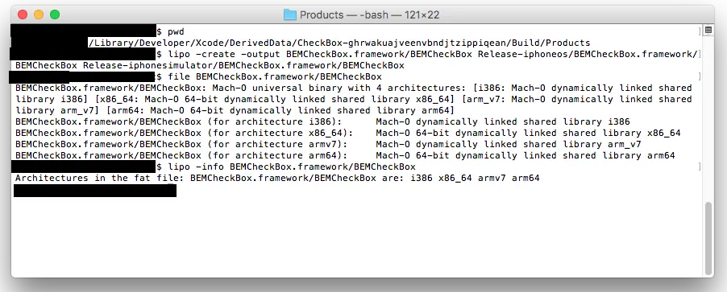
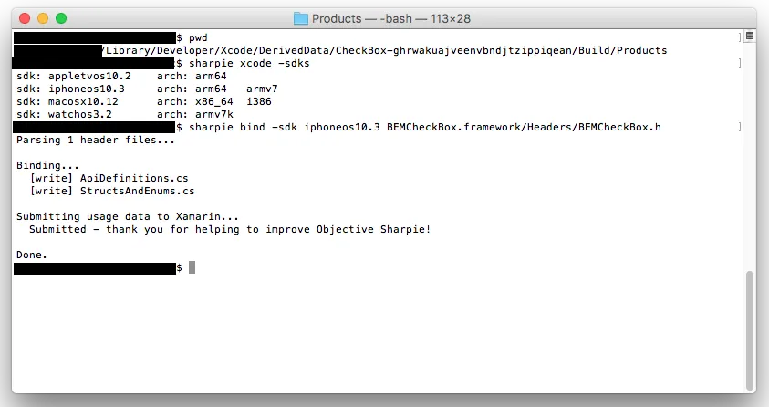

This is the 3rd part about using the [BEMCheckBox](https://github.com/Boris-Em/BEMCheckBox), an Objective-C library, in Xamarin.  Part 1 described how to compile the BEMCheckBox library using Xcode.  [Part 2](https://nftb.saturdaymp.com/today-i-learned-how-to-create-a-xamarin-ios-binding-for-objective-c-libraries-part-2-combining-libraries/) showed how to combine the multiple libraries we compiled from Part 1 into one library.  In this part I'll describe how to use Sharpie to create the C# API interface.

[Sharpie](https://developer.xamarin.com/guides/cross-platform/macios/binding/objective-sharpie/) is a tool that reads the header files in the BEMCheckBox framework and extract a C# interface.  We could create the interface manually but it's easier if we let technology do some of the work for us.  Don't worry about this job being replaced by a robot as we will have to manually edit the file after it's generated, at least for BEMCheckBox.  Download the sharpie tool [here](https://download.xamarin.com/objective-sharpie/ObjectiveSharpie.pkg) and read more about the sharpie [here](https://developer.xamarin.com/guides/cross-platform/macios/binding/objective-sharpie/).

Remember this screen shot from Part 2 where we merged two libraries into one?

[](https://nftb.saturdaymp.com/wp-content/uploads/2017/07/LipoCommandScreenShot.png)

This is the library we created that supports multiple architectures (x86, x64, Arm7, Arm64).  We need to run Sharpie on this the header files in this single framework.  Open up the terminal and run this command to see what sdk versions are installed.

```text
sharpie xcode -sdks
```

This will show something like:

```text
sdk: appletvos10.2    arch: arm64
sdk: iphoneos10.3     arch: arm64  arm7
sdk: macosx10.12      arch: x86_64 i386
sdk: watchos3.2       arch: arm7k
```

Once you know the iphone sdk version you can run the actual sharpie command.  Run this command against the header files in the BEMCheckBox framework folder.

```text
sharpie bind -sdk iphoneos10.3 BEMCheckBox.framework/Headers/BEMCheckBox.h
```

The output should look something like:

```text
Parsing 1 header files...

Binding...
  [write] ApiDefinitions.cs
  [write] StructsAndEnums.ca

Submitting usage data to Xamarin...
  Submitted - thank you for helping to improve Objective Sharpie!

Done.
```

A screen shot of the commands is below.

[](https://nftb.saturdaymp.com/wp-content/uploads/2017/07/SharpieCommand.png)

This should generate two files for BEMCheckBox: ApiDefinitions.cs and StructsAndEnums.cs.  For other libraries you might only get one file.

Go ahead and look at the files now.  In the APIDefinitions file you will C# interfaces with a bunch of attributes.  The interface maps the methods in the objective-c header file.  In the StructsAndEnums file you will see enums used by BEMCheckBox.  A snippet of the files is shown below.

API Definitions:

```csharp
// @interface BEMCheckBox : UIControl <CAAnimationDelegate>
[BaseType(typeof(UIControl), Delegates = new string[] { "WeakDelegate" }, Events = new Type[] { typeof(BEMCheckBoxDelegate) })]
interface BEMCheckBox
{
  [Export("initWithFrame:")]
  IntPtr Constructor(CGRect frame);

  [Wrap("WeakDelegate")]
  [NullAllowed]
  BEMCheckBoxDelegate Delegate { get; set; }

  // @property (nonatomic, weak) id<BEMCheckBoxDelegate> _Nullable delegate __attribute__((iboutlet));
  [NullAllowed, Export("delegate", ArgumentSemantic.Assign)]
  NSObject WeakDelegate { get; set; }

  // @property (nonatomic) BOOL on;
  [Export("on")]
  bool On { get; set; }

  // @property (nonatomic) CGFloat lineWidth;
  [Export("lineWidth")]
  nfloat LineWidth { get; set; }

  // Other methods...

}
```

Structs:

```csharp
[Native]
public enum BEMBoxType : long
{
  Circle,
  Square
}

[Native]
public enum BEMAnimationType : long
{
  Stroke,
  Fill,
  Bounce,
  Flat,
  OneStroke,
  Fade
}
```

This is all well and good but an interface can't make calls to the underlying objective-c interface.  I'll discuss how Visual Studio auto-magically creates the wiring between the C# interface and the BEMCheckBox library in Part 4.  For now go ahead and get another cookie.  You deserve it.

Don't forget you can find a working example of BEMCheckBox in Xamarin iOS [here](https://github.com/saturdaymp/XPlugins.iOSBindings).

 

P.S. - A classic Cookie Monster song about up and down.  Can you figure out what happened to Cookie Monster's cookie before the end of the song?

https://www.youtube.com/watch?v=AGsKPE3dk4k

Save
